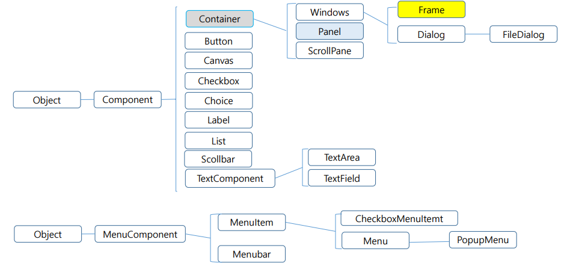
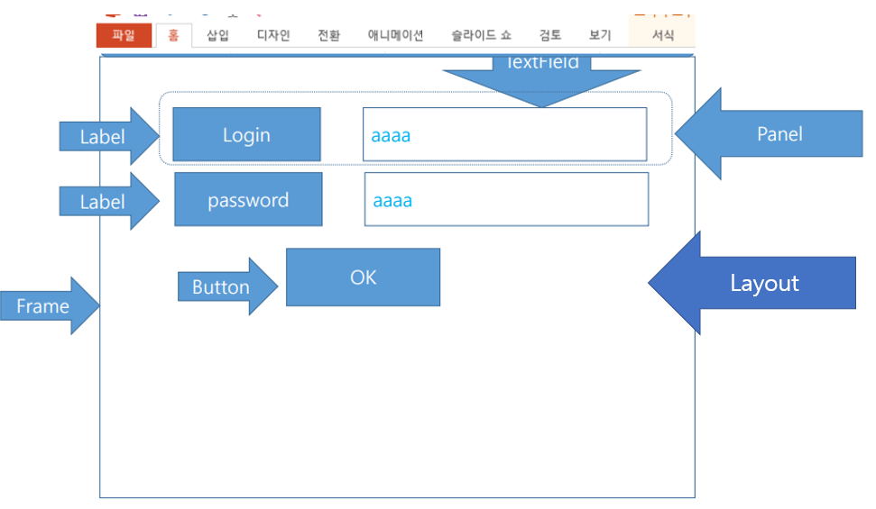
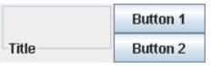
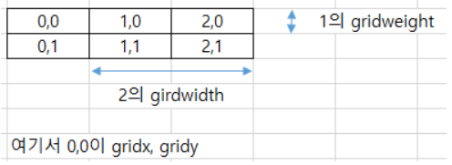
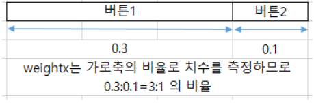

# 1. AWT

1. ## AWT란


   AWT(Abstract Window Toolkit)는 이름에서 알 수 있듯이 Window 프로그래밍(GUI프로그래밍)을 하기 위한 도구

   GUI 어플리케이션 개발에 필요한 여러 개의 관련 패키지와 집합으로 구성된다.

   

   GUI(Graphical User Interface)는 사용자가 그래픽을 통해서 하드웨어와 작용하는 환경을 말한다. 지금까지는 텍스트 기반의 어플리케이션(Character User Interface: 키보드로 명령을 내리고 결과가 문자로 표시되는 단순한 형태의 것)을 작성해왔지만 AWT를 이용하면 그래픽 기반(GUI)의 어플리케이션을 작성할 수 있다.

   

   AWT로 작성된 GUI어플리케이션은 플랫폼 독립적이라서 여러 종류 OS에서 코드를 수정하지 않고도 실행이 가능하나 윈도우 버튼과 같은 GUI 컴포넌트들을 직접 구현하지 않고 해당 OS의 컴포넌트(native component)를 사용하기 때문에 AWT로 작성된 GUI어플리케이션의 외양이 실행되는 OS마다 달라질 수 있다.(약간의 OS종속적)

   또한, 여러 종류의 GUI기반의 OS들이 공통적으로 가지고 있는 컴포넌트만으로 구성해야 하기 때문에 AWT가 제공할 수 있는 GUI컴포넌트의 수가 제한적 -> 대신, OS에서 제공하는 컴포넌트는 해당 OS에 최적화되어 있기에 자바로 구현한 컴포넌트보다 속도가 더 빠름

   

   GUI어플리케이션은 텍스트로만 구성된 어플리케이션보다 수행해야할 작업이 훨씬 많기 때문에 속도 문제를 안고 있었던 자바는 OS독립적인 부분을 다소 포기하면서 속도를 선택하였다.

   

   

   그래서 새롭게 등장한 것이 Swing!

   **Swing**은 AWT를 확장한 것이지만 AWT와는 달리 순수한 자바로 이루어져 AWT보다 다양하고 풍부한 기능의 컴포넌트를 제공함으로써 진정한 GUI어플리케이션을 개발하기 위한 도구로 사용되고 있다.

   더불어 Swing의 클래스들이 AWT의 클래스들을 기반으로 만들어진 자손 클래스들이므로 AWT와 Swing은 컴포넌트의 종류와 사용법만 조금 다를 뿐 나머지는 거의 같다.

   | AWT                                                          | Swing                                                        |
   | ------------------------------------------------------------ | ------------------------------------------------------------ |
   | 이전 버전의 자바에서 지원, 운영체제의 컴포넌트로 처리함으로 운영체제에 의존적 | 순수한 자바 언어로 처리함으로 운영체제에 독립적, AWT 기능을 상속 확대하여 다양한 컴포넌트 제공 |

   

2. ## AWT의 구성

   패키지명이 'java.awt'로 시작하는 것은 모두 AWT관련 패키지이다.

   | 패키지명       | 설명                                                         |
   | -------------- | ------------------------------------------------------------ |
   | java.awt       | AWT를 이용한 GUI어플리케이션을 작성하는데 필요한 기본적인 클래스와 컴포넌트를 제공한다. |
   | java.awt.event | GUI어플리케이션에서 발생하는 이벤트를 처리하는데 필요한 클래스와 인터페이스를 제공한다. |

   

   메뉴와 관련된 컴포넌트들을 제외한 모든 컴포넌트의 조상은 Component클래스이고 Component의 클래스의 조상은 Object클래스이다.

   Component클래스와 그 자손 클래스들은 윈도우, 스크롤바, 버튼 등 GUI응용 프로그램의 화면을 구성하는데 사용되는 클래스들이다. 이들을 AWT 컴포넌트 또는 줄여서 컴포넌트 라고 부른다.

   

   컴포넌트는 버튼이나 체크박스와 같은 일반적인 컴포넌트와 메뉴와 관련된 메뉴컴포넌트로 나누어진다. Component는 일반적인 컴포넌트의 최상위 조상이며 MenuComponent는 메뉴관련 컴포넌트들의 최상위 조상이다.

   여기서 Panel은 FlowLayout과 Window는 BorderLayout과 연관된다.

   

3. ## 컴포넌트(Component)

   Component는 MenuComponent를 제외한 AWT의 모든 컴포넌트의 조상이고 추상 클래스이다. Component에는 컴포넌트들이 가져야 할 공통적인 메서드들을 정의해놓고 있다.

   

4. ## 컨테이너(Container)

   Component의 자손들 중에 Container와 그 자손들이 있는데 이들을 컨테이너라고 부른다. 컨테이너는 다른 컴포넌트들을 포함할 수 있어서 Button, Label과 같은 컴포넌트들을 포함할 수 있다. 또한 컨테이너가 컨테이너를 포함할 수도 있다.

   1. **독립적인 컨테이너** - 독립적으로 사용될 수 있으며 다른 컴포넌트나 종속적인 컨테이너를 포함할 수 있다.

      | 컨테이너 | 설명                                                         |
      | -------- | ------------------------------------------------------------ |
      | Frame    | 가장 일반적인 컨테이너로 윈도우와 모양이 같다. titlebar와 크기조절버튼, 닫기버튼을 가지고 있으며 메뉴를 추가할 수 있다. |
      | Window   | Frame의 조상이며 경계선, titlebar, 크기조절버튼, 닫기 버튼이 없으며 메뉴도 추가할 수 없다. 단지 컴포넌트를 담을 수 있는 평면공간만을 갖는다. |
      | Dialog   | Frame처럼, titlebar와 닫기버튼을 갖고 있지만, 메뉴는 가질 수 없으며 기본적으로 크기를 변경할 수 없다. 주로 프로그램사용자에게 메시지를 보여주거나 응답을 받는데 사용한다. |

      

   2. **종속적인 컨테이너**- 독립적으로 사용될 수 없으며, 다른 컨테이너에 포함되어야만 한다.

      | 컨테이너   | 설명                                                         |
      | ---------- | ------------------------------------------------------------ |
      | Panel      | 평면공간으로 Frame과 같이 여러 컴포넌트를 담을 수 있으나 단독적으로 사용될 수는 없다. |
      | ScrollPane | Panel과 같은 평면공간이지만 Panel과는 달리 단 하나의 컴포넌트만 포함할 수 있으며 자신보다 큰 컴포넌트가 포함되면 스크롤바가 자동적으로 나타난다. |

      컨테이너에는 여러개의 오버로딩된 add메서드들이 정의되어 있어서 컨테이너에 단순히 add메서드를 사용하는 것만으로 다른 컴포넌트를 포함시킬 수 있다. 컨테이너에 포함된 컴포넌트들을 기본적으로 컨테이너에 설정된 배경색과 전경색 글자체 등의 설정을 그대로 따르게 된다.

      

      그렇지만 이제 swing과 안드로이드로 넘어가면 거의 모든 컴포넌트들이 container개념을 가지고 있으며 예를들어 버튼에 이미지가 들어갈 수 있어 화려해지는 장점을 가지게 된다.

​		


# 2. AWT의 주요 컴포넌트

다음은 AWT의 주요 컴포넌트들이다.

Frame : 기반틀		Label : 표시		Button : 실행

CheckBox / CheckGroup, Choice, List : 선택

Text Components(TextField, TextArea) : 글을 쓰기 위한 것

Panel, ScrollPane : 컨테이너 박스

PopupMenu : 툭 튀어나와서 선택할 수 있는 기능

다음을 보면서 더 자세히 알아보자.

1. ## Frame

   GUI프로그래밍의 가장 대표적인 컴포넌트로 다른 컴포넌트들을 포함할 수 있는 컨테이너이다. titlebar와 최대화버튼, 최소화버튼, 닫기버튼이 있으며 크기를 조절할 수 있다. (디폴트 레이아웃은 BoarderLayout)

   1. Frame객체를 하나 만들고 (생성자에 사용된 String은 Frame의 titlebar에 나타난다.)

      `Frame f = new Frame("Login");`

   2. 생성된 Frame의 크기를 설정한 다음 (폭 300픽셀, 높이 200픽셀)

      `f.setSize(300,200);`

   3. Frame을 화면에 보이도록한다. (Frame객체를 생성했다고 해서 화면에 보이는 것은 아니고 반드시 setVisible()을 사용해야 화면에 나타난다.

      `f.setVisible(true);`

   

   Frame에 Layout Manager가 설정되지 않았을 때 `setSize() setBounds()` 를 이용해서 컴포넌트들의 크기를 지정해주지 않으면 컴포넌트가 화면에 나타나지 않으니 주의하자.

   

2. ## Button

   버튼은 사용자가 클릭했을 때 어떤 작업이 수행되도록 할 때 사용된다.

   ```java
   import java.awt.*;
   
   public class ButtonDemo {
   	
   	public ButtonDemo() {
   		Frame f = new Frame("Button Demo : SYJ");
   		Button b = new Button("OK");
   		f.add(b);
   		f.setSize(300, 300);
   		f.setVisible(true);
   	}
   }
   ```

   다음과 같은 코드는 Button이 눌러졌을 때 수행해야할 코드를 적어주지 않았으므로 Button을 눌러도 아무런 일이 일어나지 않는다. 

   즉 Button이 눌러졌을 때 어떤 작업을 하도록하기 위해 이벤트 처리를 해주어야한다. 이러한 설정은 `addActionLisener()` 함수가 필요하다.

   여기서도 ECA룰이 적용되는데

   

   *E : 클릭 자체가 이벤트이다.*

   *C : 클릭한 후 어떤 액션 메소드를 수행할지 체크한다.*

   *A : 액션 실행*

   

   가 적용된다.

   

   또한 실습을 통해 상속을 받은 코드와 받지 않은 코드를 비교해보자.

   ```java
   import java.awt.*;
   
   public class ButtonTestwithFrame extends Frame{
   Button ok;
   Label label; //클래스 내의 모든 함수에서 접근가능함
   	
   	ButtonTestwithFrame(){
   		super("Button Test extends Frame : SYJ");
   		setLayout(new FlowLayout());
   		
   		ok = new Button("OK");
   		label = new Label("저는 라벨");
   		add(ok);
   		add(label);
   		
   		setSize(300,300);
   		setVisible(true);
   	}
   	
   	ButtonTestwithFrame(String title){
   		super(title);
   		setLayout(new FlowLayout());
   		
   		ok = new Button("OK");
   		label = new Label("저는 라벨");
   		add(ok);
   		add(label);
   		
   		setSize(300,300);
   		setVisible(true);
   	}
   }
   ```

   위와 같은 Frame 클래스를 상속받은 경우

   `super()` 를 사용하여 클래스가 Frame속성을 가지게 된다. 클래스 자체가 Frame속성을 가지고 있기 때문에 메소드만 써도 Frame의 메소드를 사용할 수 있다.

   ```java
   import java.awt.*;
   
   public class ButtonTestnoExtends{
   Frame f;
   Button ok;
   Label label;
   	
   	ButtonTestnoExtends(){
   		f = new Frame("Button Test extends Frame : SYJ");
   		f.setLayout(new FlowLayout());
   		
   		ok = new Button("OK");
   		label = new Label("저는 라벨");
   		f.add(ok);
   		f.add(label);
   		
   		f.setSize(300,300);
   		f.setVisible(true);
   	}
   	
   	ButtonTestnoExtends(String title){
   		f = new Frame(title);
   		f.setLayout(new FlowLayout());
   		
   		ok = new Button("OK");
   		label = new Label("저는 라벨");
   		f.add(ok);
   		f.add(label);
   		
   		f.setSize(300,300);
   		f.setVisible(true);
   	}
   }
   
   ```

   위와 같이 Frame을 상속받지 않는 경우

   생성자를 형성해야하고 메소드 앞에 f.를 기입해야 한다.

   

   Frame의 상속유무는 프로그램의 규모에 따라서 결정된다.

   |      | Frame을 상속받는 경우                                        | Frame을 상속받지 않는 경우                                   |
   | ---- | ------------------------------------------------------------ | ------------------------------------------------------------ |
   | 장점 | Frame에 존재하는 메소드들을 빈번히 사용하는 경우             | 앞에 f.과 같은 레퍼런스 변수를 사용하여 어떤 클래스의 어떤 메소드인지 명확하게 알 수 있다. |
   | 단점 | 자바는 단일 상속이기 때문에 이미 상속을 한번 써버린 상황이기 때문에 다른 클래스를 더 이상 상속받지 못한다. | 생성자와 레퍼런스 변수를 매번 써줘야하는 번거로움이 존재한다. |

   

3. ## Choice

   여러개의 item이 있는 목록을 보여주고 그 중에서 한가지를 선택하도록 할 때 Choice를 사용한다.

   `add()` 를 이용하면 Choice에 나타날 항목을 추가할 수 있다.

   Choice는 List와 비슷하지만 Choice는 List가 보이지 않는다.

   

4. ## List

   List역시 Choice처럼 목록 중에서 원하는 항목(item)을 선택할 수 있도록 할 때 사용된다. 그러나 List는 Choice와 달리, 처음부터 모든 item의 목록을 보여주며 목록의 item중에서 하나 또는 여러 개를 선택할 수 있게 한다.

   `List list = new List(6, true);` 이렇게 두번째 매개변수에 true값을 주면 중복선택이 가능하게 한다.

   

5. ## Label

   Label을 사용하면 화면에 글자를 표시할 수 있으며 설명이나 메시지를 화면에 나타내는데 주로 사용된다.

   

6. ## Checkbox

   Checkbox는 boolean과 같이 true/flase 또는 on/off와 같이 둘 중의 한 값을 가질 수 있는 컴포넌트이다. 또 CheckboxGroup을 이용하면 여러가지 값들 중에서 한 가지를 선택할 수 있는 radio button도 만들 수 있다.

   그룹화하지 않은 Checkbox들은 각각 독립적으로 선택이 가능하다. 그룹화된 Checkbox들은 같은 그룹 내의 Checkbox들 중에서 한가지만 선택할 수 있다.

   `Checkbox new = new Checkbox("news", true);` 

   위와 같은 코드는 생성자의 두 번째 매개변수에 true를 설정하여 선택된 상태로 생성되게 하는 코드이다. (디폴트는 false)

   

7. ## TextField

   사용자로부터 값을 입력을 받을 수 있는 컴포넌트이다. 편집이 가능하며 한 줄만 입력할 수 있어서 이름, id, 비밀번호 등 비교적 짧은 값의 입력에 사용된다.

   글자가 특정 문자로 보이게 하는 `setEchoChar(char c)` 도 알아두자.

   

8. ## TextArea

   TextArea는 여러 줄의 text를 입력하거나 보여줄 수 있는 편집 가능한 컴포넌트이다. 그리고 스크롤바를 이용해서 실제화면에 보이는 것보다 많은 양의 text를 담을 수 있다.

   

9. ## LoginUI

   

   로그인UI창을 만들기 위해서는

   1. Frame 설정
   2. Layout 설정 
   3. Panel 설정
   4. Label 설정
   5. Textfield 설정
   6. Button 설정

   을 해주어야 한다.

   

   

   그러나 우리는 아직 Pannel설정을 안배웠고 이로 인해 Pannel 설정을 해야 무언가 달라질 수 있음을 알 수 있다.

   

   

10. ## Panel

    - 컨테이너이다.
    - 다른 GUI 구성요소를 연결할 수 있는 공간을 제공한다.
    - 다른 패널을 부착할 수 있다.
      - 패널을 중첩하여 생성가능 (패널 안에 또다른 패널)
    - 작성된 패널을 프레임 또는 윈도우에 추가해야 볼 수 있다.
      - 패널을 생성했다고 해서 자동으로 frame안으로 들어가는 것이 아님, add를 이용해 frame안에 panel을 직접 넣어주어야 한다.

    +) 추가 팁 

    - main파일을 컴파일 하면 그 메인 파일에 dependency가 있는 java파일들이 다 같이 자동으로 컴파일이 된다.

11. ## ScrollPane

    - 컨테이너이다.
    - 스크롤이 있는 패널을 제공한다.
      - pane이 사이즈가 크면 다 보여주지 못하기에 스크롤을 이용하여 보여주는 기능

    - 그러나 하나의 구성요소만 연결할 수 있다.
    - 여러 콤포넌트들을 부착하려면 먼저 패널을 부착한 다음에 다른 콤포넌트를 부착한다.
    - 주로 트리, 테이블, 리스트, 텍스트 영역과 함께 사용된다.

    +) 추가 팁 : 코드 작성 시

    1. 생성할 컴포넌트들을 생성자를 구현하기 전에 정리하여 선언한다.
    2. new 연산자를 이용하여 컴포넌트들을 하나씩 정의한다.
    3. 패널에 들어갈 것이 무엇인지 파악하여 패널에 컴포넌트를 추가해준다.

12. ## PopupMenu

    - 컨테이너이다

    - 다른 컴포넌트에 표시할 수 있는 독립 실행형 메뉴를 제공한다.

    - 마우스를 클릭하면 "팝업 메뉴" 라는 메뉴가 표시된다.

      - 마우스를 클릭해야 무엇인가 발생하기 때문에 이벤트 구현을 해야한다. (즉 마우스 클릭이 이벤트)

      - 주의해야 할 점 : Button클래스의 인스턴스가 생성자 안의 지역변수가 된다면 다른 곳에서는 정의되지 않아(생성자 안 제외) 이벤트 실행 함수에서 컴파일 에러가 발생한다.

        - 이벤트 관련된 클래스 임포트 

          ```java
          import java.awt.event.*;
          ```

        - 이벤트 처리 interface를 상속받는다. 

          ```java
          public class Popup extends Frame implements ActionListener {}
          ```

        - 이벤트를 받을 준비 : 

          ```java
          b.addActionListener(this); //b는 버튼 인스턴스
          ```

        - 이벤트 실행 : 

          ```java
          public void actionPerformed(ActionEvent e){
              popup.show(b, 10, 10);
          } //ActionListener interface에 정의된 함수를 오버라이딩함
          ```

          

    

    

    

    

# 3. AWT의 Layout

- 컨테이너 레이아웃이다

- 프레임 또는 패널과 같이 컨테이너에 표시할 수 있는 컴포넌트를 관리한다.

- 각 컨테이너에는 자신과 연결된 기본 레이아웃 매니저가 있다.

  - BorderLayout : Window, Frame, Dialog
  - FlowLayout : Panel

- 레이아웃 매니저를 변경하려면 setLayout()을 사용한다.

- AWT 컨테이너의 기본 레이아웃

  - FlowLayout
  - BorderLayout
  - GridLayout
  - CardLayout
  - GridBagLayout

- 이것들은 java awt에 대한 레이아웃이며 swing, 안드로이드에 적용될 레이아웃과 다르다.

  

## 1. FlowLayout

- 콤포넌트를 왼쪽에서 오른쪽으로 동일한 방식으로 부착한다.

- 프레임 또는 패널과 같이 컨테이너에 표시할 수 있는 컴포넌트들을 관리한다.

- 디폴트 값은 "CENTER"

  - ```java
    setLayout(new FlowLayout(FlowLayout.CENTER));
    setLayout(new FlowLayout(); //둘 다 같은 의미
    ```

## 2. BorderLayout

- 컴포넌트를 컨테이너의 상단, 하단, 왼쪽, 오른쪽 중앙에 부착한다.
  - “North”, “South”, “East”, “West”, “Center”
- `setLayout(new BorderLayout(10, 20))` : 각 컴포넌트의 수평 간격은 10, 수직 간격은 20 픽셀이다.

## 3. GridLayout

- 행과 열이 있는 매니저를 만든다.
- 셀 크기는 동일하다.
- 만들어진 셀에 컴포넌트를 채운다.
- 생성자
  - setLayout(new GridLayout(r, c))
  - setLayout(new GridLayout(r, c, w, h)) : row, column, width, height

## 4. GridBagLayout

- GridBagLayout 클래스는 컴포넌트의 크기가 동일할 필요 없이 구성 요소를 수직, 수평 또는 기준선에 따라 정렬하는 유연한 레이아웃 관리자이다. 각 GridBagLayout 객체는 각 컴포넌트가 표시 영역이라고 하는 하나 이상의 셀을 점유하는 동적 직사각형 셀 그리드를 유지한다.

- GridBagLayout으로 관리되는 각 컴포넌트는 GridBagConstraints의 인스턴스와 연결됩니다. **constraints객체**는 그리드에서 컴포넌트의 표시 영역이 위치해야 하는 **위치**와 컴포넌트가 표시 영역 내에 위치해야 하는 **방법**을 지정한다. GridBag 레이아웃은  constraints객체 외에도 컴포넌트의 크기를 결정하기 위해 각 구성 요소의 최소 및 기본 크기를 고려한다.

- 그리드의 전체 방향은 컨테이너의 **ComponentOrientation속성**에 따라 달라집니다. **수평 좌우 방향**의 경우 그리드 좌표(0,0)는 컨테이너의 왼쪽 상단 모서리에 있으며 x는 오른쪽으로 증가하고 y는 아래로 증가한다. **수평 오른쪽에서 왼쪽으로의 방향**의 경우 그리드 좌표(0,0)가 컨테이너의 오른쪽 상단 모서리에 있고 x는 왼쪽으로 증가하고 y는 아래로 증가한다.

- GridBagLayout을 효과적으로 사용하려면 컴포넌트와 연결된 하나 이상의 **GridBagConstraints 객체를 사용자 정의**해야 한다. 하나 이상의 **인스턴스 변수를 설정**하여 GridBagConstraints 객체를 사용자 지정할 수 있다.

- **GridBagConstraints.gridx, GridBagConstraints.gridy**

  - 그리드의 원점에 있는 셀이 주소 gridx = 0, gridy = 0인 컴포넌트 표시 영역의 선행 모서리를 포함하는 셀을 지정한다. 수평 왼쪽에서 오른쪽으로 레이아웃의 경우 구성요소의 왼쪽 위 모서리가 된다. 수평 오른쪽에서 왼쪽으로 레이아웃의 경우 구성요소의 선행 모서리가 오른쪽 상단이다. 
  - GridBagConstraints.RELATIVE(기본값)
    - 컴포넌트가 컨테이너에 추가되기 직전에 추가된 컴포넌트 바로 뒤에 배치되도록 지정한다. (gridx의 경우 x축을 따르고 girdy의 경우 y축을 따라서)

- **GridBagConstraints.gridwidth**, **GridBagConstraints.gridheight**

  - 컴포넌트의 표시영역에서 행(gridwidth) 또는 열(gridheight)의 셀 수를 지정한다. 기본값은 1이다.
  - GridBagConstraints.REMAINDER
    - 컴포넌트의 표시 영역이 gridx에서 행의 마지막셀까지 또는 gridy에서 열의 마지막셀까지로 지정된다.

  - GridBagConstraints.RELATIVE
    - 컴포넌트의 표시 영역이 gridx에서 행의 마지막셀 옆까지 또는 gridy에서 열의 마지막셀 옆까지로 지정된다.

- **GridBagConstraints.fill**

  - 컴포넌트의 표시영역이 컴포넌트의 **요청된 크기보다 큰 경우** 컴포넌트의 크기 조정 여부(및 방법)를 결정하는 데 사용된다.
  - 가능한 값
    - GridBagConstraints.NONE : 디폴트
    - GridBagConstraints.HORIZONTAL
      - 컴포넌트를 가로로 표시영역을 채울 수 있을 만큼 충분히 넓히지만 높이는 변경안됨

    - GridBagConstraints.VERTICAL
      - 컴포넌트를 세로로 표시영역을 채울 수 있을 만큼 충분히 넓히지만 너비는 변경안됨

    - GridBagConstraints.BOTH
      - 컴포넌트를 표시영역에 완전히 다 채운다.

- **GridBagConstraints.ipadx**, **GridBagConstraints.ipady**

  - 레이아웃 내에서 컴포넌트의 내부 패딩 (컴포넌트의 최소크기에 추가할 크기)을 지정한다.
  - 컴포넌트의 너비 : 최소 너비 + ipadx 픽셀 이상
  - 컴포넌트의 높이 : 최소 높이 + ipady 픽셀 이상

- **GridBagConstraints.insets**

  - 컴포넌트의 외부 패딩(컴포넌트와 표시영역의 가장자리의 최소 공간)을 지정한다.

- **GridBagConstraints.anchor**

  - 컴포넌트가 표시영역에 배치될 위치를 지정한다. 가능한 값은 3가지가 있다. "absolute, orientation-relative, baseline-relative"
  - Orientation-relative values는 컨테이너의 방향 속성을 기준으로 해석되지만 Absolute values는 그렇지 않다. Baseline relative values는 기준선을 기준으로 계산된다.

- **GridBagConstraints.weightx**, **GridBagConstraints.weighty**

  - 크기조정 동작을 지정하는 데 중요한 공간 분배 방법을 결정하는 데 사용된다. 컴포넌트의 디스플레이 영역이 컴포넌트가 요청한 크기보다 클 때 남는 영역을 각 컴포넌트들에게 배분해주어야 하는데 이 때 컴포넌트가 차지할 너비(weightx)와 높이(weighty)에 대한 가중치(weight)를 나타낸다. 
  - 행(weightx)과 열(weighty)에서 하나 이상의 컴포넌트에 대한 weight를 지정하지 않으면 모든 컴포넌트가 컨테이너 중앙에 뭉친다. (weight가 0(기본값)인 경우 디스플레이 영역이 커지더라도(사용자가 윈도우의 창을 키울 때) 각 컴포넌트에 배당되는 영역이 없으므로 모든 컴포넌트들은 한 군데 위치하게 되고 남는 영역은 빈 공간으로 나타난다.)

- 각 행에는 기준선이 있을 수 있다. 기준선은 유효한 기준선이 있는 행의 컴포넌트나 기준선을 따라 정렬된 행의 컴포넌트에 의해 결정된다. (컴포넌트의 고정 값은 `BASELINE`, `BASELINE_LEADING` or `BASELINE_TRAILING` 중 하나이다. ) 행에 유효한 기준선이 있는 컴포넌트가 없으면 행에 기준선이 없는 것이다.

- 컴포넌트가 행에 걸쳐있는 경우 시작 행의 기준선(기준 크기 조정 동작이 CONSTANT_ASCENT인 경우) 또는 끝 행(기준 크기 조정 동작이 CONSTANT_DESCENT인 경우)에 정렬된다. 구성 요소가 정렬된 행을 우선 행이라고 한다.

- 행에 걸쳐 있는 구성요소를 포함하는 baselinelayout

  - 이 레아이웃은 세 가지 구성요소로 구성된다.

    

    - 0행에서 시작해 1행으로 끝나는 패널이다. 패널에는 CONSTANT_DESCENT의 기준선 크기 조정 동작과 BASELINE 의 앵커가 있다. 기준선 크기 조정 동작이 CONSTANT_DESCENT이므로 패널의 주요 행은 1행이다.

    - 두개의 버튼은 각각 CENTER_OFSET의 기준선 크기 조정 동작과 BASELINE의 앵커가 있다.

  - 두 번째 버튼과 패널은 동일한 현재 행을 공유하므로 둘 다 기준선을 따라 정렬된다.

- baseline-relative values 중 하나를 사용하여 배치된 컴포넌트는 absolute 또는 orientation-relative value를 사용하여 배치되었을 때와 크기가 다르다. 컴포넌트의 변경 방법은 현재 행의 기준선이 어떻게 변경되는지에 따라 결정된다. 동일한 주요 행을 가진 컴포넌트가 CONSTANT_DESCENT의 기준선 크기 조정 동작을 갖는 경우 기준선은 표시 영역의 맨아래에 고정되고 그렇지 않은 경우 기준선은 표시 영역의 맨 위에 고정된다. 다음 규칙은 크기조정 동작을 지정한다.

  - 기준선 위에 위치한 크기 조정 가능한 컴포넌트는 기준선의 높이만큼 커질 수 있다.
    - 예) 기준선이 100에 있고 맨 위에 고정된 경우 기준선 위에 위치한 크기 조정가능한 컴포넌트는 100단위 이상 성장할 수 없다.

  - 마찬가지로 기준선 아래에 위치한 크기 조정가능한 컴포넌트는 디스플레이 높이와 기준선의 차이만큼만 커질 수 있다.


- 그리드 레이아웃을 기반으로 하는 복잡한 레이아웃이다.

- 두 개 이상의 셀로 확장할 수 있는 단일 컴포넌트를 제공한다.

- 한 컴포넌트가 두 개 이상의 그리드 셀을 수평 또는 수직을 사용 가능하다.

- 사용흐름
  1. GridBagLayout gridbag = new GridBagLayout();
  2) GridBagConstraint constraint = new GridBagConstraint();
  3) setLayout(gridbag);
  4) constraint.weightx = 1.0, constraint.gridheight = 1.0, constraint.gridwidth = 1.0 
  // 무게x, 무게y, 높이, 너비에 대한 제약 조건 정의
  5) Gridbag.setConstraints(cell, constraint)
   // 셀 제약조건 설정
  6) add(cell); 
  // 컨테이너에 컴포넌트 추가

- GridBagLayout은 GridLayout을 더 유연하게 사용하게 해줌
  - GridLayout은 셀 영역이 (1*1)로 모두 같은 형태이지만 GridBagLayout은 엑셀처럼 셀을 병합하여 사용자가 원하는 스타일로 지정할 수 있다

- GridBagConstraints의 인스턴스 확인

  - GridBagConstraints.girdx 는 grid행렬의 시작점 x좌표

  - GridBagConstraints.girdy 는 grid행렬의 시작점 y좌표

  - GridBagConstraints.gridwidth 는grid행렬의 w너비(버튼이면 버튼의 가로 길이)

  - GridBagConstraints.gridheight 는grid행렬의 h너비(버튼이면 버튼의 세로 길이)

    

  - GridBagConstraints.weightx 는 비율로 영역 분배

  - GridBagConstraints.weighty 는 비율로 영역 분배

    

  - GridBagConstraints.fill : component을 배치하고 남는 여백 채우는 것

  - GridBagConstraints.fill= GridBagConstraints.BOTH : X,Y 축 채움

  - GridBagConstraints.fill= GridBagConstraints.HORIZONTAL : X 축 채움

  - GridBagConstraints.fill= GridBagConstraints.VERTICAL : Y 축 채움

  - GridBagConstraints.fill= GridBagConstraints.NONE : X,Y 축 COMPONENT 그대로


