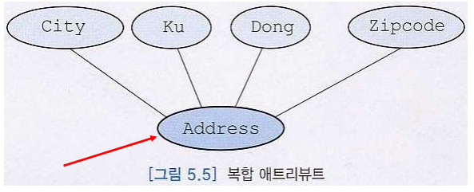
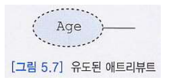
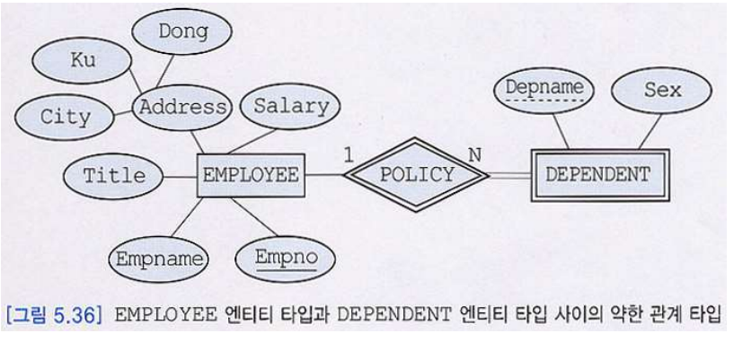
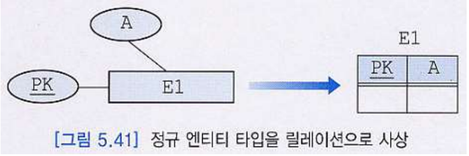
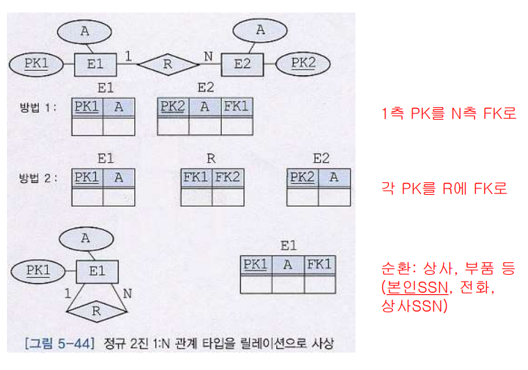

# Part 1 기본 개념

#### Database 설계

- Database 전체에 대한 체계 (뼈대)를 확립하는 일
- Database 설계자는 Database 전반 (시스템, 프로그래밍, 유지보수)에 걸쳐 높은 역량을 가진 기획 전문가로서 다음의 일을 수행함
  - 기획, 디자인(ex. 스키마 디자인, 기술적 디자인), 구현 책임, 유지보수
- Database 설계자가 갖추어야 하는 선행 능력
  - 업무, 일의 환경을 이해하고 적용하는 능력
  - Database 시스템 환경 구축 능력
  - 능숙한 Database 프로그래밍 능력
  - Data 운영 시 발생할 수 있는 미래를 정확히 예측하는 능력 (Data 양, 종류 등)

#### ER Model

- ER Model이란?
  - 초기, 고수준(개념적) Database 설계를 표현하는데 사용하는 Model
  - **ER Model**은 실세계를 (1) 엔티티 (Entity), (2)애트리뷰트 (Attribute), (3) 엔티티들 간의 관계성으로 표현한다. 
  - ER Model은 **ER Diagram**으로 표현한다. 
    - (1) 엔티티 타입, (2) 관계 타입, (3) 이들의 애트리뷰트들을 그래픽하게 표현
  - 최종적으로, ER Model은 **관계 Data Model**로 쉽게 바꿀 수 있다. 
- ER Model의 장점
  - (1) 개념적 설계를 위한 인기 있는 Model임
  - (2) 높은 수준으로 추상화함
  - (3) 이해하기 쉬움
  - (4) 구문들의 표현력이 뛰어남
  - (5) 사람들이 응용에 대해 생각하는 방식과 가까움
  - (6) 많은 CASE 도구들에서 지원됨

#### Database 설계

- 개념적 Database 설계와 물리적 Database 설계로 구분할 수 있음
  - **개념적 Database 설계**는 실제로 Database를 “어떻게 구현할 것인가” 와는 독립적이며 정보 사용의 Model을 개발하는 과정
  - **물리적 Database 설계**에서는 물리적인 저장 장치(disk 등)와 접근 방식(access path)(index)을 다룸
- 개념적 Database 설계 과정에서 조직체(실세계)의 엔티티, 관계, 프로세스, 무결성 제약조건 등을 나타내는 **추상화 Model**을 구축
  - **엔티티**는 서로 구분이 되면서 조직체에서 Database에 나타내려는 객체(사람, 장소, 사물 등)를 의미
  - **관계**는 두 개 이상의 엔티티들 간의 연관을 나타냄 (ex. 1:n, n:m)
  - **프로세스**는 관련된 활동을 나타냄 (ex. 전체참여, 부분참여)
  - **무결성 제약조건**은 Data의 정확성과 비즈니스 규칙을 의미
- 개념적 설계의 최종 산출물
  - 물리적인 구현을 고려하지 않는, **한 조직의 개념적 Schema**

#### 개념적 수준의 Model이란?

- 특정 Data Model과 독립적으로(상관없이), 응용 세계를 모델링할 수 있도록 하는 **일반적 방법론**
- 인기 있는 개념적 수준의 Model은 **엔티티-관계**(ER: Entity-Relationship) Model이 있음
- Database 구조나 Schema 를 하향식 (Top-Down) 으로 개발할 수 있기 위한 틀(framework)을 제공함.
- 컴퓨터에서 Data를 표현하거나 검색하는 것과 같이 **구체적인 것은 거의 고려하지 않음**. 
- ER Model과 같은 개념적인 Data Model이 사상될 수 있는, 다수의 구현 Data Model(“ER -> 구현”으로 바꿔주는 Model) 이 존재함
- 구현 단계에서 사용되는 3 가지 Data Model
  - (1) **관계 Data Model**, (2) 계층 Data Model, (3) 네트워크 Data Model

# Part 2 Database 설계 개요

#### Database 설계의 개요 (=schema 설계)

- 한 조직체의 운영과 목적을 지원하기 위해 Database를 생성하는 과정

- 주요 **목적**은 모든 주요 응용과 사용자들이 요구하는 Data, Data 간의 관계를 표현하는 것

- 훌륭한 Database 설계?

  - **시간**의 흐름에 따른 Data의 모든 측면을 나타낸다.

  - Data 항목의 **중복을 최소화**한다.

  - Database에 대한 **효율적인 접근**을 제공한다. (ex. 인덱스)

  - Database의 **무결성**을 제공한다. -> 깔끔하고 일관성이 있다.

  - **이해**하기 쉬워야 한다.

    

#### Database 설계의 주요 단계

-  Database 설계는 다음의 단계로 이루어 진다. 

1. 요구사항 수집 및 분석

2. 개념적 설계

3. DBMS의 선정

   ex. relational, hierarchical, network 어떤 dbms 쓸건지

4. 논리적 설계

   ex. 스키마 설계

5. 물리적 설계

   ex. 어떤 디스크 위치에 저장, 인덱스 유무

6. Transaction 설계 (응용 프로그래밍 고려 단계)

7. (추가-생략가능) 튜닝 등 기타 여러 작업

- 일반적으로, Database 설계의 완성도를 높이기 위해서 이런 작업들을 앞뒤로 왔다 갔다 할 필요가 있음 (2, 4, 5 반복)

- 한 작업에 대한 결정은 다른 작업에 영향을 미침

  - 그러나 논리적 설계가 바뀐다고 해서 꼭 물리적 설계가 바뀌는 것은 아님

  

##### 1. 요구사항 수집과 분석 단계

- 요구사항을 **수집**하고, 의견들을 **평가**하고 **조정**함
- 요구사항을 수집하기 위해서, 흔히 **기존의 문서를 조사**하고, 인터뷰나 설문 조사 등이 시행됨
  - **인터뷰**는 요구사항 수집을 위해 가장 흔히 사용됨. 일반적으로 가장 유용한 방식
  - **설문조사**는 자유롭게 의견을 적어내도록 하는 방식과 주어진 질문에 대해서만 답을 하는 방식으로 구분
- 요구사항에 관한 지식을 기반으로 다음 사항을 결정함
  - (Entity) 관련 있는 **엔티티들을 선정**함 (ex. 학생, 교수)
  - (Attribute) 이들(엔티티들)의 **애트리뷰트**들이 무엇인가를 결정함 (ex. 학생은 나이, 성별, 학번 속성을 가짐)
  - (Ralationship) 엔티티들 **간의 관계**가 무엇인가를 파악하고 적용함(ex. 학생과 교수 table은 어떤 관계인지)
- **Data 처리**에 관한 요구사항에 대하여
  - 적합한 연산들은 무엇인지를 결정함
  - 연산들의 의미가 명확한 것인지를 재분석함
  - 접근하는 Data의 양, 타입, 사용자, 결과, 예상되는 이상치(outlier) 등을 분석함

##### 2. 개념적 설계 단계

- 설계 결과는 **ER Diagram**으로 표현됨

  - 사용자들의 요구사항 명세로부터 개념적 Schema가 만들어짐
  - 본 단계의 결과물은 논리적 설계 단계의 입력으로 사용됨
  - **높은 추상화 수준**의 Data Model을 기반으로 정형적인 언어(도형)로 Data 구조를 명시함

- 대표적인 Data Model이 ER Model

- ER Model에서는

  (1) 엔티티 타입 정함

  (2) 관계 타입 정함

  (3) 애트리뷰트들을 결정함

  (4) 애트리뷰트들의 도메인 (= 타입, ex, 정수, 실수, 텍스트 등)을 결정함

  (5) 기본 키 와 (6) 후보 키 애트리뷰트들을 결정함

- 완성된 개념적 Schema(ER Schema)는 “**ER Diagram**”으로 표현됨

##### 3. DBMS 선정 단계

- 여러 가지 요인들을 검토한 후, 해당 업무에 **최적인 DBMS**를 선정함
  - **기술적**인 요인은 DBMS가 제공하는 Data Model, 저장 구조, 인터페이스, 질의어, 도구, 제공되는 서비스 등
  - **정치적**인 요인은 고수준의 전략적인 결정 등
  - **경제적**인 요인은 DBMS 구입 비용, 하드웨어 구입 비용, 유지 보수(서비스) 비용, 기존의 시스템을 새로운 DBMS에 맞게 변환하는데 소요되는 비용, 인건비, 교육비 등

##### 4. 논리적 설계 단계

- 설계 결과는 **해당 Database의 “Schema”**으로 표현됨

  - Database 관리를 위해 선택한 DBMS의 Data Model을 사용하여, **논리적 Schema(외부 Schema도 포함)를 생성**함

  - 개념적 Schema에 알고리즘 (변환 방법)을 적용하여, 논리적 Schema를 생성함

  - 논리적 Schema를 나타내기 위해, **관계 Data Model을 사용하는 경우**

    - ER Model로 표현된 개념적 Schema를 “**관계 Database Schema**”로 사상함

  - 관계 Database Schema를 더 좋은 관계 Database Schema로 변환하기 위해서, 

    -> **정규화 과정**을 적용함

  - Database 설계자가 요구사항 수집과 분석 후에 바로 논리적 설계 단계로 가는 경우가 있음

    -> 이런 경우에는, 흔히, 좋은 관계 Database Schema가 생성되지 않음

##### 5. 물리적 설계 단계

- 설계 결과는 **성능 향상**으로 나타남
  - 처리 요구사항들을 만족시키기 위해 시스템 (디스크) 저장 구조와 접근 경로(질의어 선택, 인덱스 선택) 등을 결정함
  - 성능상의 주요 기준은 몇 가지로 구분할 수 있음
    - **응답 시간:** 질의와 갱신이 평균적으로 또는 피크 시간 때 얼마나 오래 걸릴 것인가? 
    - **Transaction 처리율**: 1초당 얼마나 많은 Transaction들이 평균적으로 또는 피크 시간 때 처리될 수 있는가? 
    - **확장성**: 데이터의 양이 증가할 때 저장량의 확장 가능한가? 
    - **유연성**: 운영 중 데이터의 유형이 변하는 경우 대처가 가능한가? 
    - (중요하지 않음) 전체 Database에 대한 보고서를 생성하는데 얼마나 오래 걸릴 것인가?

##### 6. Transaction 설계 단계 (응용 Prog 고려 단계)

- 설계 결과는 여러 가지 “**흩어진 일들이 하나로 묶여진 프로그램 계획서 생성**”
  - 어떤 일들을 하나로 묶어서 프로그램을 작성할 것인지 결정하는 단계
  - 요구사항 수집과 분석 후에 Database 설계 과정과 별도로 Transaction 설계를 진행할 수 있음
    - **고객의 최종 필요성을 중심**으로 프로그래밍을 고려하는 레벨
  - Transaction은 완성될 Database에서 동작할 응용 프로그램
  - Database Schema는 Transaction에서 요구하는 모든 정보를 포함해야 함
  - 검색, 갱신, 입력, 출력 등의 유형으로 구분함

# Part 3 ER Model

1. attribute를 어떻게 표현할 것인지
2. entity를 어떻게 표현할 것이며 어떤 종류가 있는지
3. relation ship (엔티티들간의 관계)

### ER Model (상기 단계에서 2단계에 해당함)

- 초기의 고수준(개념적) Database 설계를 표현하는데 사용되는 Model
- ER Model은 쉽게 관계 Data Model로 사상됨
- Database 설계를 용이하게 하기 위해서 **P.P. Chen**이 1976년에 제안한 이후 점차 강화되었으며 현재 **EER**(Enhanced Entity Relationship) Model이 Database 설계 과정에 널리 사용되고 있음
- 기본적인 구문으로는 엔티티, 관계, 애트리뷰트가 있음
- 기타 구문으로는 카디날리티 비율, 참여 제약조건 등이 있음

### ER Model의 장점

1. **적은 노력**으로도 쉽게 배울 수 있음
2. 전문가가 아니어도 **이해하기 쉬움**
3. 자연어보다는 좀 더 **정형적**임
4. **구현에 독립적**이어서 Database 설계자들이 최종 사용자들과 **의사소통**을 하는데 적합함

### 기타

- ER Model을 기반으로 만들어진 다수의 CASE 도구(ex. **ERWin**, DataArchitect, PowerBuilder 등)
- 이런 도구들은 **ER 설계를 자동적**으로 Sysbase, Oracle, Infomix, DB2등의 **DDL로 자동 변환**됨
- ER 모델링은 현재는 Database 설계를 위한 다소 구형 그래픽 표기법으로 현재 대규모 기업의 Database 설계에서는 **UML**(Unified Modeling Language)을 사용

### 엔티티 (Entity)

- 하나의 엔티티는 **사람, 장소, 사물, 사건** 등과 같이 독립적으로 존재하면서 고유하게 식별이 가능한 실세계의 객체
- **사원**처럼 실체가 있는 것도 있지만 생각이나 개념과 같이 추상적인 것도 존재

### 엔티티 타입 (Entity Type, 속성의 집합을 "타입"이라고 명함)

- 엔티티 타입 : 관계 Model의 Relation의 내포(Schema) 에 해당함 (동일한 애트리뷰트들을 가진 엔티티들의 틀)
- 엔티티 집합 : 관계 Model의 Relation의 외연 (Instances, Tuples) 에 해당함 (동일한 애트리뷰트들을 가진 엔티티들의 모임)
- 엔티티들 : 엔티티 타입(또는 엔티티 집합)들에 따라 분류됨 (하나의 엔티티는 한 개 이상의 엔티티 집합에 속할 수 **있음**)
- 단 ER Diagram에서는 엔티티 타입과 엔티티 집합을 엄격하게 구분할 필요는 없음
- ER Diagram에서 엔티티 타입은 **직사각형**으로 나타냄

##### 강한 엔티티 타입

- 강한 엔티티 타입(정규 엔티티 타입)은 독자적으로 존재하며 엔티티 타입 내에서 자신의 키 애트리뷰트를 사용하여 **고유하게** 엔티티들을 식별할 수 있는 엔티티 타입을 의미

##### 약한 엔티티 타입

- 약한 엔티티 타입은 키를 형성하기에 충분한 애트리뷰트들을 갖지 못한 엔티티 타입
- 약한 엔티티 타입이 존재하려면 **소유 엔티티 타입**이 있어야 함
- 강한 엔티티 타입이 소유 엔티티 타입이 될 수 있음
- **강한 소유 엔티티 타입의 키 애트리뷰트를 결합해야만** 고유하게 약한 엔티티 타입의 엔티티들을 식별할 수 있음

### 애트리뷰트

- **하나의 엔티티는 연관된 애트리뷰트들의 집합으로 설명됨**

  ex. 사원 엔티티는 사원번호, 이름, 직책, 급여 등의 애트리뷰트를 가짐

- 한 애트리뷰트의 도메인은 그 애트리뷰트가 가질 수 있는 모든 가능한 값들의 집합을 의미

  ex. 사원번호는 1000부터 9999까지의 값을 가짐

- 여러 애트리뷰트가 동일한 도메인을 공유할 수 있음

  ex. 사원번호와 부서번호가 네 자리 정수를 가질 수 있음

- 키(key) 애트리뷰트는 한 애트리뷰트 또는 애트리뷰트들의 모임으로서 한 엔티티 타입 내에서 각 엔티티를 고유하게 식별함

- ER Diagram에서 **기본 키(Primary Key)에 속하는 애트리뷰트는 밑줄을 그어 표시함**

- 애트리뷰트는 요구사항 명세에서 명사나 형용사로 표현됨

- 엔티티와 애트리뷰트의 차이점은 엔티티는 독립적인 의미를 갖는데 반해서 애트리뷰트는 **독립적인 의미를 갖지 않는다**는 것

- ER Diagram에서 애트리뷰트는 **타원형으로 나타냄**

- 애트리뷰트와 엔티티 타입은 **실선으로 연결*

#### 단순 애트리뷰트

- 더 이상 **다른 애트리뷰트로 나눌 수 없는** 애트리뷰트

- ER Diagram에서 실선 타원으로 표현함

- ER Diagram에서 대부분의 애트리뷰트는 단순 애트리뷰트

  

#### 복합 애트리뷰트

- **두 개 이상**의 애트리뷰트로 이루어진 애트리뷰트

- 동일한 엔티티 타입이나 관계 타입에 속하는 애트리뷰트들 중에서 밀접하게 연관된 것을 모아놓은 것

  

#### 단일 값 애트리뷰트

- 각 엔티티마다 **정확하게 하나의 값**을 갖는 애트리뷰트

- 단일 값 애트리뷰트는 ER Diagram에서 단순 애트리뷰트와 동일하게 표현됨

  ex. 사원의 사원번호 애트리뷰트는 어떤 사원도 두 개 이상의 사원번호를 갖지 않으므로 단일 값 애트리뷰트

  ex. 사람 엔티티의 Age

- ER Diagram에서 대부분의 애트리뷰트는 단순 애트리뷰트

#### 다치 애트리뷰트

- 각 엔티티마다 **여러 개의 값**을 가질 수 있는 애트리뷰트

  ex. 사람 엔티티의 College_degree : 고졸, 학사, 석사, 박사 

- ER Diagram에서 이중선 타원으로 표현함

  

#### 저장된 애트리뷰트

- 다른 애트리뷰트와 연관성 없이 **독립적으로 존재**하는 애트리뷰트

  ex. 사원 엔티티 타입에서 사원 이름, 급여는 다른 애트리뷰트와 연관 관계가 없이 독립적으로 존재하므로 저장된 애트리뷰트에 속함

  ex. 시, 도 등은 주소 애트리뷰트와 연관되어 독립적으로 존재하지 않으므로 저장된 애트리뷰트에 속하지 않음

- ER Diagram에서 대부분의 애트리뷰트는 저장된 애트리뷰트

- ER Diagram에서 단순 애트리뷰트와 동일하게 표현됨

#### 유도된 애트리뷰트

- 다른 애트리뷰트의 **값으로부터 얻어진** 애트리뷰트

  ex. 주민번호 기록 시 나이라는 정보 얻어낼 수 있음

- 유도된 애트리뷰트는 관계 Database에서 Relation의 애트리뷰트로 **포함시키지 않는 것이 좋음**

- ER Diagram에서 점선 타원으로 표현함

  

### 약한 엔티티 타입

- 약한 엔티티 타입은 키를 형성하기에 충분한 애트리뷰트들을 갖지 못한 엔티티 타입

- 약한 엔티티 타입에게 키 애트리뷰트를 **제공**하는 엔티티 타입을 **소유(강한)** 엔티티 타입(Owner entity type) 또는 **식별** 엔티티 타입(Identifying entity type)이라고 부름

- ER Diagram에서 약한 엔티티 타입은 **이중선** 직사각형으로 표기

- 약한 엔티티 타입의 **부분 키는 점선** 밑줄을 그어 표시

- 부분 키(partial key)

  부양가족의 이름처럼 한 사원에 속한 부양가족 내에서는 서로 다르지만 회사 전체 사원들의 부양가족들 전체에서는 같은 경우(ex. 여러명의 김철수)가 생길 수 있는 애트리뷰트

  

### 관계와 관계 타입

- 관계는 엔티티들 사이에 존재하는 **연관이나 연결**로서, 두 개 이상의 엔티티 타입들 사이의 **사상(mapping)**으로 생각할 수 있음

- 관계 집합은 동질의 관계들의 집합

- 관계 타입은 동질의 관계들의 틀

- 요구사항 명세에서 흔히 **동사**는 ER Diagram에서 관계로 표현됨

- ER Diagram에서 **다이어몬드**로 표기

- 관계 타입이 서로 연관시키는 엔티티 타입들을 관계 타입에 **실선**으로 연결함

- 관계 집합과 관계 타입을 엄격하게 구분할 필요는 없음

  

#### 관계의 애트리뷰트

- 관계 타입은 관계의 **특징을 기술**하는 애트리뷰트들을 가질 수 있음

- 관계 타입은 키 애트리뷰트를 갖지 않음

  

#### 차수(degree)

- 관계의 차수는 관계로 연결된 **엔티티 타입들의 연관 개수**를 의미

- 실세계에서 가장 **흔한** 관계는 두 개의 엔티티 타입을 연결하는 **2진 관계**

  

#### 카디날리티 비율(첫 번째 제약 조건)

- 카디날리티 비율은 **한 엔티티가 참여할 수 있는 관계의 수**를 나타냄
- 관계 타입에 참여하는 엔티티들의 가능한 조합을 제한함
- 관계를 흔히 1:1, 1:N, M:N으로 구분
- 카디날리티에 관한 정보는 간선 위에 나타냄

##### 1:1 관계

- E1의 각 엔티티가 정확하게 E2의 한 엔티티와 연관되고 E2의 각 엔티티가 정확하게 E1의 한 엔티티와 연관되면 이 관계를 1:1 관계라고 함

  ex. 각 사원에 대해 최대 한 개의 PC가 있고 각 PC에 대해 최대 한 명의 사원이 있으면 고유 사원과 고유 PC간의 관계는 1:1 관계(PC 단독 사용)

##### 1:N 관계

- E1의 각 엔티티가 E2의 임의의 개수의 엔티티와 연관되고 E2의 각 엔티티는 정확하게 E1의 한 엔티티와 연관되면 이 관계를 1:N 관계라고 함

  ex. 각 사원에 대해 최대 한 대의 PC가 있고 각 PC에 대해 여러명의 사원들이 있으면 고유 PC와 여러 사원 간의 관계는 1:N 관계 (PC 같이 사용)

##### M:N 관계

- 한 엔티티 타입에 속하는 임의의 개수의 엔티티가 다른 엔티티 타입에 속하는 임의의 개수의 엔티티와 연관되면 이 관계를 M:N 관계라고 함

  ex. 각 사원에 대해 여러 대의 PC가 있고 각 PC에 대해 여러 명의 사원들이 있으면 여러 사원과 공용 PC 간의 관계는 M:N 관계

##### 카디날리티 비율의 최소값과 최대값

- ER Diagram에서 관계 타입과 엔티티 타입을 연결하는 실선 위에 *(min, max)* 형태로 표기 (max값만 표시)

- 어떤 관계 타입에 참여하는 각 엔티티 타입에 대하여

  - min은 이 엔티티 타입 내의 각 엔티티는 적어도 min 번 관계에 참여함을 의미
  - max는 이 엔티티 타입 내의 각 엔티티는 최대한 max 번 관계에 참여함을 의미

- **min = 0** 은 어떤 엔티티가 반드시 관계에 참여해야할 필요는 없음을 의미

- **max = *** 는 어떤 엔티티가 관계에 임의의 수만큼 참여할 수 있음을 의미

  

​	

- CAR과 SALESREP는 1:N 관계
- CAR과 CUSTOMER는 1:N 관계
- CUSTOMER과 SALESREP는 M:N 관계

#### 역할

- 관계 타입의 **의미를 명확하게 하기 위해** 사용됨
- 특히 하나의 관계 타입에 하나의 엔티티 타입이 여러 번 나타나는 경우에는 반드시 역할을 표기해야 함
- 관계 타입의 **간선 위**에 표시

#### 전체 참여와 부분 참여(두번째 제약 조건)

- 전체 참여는 어떤 관계에 엔티티 타입 **E1의 모든 엔티티들이** 관계 타입 R에 의해서 어떤 엔티티 타입 **E2의 어떤 엔티티**와 연관되는 것을 의미

  ex. 모든 EMPLOYEE는 WORKS_FOR라는 관계에 반드시 참여

- 부분 참여는 어떤 관계에 엔티티 타입 **E1의 일부 엔티티만** 참여하는 것을 의미

  ex. 모든 EMPLOYEE가 항상 MANAGES라는 관계에 참여하는 것은 아님

- 약한 엔티티 타입은 항상 관계에 전체 참여

  ex. 부양가족은 POLICY라는 관계에 전체 참여해야 됨

- **전체 참여**는 ER Diagram에서 **이중 실선**으로 표시

- 카디날리티 비율과 함께 참여 제약조건은 관계에 대한 중요한 제약조건

  

##### 다중관계

- 두 엔티티 타입 사이에 **두 개 이상**의 관계 타입이 존재할 수 있음

  

##### 순환적 관계

- 하나의 엔티티 타입이 동일한 관계 타입에 두 번 이상 참여하는 것

  

#### +추가사항

- 관계는 일반적으로 독자적으로 존재할 수 없지만 엔티티 타입과 관계타입을 절대적으로 구분하는 것은 어려움

### Database 설계 과정

1. 응용의 요구사항을 **수집**하여 기술
2. 사전 결정 사항
   - 응용과 연관이 있는 **엔티티 타입**들을 식별하여 결정
   - 응용과 연관이 있는 **관계 타입**들을 식별하여 결정
   - 관계가 **1:1, 1:M, 1:N** 중에서 어느 것에 해당하는 지 결정
3. (응용을 위한) ER Schema Diagram을 작성
   - **엔티티 타입에 필요한 애트리뷰트들**을 식별하여 그림을 그리고
   - **관계 타입들에 필요한 애트리뷰트들**을 식별하여 그림을 그리고
   - 각 애트리뷰트가 가질 수 있는 값들의 집합을 고려하여 **카더널리티와 참여 방법의 관계성**을 적음
   - 애트리뷰트들 중에서 엔티티 타입들을 위한 **기본 키**를 식별
4. ER Schema Diagram이 **응용에 대한 요구사항에 부합**되는지 최종 검사한다.
5. ER Schema Diagram을 각종 DBMS에서 사용되는 Database Model로 변환한다.

### ER 표기법의 요약

# Part 4 Database 설계 사례

### 기업에서 흔히 볼 수 있는 작은 세계에 관한 요구사항

- 회사에서는 다수의 사원들이 **재직하며** 각 ***<u>사원(Employee)</u>***에 대해서 사원번호(고유), 이름, 직책, 급여, 주소(시, 구, 동으로 세분)를 저장

  

- 각 사원은 0명 이상의 ***<u>부양가족(Dependent)</u>***을 가질 수 있는 정책(**Policy 관계성**)이 있음

  - 한 부양가족은 두 명 이상의 사원에게 속하지 않음, 각 부양가족에 대해서 부양가족의 이름과 성별을 저장

  

- 회사는 여러개의 ***<u>프로젝트(Project)</u>***를 진행

  - 각 프로젝트에 대해서 프로젝트 번호(고유), 이름, 예산, 프로젝트가 진행되는 위치를 나타냄

    

  - 한 프로젝트는 **여러 위치**에서 진행될 수 있음(다치 애트리뷰트)

  - 각 프로젝트마다 여러 명의 사원들이 일함(1:N), 각 사원은 여러 프로젝트에서 근무할 수 있음(1:N) -> **Work For관계성 존재**

  - 각 사원이 해당 프로젝트에서 **어떤 역할**을 수행하고 **얼마 동안 근무**해 왔는가를 나타냄

  - 각 프로젝트마다 한 명의 프로젝트 관리자가 있음(**Manage 관계 타입 필요**)

  - 한 사원은 두개 이상의 프로젝트의 관리자가 될 수는 없음(1:1)

  - 프로젝트 관리자 임무를 시작한 날짜를 기록(**관계가 발생한 날이므로 관계타입에 표기**)

  - 프로젝트에서 사용되는 **부품**, 그 부품과 **공급자**가 긴밀한 관계가 있음

  

- 각 사원은 한 ***<u>부서(Department)</u>***에만 속함(**Belong 관계성**)

  - 각 부서에 대해서 부서번호(고유), 이름, 부서가 위치한 층을 나타냄

  

- 각 프로젝트에는 ***<u>부품(Part)</u>***들이 필요

  

  - 한 부품이 두개 이상의 **프로젝트**에서 사용될 수 있음
  - 하나의 부품은 다른 여러 개의 부품들로 이루어질 수 있음
  - 각 부품에 대해서 부품번호(고유), 이름, 가격과 그 부품이 다른 부품을 포함하는 경우에는 그 부품들에 관한 정보(**공급자 정보** 등)도 나타냄

- 각 부품을 공급하는 ***<u>공급자(Supplier)</u>***들이 있음

  

  - 한 명의 공급자는 **여러가지 부품들을 공급(Supply 관계성)**할 수 있고 각 부품은 여러 공급자들로부터 공급될 수 있음

  - 각 공급자에 대해서 공급자 번호(고유), 이름, 신용도를 나타냄

  - 각 공급자에 대해서 그 공급자가 어떤 부품을 어떤 **프로젝트**에 얼마나 공급하는가를 나타냄

    

### 관계와 애트리뷰트들을 식별

# Part 5 ER Schema를 관계 Model의 Relation으로 사상

### ER Schema를 관계 Model의 Relation으로 사상

- 논리적 설계 단계에서는 ER Schema를 관계 Data Model의 Relation들로 사상함

- ER Schema에는 엔티티 타입과 관계 타입이 존재하지만 관계 Database에는 엔티티 타입과 관계 타입을 **구분하지 않고** Realtion들만 있음

- Relation으로 사상할 대상이 ER Schema에서 

  엔티티 타입인지 또는 관계 타입인지 

  엔티티 타입이라면 정규 엔티티 타입인지 또는 약한 엔티티 타입인지 

  관계 타입이라면 2진 관계 타입인지 3진 이상의 관계 타입인지 

  애트리뷰트가 단일 값 애트리뷰트인지 또는 다치 애트리뷰트인지 

  등에 따라 사상하는 방법이 달라짐

- ER Model을 Relation들로 사상하는 7개의 단계로 이루어진 알고리즘

  

### ER-관계 사상 알고리즘

##### 단계 1 : 정규 엔티티 타입과 단일 값 애트리뷰트

- ER Schema의 각 정규 엔티티 타입 E에 대해 하나의 Relation R을 생성함

- E에 있던 단순 애트리뷰트들을 Relation R에 모두 포함시킴

- E에서 복합 애트리뷰트는 그 복합 애트리뷰트를 구성하는 단순 애트리뷰트들만 Relation R에 포함시킴 

  ex. Adress를 구성하는 city, gu, dong 제외하고 Adress만 R로 구성

- E의 기본 키가 Relation R의 기본 키가 됨

  

  

##### 단계 2 : 약한 엔티티 타입과 단일 값 애트리뷰트

- ER Schema에서 소유 엔티티 타입 E를 갖는 각 약한 엔티티 타입 W에 대하여 Relation R을 생성함

- W에 있던 모든 단순 애트리뷰트들을 Relation R에 포함시킴

- 소유 엔티티 타입 E에 해당하는 Relation의 기본 키를 약한 엔티티 타입 W에 해당하는 Relation에 외래 키로 포함시킴

- 약한 엔티티 타입 W에 해당하는 Relation의 **기본키**는

  - 약한 엔티티 타입 **W의 부분키**와

  - 소유 엔티티 타입 E의 Relation을 참조하는 **외래 키의 조합**으로 이루어짐

    

##### 단계 3 : 2진 1:1 관계 타입

- ER Schema의 각 2진 1:1 관계 타입 R에 대하여 R에 참여하는 엔티티 타입에 대응되는 Relation S와 T를 찾음

- S와 T중에서 한 Relation을 선택함, 만일 S를 선택했다면 T의 기본 키를 S에 외래 키로 포함시킴

- 가능한, S와 T 중에서 관계 타입에 완전하게 참여하는 Relation을 S의 역할을 하는 Relation으로 선택함

- 관계 타입 R이 가지고 있는 **모든 단순 애트리뷰트**(복합 애트리뷰트를 갖고 있는 경우에는 복합 애트리뷰트를 구성하는 단순 애트리뷰트)들을 S에 대응되는 Relation에 포함시킴

- 두 엔티티 타입 **S, T가 관계 타입 R에 완전하게 참여**할 때는 **두 엔티티 타입과 관계 타입을 하나의 Relation**으로 합치는 방법도 가능함

  

  

  

##### 단계 4 :정규 2진 1:N 관계 타입

- 정규 2진 1:N 관계 타입 R에 대하여
  - N측의 참여 엔티티 타입에 대응되는 Relation S측을 찾고
  - 1측의 참여 엔티티 타입에 대응되는 Relation T측을 찾음
- 정규 2진 1:N 관계 타입 R에 참여하는 **1측인 T의 기본 키**를 **N측인 S에 외래 키**로 포함시킴 (즉, N측인 S를 중심으로 1측인 T의 기본 키를 영입)
  - 반대로 N측의 Relation S의 기본 키를 1측의 Relation T에 외래 키로 포함시키면 애트리뷰트에 값들의 집합이 들어가거나 **정보의 중복**이 많이 발생함
- 관계 타입 R이 가지고 있는 모든 단순 애트리뷰트(복합 애트리뷰트를 갖고 있는 경우에는 복합 애트리뷰트를 구성하는 단순 애트리뷰트)들을 N측의 Relation S에 해당하는 Relation에 포함시킴

##### 단계 5 : 2진 M:N 관계 타입

- 2진 M:N 관계 타입 R에 대해서는 Relation R을 생성함

- 참여 엔티티 타입에 해당하는 Relation들의 기본 키를 Relation R에 외래 키로 포함시키고 **이들의 조합**이 Relation R의 **기본 키**가 됨

- 관계 타입 R이 가지고 있는 모든 단순 애트리뷰트(복합 애트리뷰트를 갖고 있는 경우에는 복합 애트리뷰트를 구성하는 단순 애트리뷰트)들을 Relation R에 포함시킴

  

##### 단계 6 : 3진 이상의 관계 타입

- 3진 이상의 각 관계 타입 R에 대하여 Relation R을 생성함

- 관계 타입 R에 참여하는 모든 엔티티 타입에 대응되는 Relation들의 기본 키를 Relation R에 외래 키로 포함시킴

- 관계 타입 R이 가지고 있는 모든 단순 애트리뷰트(복합 애트리뷰트를 갖고 있는 경우에는 복합 애트리뷰트를 구성하는 단순 애트리뷰트)들을 Relation R에 포함시킴

- 일반적으로 **외래 키들의 조합이 Relation R의 기본키**가 됨

- 관계 타입 R에 참여하는 엔티티 타입들의 카디날리티가 1:N:N 이면 카디날리티가 **1인 Relation의 기본 키를 참조하는 외래 키**가 Relation R의 기본 키가 됨

  

  

##### 단계 7 : 다치 애트리뷰트

- 각 다치 애트리뷰트에 대하여 Relation R을 생성함

- 다치 애트리뷰트에 해당하는 애트리뷰트를 Relation R에 포함시키고 다치 애트리뷰트를 애트리뷰트로 갖는 엔티티 타입이나 관계 타입에 해당하는 Relation의 기본 키를 Relation R의 외래 키로 포함시킴

- Relation R의 기본키는 **다치 애트리뷰트와 외래 키**의 조합

  

### Database 설계 사례에 알고리즘 적용

##### 단계 1 : 정규 엔티티 타입과 단일 값 애트리뷰트

##### 단계 2 : 약한 엔티티 타입과 단일 값 애트리뷰트

##### 단계 3 : 2진 1:1 관계 타입

##### 단계 4 :정규 2진 1:N 관계 타입

##### 단계 5 : 2진 M:N 관계 타입

##### 단계 6 : 3진 이상의 관계 타입

##### 단계 7 : 다치 애트리뷰트

