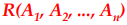
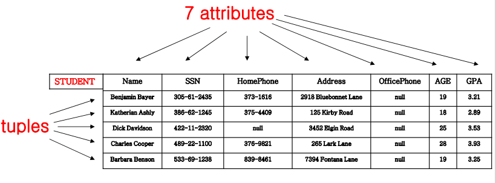
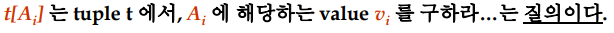
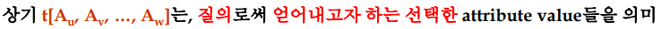
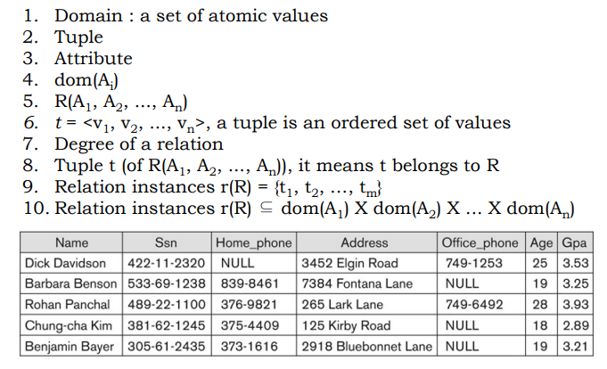
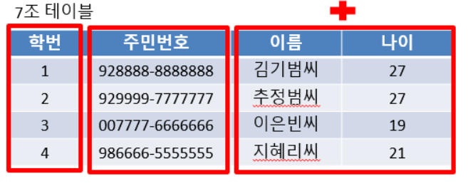
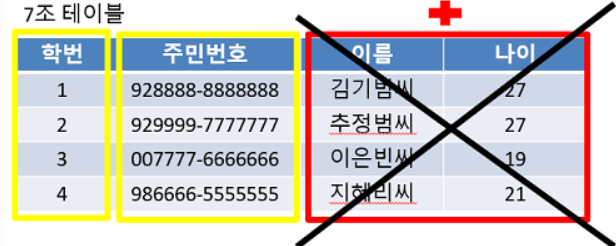
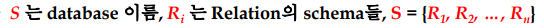
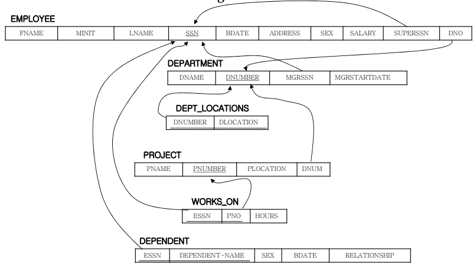

# 1. 관계형 모델의 개념

- 데이터의 관계 모델은 관계 개념을 기반으로 한다.

  - 데이터 관리에 대한관계형 접근 방식의 강점은 관계 이론에 의해 제공되는 공식적인 기초에서 비롯된다.

- 우리는 이 장에서 **공식적인 관계 모델**의 필수 요소를 검토함

- 형식 모델과 실제 모델 사이에는 몇 가지 중요한 차이점이 있다.

- 관계는 집합의 개념에 기초한 수학적 개념이다.

- 관계형 모델을 1970년 IBM Research의 Dr. E.F Codd에 의해 다음 논문에서 처음 제안되었다.

  "A Relational Model for Large Shared Data Banks," Communications of the ACM, June 1970

#### (Informally) Relation 정의

- 튜플의 테이블
- 테이블의 **각 열**에는 **애트리뷰트 라는 열 머리글**이 있음
- **각 행**을 **튜플**이라고 한다.

#### 정형화된 관계형 개념 (Formal Relational Concepts)

- 도메인 : 원자(분할할 수 없는) 값 집합
- 애트리뷰트
  - 도메인이 특정 관계에서 수행하는 의미를 나타내는 이름
  - 각 애트리뷰트 Ai는 도메인을 가지고 있다
- **관계 스키마**
  - 관계를 정의하는 관계 이름 R과 Ai 애트리뷰트들의 집합
  - 

#### 정의 요약

| Informal Terms             | Formal Terms          |
| -------------------------- | --------------------- |
| Table                      | Relation              |
| Column Header              | Attribute             |
| All possible Column Values | Domain                |
| Row                        | Tuple                 |
| Table Definition           | Schema of a Relation  |
| Populated Table            | State of the Relation |

#### 예시

- 릴레이션 "STUDENT"의 애트리뷰트들과 튜플들

- 열 머리글 : a sequence of attribute

- 각 행들 : a sequence of attribute value

  

# 2. 릴레이션의 특징

- 릴레이션 r(R)에 있는 **tuple들의 순서는 의미 없음**

  튜플이 표 형식으로 나타나더라도 순서가 지정된 것으로 간주되지 않음

- 릴레이션 스키마 **R에 있는 attribute들의 순서는 중요함** (이와 연동되어 확장된 각 tuple들 안에 있는 value들의 순서)

- 한 튜플 내에 있는 각 value들

  - 더이상 나뉘지 않음(**atomic**)
  - 특수 null 값은 "1. **알 수 없거나** 2. **특정 튜플에 적용되지 않음**"의 값을 나타내는 데 사용됨

- 표현 방법

- 

  

#### 정의 요약

# 3. 관계형 무결성 제약 조건

- **Constraints**(지켜져야 하는 조건들) : **모든 유효한 관계 인스턴스**에서 유지되어야 하는 조건이다.
- 3가지 중요한 제약조건
  1. **Key** constraints(키) : key를 꼭 가져야 한다.
  2. **Entity integrity** constraints(엔티티 무결성) : key가 Null이 되어서는 안된다.
  3. **Referential integrity** constraints(참조 무결성) : (부르는) R1에 있는 FK attribute 값은 (불리워지는) R2 안에 나타난 PK attribute 값만 가져야 한다.

#### (1) Key 제약 조건 : (candidate key)를 가져야 한다는 조건

- **R의 슈퍼키**

  유효한 관계 인스턴스 r(R)의 두 튜플이 SK에 대해 **동일한 값을 가지지 않도록** 하는 R의 속성 SK 집합

  

  

- **R의 후보키**

  - 최소화된 슈퍼키를 말한다.

  - 즉 슈퍼키를 구성하는 애트리뷰트 중 하나라도 빼면 키의 역할을 못하는 최소한의 키를 후보키라고 한다

  - 

    

- 만약 어떤 관계가 여러 개의 후보 키를 가지고 있다면 주 키가 임의로 선택된다.

- 기본 키 속성은 밑줄로 표시

- 슈퍼키, 후보키, 프라이머리키, 대체키

#### (2) Entity Integrity 제약조건

- 관계형 데이터 베이스 스키마

  

- **엔티티 무결성 : key가 null이 되어서는 안된다.**

  - S에 있는 각 관계 스키마 R의 기본 키 특성 PK는 r(R)의 튜플에 null 값을 가질 수 없다
  - 기본 키 값이 개별 튜플을 식별하는데 사용되기 때문

- 키가 아닐지라도 null이 되지 않도록 해주어야 함

  - 비록 그것들이 주 키가 아니더라도 R의 다른 애트리뷰트도 마찬가지로 null값을 허용하지 않도록 제약될 수 있음

  ​	

#### (3) Referential Integrity 제약조건

- 개요 : 참조 관계 R1의 튜플에는 참조 관계 R2의 기본 키 속성 PK를 참조하는 속성 FK(외부 키)가 있음

  -> (부르는) R1에 있는 외래 키 값은 (불리워지는) R2 안에 나타난 주키 값 만을 가져야 한다.

- 목적 : 두 관계에서 튜플 간의 관계를 지정하는 데 사용

- 제약 조건의 범위(두 테이블 간) : 두가지 관계가 얽혀 있는 제약

- 스키마 표현 방법 : 참조 무결성 제약 조건은 관계형 데이터 베이스 스키마에 호로 표시될 수 있음

  

# 4. 릴레이션에 대한 갱신 연산

- 종류
  - INSERT a tuple
  - DELETE a tuple
  - MODIFY a tuple
- 제약 조건 :  무결성 제약조건은 업데이트 연산자에 절대 위배되어서는 안된다
- 갱신 시 여러 개의 연관된 update operation들은 반드시 그룹을 지어 **한번에 갱신되어져야 한다.**
  - 관계들 간에 **외래키로 연결되어 있다면 한번에 연속적으로 갱신**이 이루어져야 된다는 것
- 갱신의 영향 범위 : 연관된 data들은 **자동적으로 모두 변경**되어야 integrity가 유지된다
- **데이터 무결성을 위반** 시 몇가지 조취를 취할 수 있다.
  - 위반을 유발하는 **작업을 취소**한다
  - 작업을 수행하되 사용자에게 위반 **사실을 알린다**
  - 위반이 수정되도록 **추가적인 업데이트 trigger**
  - **사용자** **지정 오류 수정** 루틴 실행