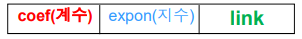
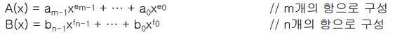

## 7. 헤더 노드

- ##### 기존의 연결리스트 처리 알고리즘

  - 첫 번째 노드나 마지막 노드 그리고 리스트가 공백인 경우를 예외적인 경우로 처리해야함

- ##### 헤더 노드 추가

  - 예외 경우를 제거하고 코드를 간단하게 하기 위한 방법
  - 연결 리스트를 처리하는 데 필요한 정보를 저장 (ex. 리스트의 길이)
  - 헤더 노드의 구조가 리스트의 노드 구조와 같을 필요는 없음
  - 헤더 노드에는 필요 정보를 저장
    1. 리스트의 첫번째 노드를 가리키는 포인터
    2. 리스트의 길이
    3. 마지막 노드를 가리키는 포인터 등

- ##### 헤더 노드를 가진 연결 리스트의 정의

  ```c
  typedef struct listNode {
  	char data[5]; /* 리스트 노드 구조 */ 
  	struct listNode* link; 
  } listNode; 
  
  typedef struct {	/* 리스트 헤더 노드 구조 */ 
  	int length; /* 리스트의 길이(노드 수) */ 
  	listNode* head; /* 리스트의 첫 번째 노드에 대한 포인터 */ 
  	listNode* tail; /* 리스트의 마지막 노드에 대한 포인터 */
  } h_linkedList;
  
  void addLastNode(h_linkedList * H, char* x) { 
  /* 헤더 노드를 가진 연결 리스트의 끝에 원소 삽입 */
  } 
  void reverse(h_linkedList * H) { 
  /* 헤더 노드를 가진 연결 리스트의 원소를 역순으로 변환 */ 
  } 
  void deleteLastNode(h_linkedList * H) { 
  /* 헤더 노드를 가진 연결 리스트의 마지막 원소를 삭제 */ 
  } 
  void printList(h_linkedList * H) { 
  /* 헤더 노드를 가진 연결 리스트의 원소들을 프린트 */ 
  } 
  /* 기타 다른 함수 정의 */ 
  ```

- ##### 헤더 노드를 가진 연결 리스트 표현

  - 단순 연결 리스트
  - 원형 연결 리스트
  - 이중 연결 리스트
  - 이중 연결 원형 리스트

- 공백 리스트 : length가 0이고 head가 null, tail이 null인 헤더 노드로 표현

- 리스트 처리 알고리즘을 단순화 시키기 위해 모조 노드(dummy node)를 추가로 사용 (tail이 없음)

  - 모조 노드를 사용해 표현한 단순 연결 원형 리스트의 공백 리스트 구조
  - 모조 노드를 사용해 표현한 이중 연결 원형 리스트의 공백 리스트 구조


## 8. 다항식의 리스트 표현과 덧셈

- 단순 연결 리스트로 다항식을 표현

- 다항식은 일반적으로 0이 아닌 항들의 합으로 표현

- 각 항은 하나의 노드로 표현

- Polynomial term의 표현 : 하나의 node로 표현

  

- 타입선언

  ```c
  typedef struct poly_node * poly_pointer;
  typedef struct poly_node {
  	int coef;
  	int expon; 
  	poly_pointer link;
  };
  poly_pointer a, b, d, rear; 
  ```

- ##### 다항식의 덧셈, C(x) <- A(x) + B(x)

  - 순회 포인터 변수 p와 q를 사용 : 다항생 A와 B의 항들을 따라 순회하는 데 사용
  - p와 q가 가리키는 항들의 지수(exp) 관계에 따라 3가지 경우
    1. p.exp = p.exp : 지수가 같은 경우 덧셈 가능
       - 두 계수를 더해서 0이 아니면 새로운 항을 만들어 결과 다항식 C에 추가한다. 그리고 p와 q는 모두 다음 항으로 이동
    2. p.exp < p.exp : q 지수가 큰 경우 q만 결과 C로 나가고 q 증가
       - q가 지시하는 항을 새로운 항으로 복사하여 결과 다항식 C에 추가, 그리고 q만 다음 항으로 이동
    3. p.exp > p.exp : p 지수가 큰 경우 p만 결과 C로 나가고 p 증가
       - p가 지시하는 항을 새로운 항으로 복사하여 결과 다항식 C에 추가, 그리고 p만 다음 항으로 이동

- 다항식 덧셈(padd) 함수의 분석

  - 다음 두 다항식에서

    

  - Exponent 비교 (-> 지수의 비교 횟수 : O(m +n))

    - min{m, n} ≤ 비교횟수 ≤ m+n-1 
    - (m = n) 인 경우, 비교 횟수가 (m+n-1)이 된다. 
    - 그러므로, 최대 O (m+n)

  - Coefficient 덧셈 (-> 계수의 덧셈 : O(min{m, n}))

    - 0 ≤ 덧셈횟수 ≤ min{m, n} 
    - 지수가 같은 항이 없으면 덧셈은 없음, 덧셈은 항이 작은 쪽 기준으로 결정됨
    - 그러므로, 최대 O (min{m, n})

  - Polynomial d에 포함될 새로운 node의 생성 (-> 생성 횟수 : O(m+n))

    - Max{m, n} ≤ 생성횟수 ≤ m+n 
    - 한쪽이 길면, 긴 쪽 만큼 d가 길어짐, 최대인 경우는, 지수가 같은 항이 없는 경우
    - 그러므로, 최대 O (m+n) 

  - 최종 worst cast time complexity : O(m+n), 그러므로 최종 O(n)

    -  O (m+n) + O (min{m, n}) + O (m+n) = O (2n) + O (n) + O (2n) = O (5n), 그러므로 O(n)
