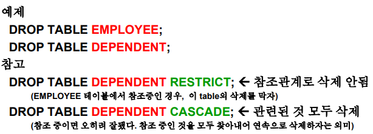
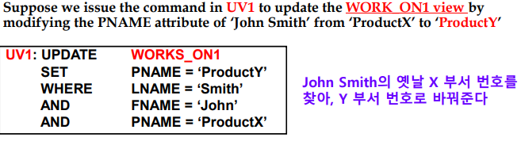
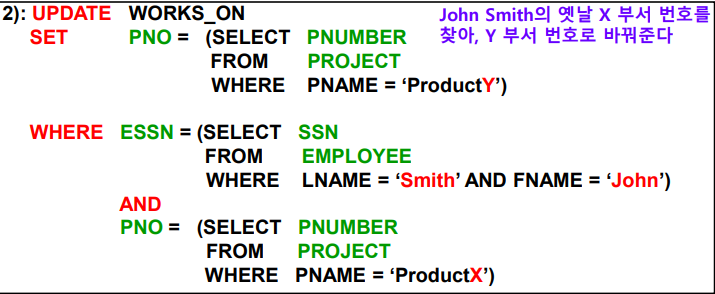

## 1. Basic SQL introduction

### Basic SQL

#### SQL language

- 관계형 데이터 베이스의 상업적 성공에 대한 주요 이유 중 하나로 고려됨

#### SQL

- SQL의 기원은 처음에 언어 "**SQUARE**"로 제안되었던 **튜플 미적분**이라고 불리는 관계형 술어 미적분학이다.
- 실제로 SQL은 논문에서 사용된 원래 용어인 챔버린과 보이스의 "SEQUEL TO SQUARE"에서 유래했다.
- 현재 일반적으로 "Structured Query Language(구조화된 쿼리 언어)"로 알려져 있다.
- SQL은 구문을 가진 관계형 데이터 모델의 비공식적 또는 실용적인 렌더링이다.

### SQL Data Definition, Data Types, Standards

#### Terminologies in SQL

- Table		Row		Column (관계형 모델 용어)

  Relation 	Tuple 	Attribute (SQL 용어)

#### CREATE statement

- 데이터 **정의**를 위한 기본 SQL 명령

#### language가 가지고 있는 특징 (교과서 내에서)

- 이 챕터는 데이터 정의, 데이터 조작을 보여줌
- 트랜잭션 제어 (20장)
- 인덱싱 (17장)
- 보안 사양 (허가 및 취소 30장)
- 데이터베이스 활성화 (26장)
- 멀티미디어 데이터베이스 (26장)
- 분산된 데이터 베이스 등 (23장)

### SQL Standards

- SQL은 많은 표준을 거쳤다.
  - SQL-86 또는 SQL-92 로 시작하는 것을 SQL-2라고 한다.
- SQL-1999의 최신 표준은 1. 코어사양 2. 특수 확장 으로 나뉜다.
  - 2.확장은 다른 애플리케이션에 대해 구현된다.
  - 데이터 마이닝, 데이터 웨어하우징, 멀티미디어(비디오, 이미지, 사운드)등
- **SQL-3**는 **SQL-1999**로 시작된 현재의 표준이다.
  - 이것은 어떤 RDBMS에서도 완전히 구현되지 않는다.

##### RDB 표준 정리 : SQL-2 -> SQL-1999 -> SQL-3(now)

### Schema and Catalog Concepts in SQL

- 우리는 기존 표준 SQL 구문을 다룬다.

  - 기존 구형의 RDBMS의 변형이 있다.

- #### SQL schema

  - 스키마 이름으로 식별된다.
  - 각 요소에 대한 식별자와 설명자의 허가를 포함한다.

- #### 스키마 요소

  - 테이블, 제약조건, 뷰, 도메인 및 기타 구조
  - SQL의 각 문은 세미클론(;)으로 끝난다.

- CREATE SCHEMA 코드문

  - 예시) **CREATE SCHEMA** COMPANY **AUTHORIZATION** 'Jsmith' ;

- 카탈로그

  - SQL 환경의 명명된 스키마 콜렉션

### The CREATE TABLE Command in SQL

- 새로운 관계 지정

  - 테이블의 **이름**을 제공
  - 애트리뷰트, 그들의 타입, 초기 제약조건 지정

- 데이터 베이스 이름을 사용하여 스키마를 **선택적으로** 지정할 수 있다.

  - 예시) CREATE TABLE **COMPANY.**EMPLOYEE ...

    CREATE TABLE EMPLOYEE ...

- ##### 기본 테이블

  - "base relations"라고도 함
  - 관계 및 관계 튜플은 **실제**로 생성되고 **파일**로 저장된다.

- ##### 가상 관계

  - "views"라고도 함
  - **CREATE VIEW** 문을 통해 작성된다.
  - 물리적인 파일과 일치하지 않는다.

- ##### 일부 외래 키로 인해 오류가 발생할 수 있다.

  - 다음 중 하나를 통해 지정됨
    - **순환 참조**
    - 또는 **아직 작성되지 않은** 테이블을 참조
  - DBA의 책임
    - DBA는 참조 무결성 적용을 중지하여 이 문제를 해결할 수 있는 방법을 제공한다.

##### COMPANY의 관계형 데이터베이스 스키마

##### COMPANY 관계형 데이터 베이스 스키마에 대해 가능한 하나의 데이터베이스 상태

##### COMPANY 스키마를 정의하기 위한 SQL CREATE TABLE 데이터 정의문

### Attribute Data Types and Domains in SQL

- ##### 기본 데이터 타입

  - **숫자** 데이터 유형
    - 정수 : INTEGER, INT, and SMALLINT
    - 부동소수점 : FLOAT or REAL, and DOUBLE PRECISION
  - **Character-string** 데이터 유형
    - 고정 길이 : CHAR(n), CHARACTER(n)
    - 변하는 길이 : VARCHAR(n), CHAR VARYING(n), CHARACTER VARYING(n)
  - **Bit-string** 데이터 유형
    - 고정된 길이 : BIT (n)
    - 변하는 길이 : BIT VARYING (n)

  - **Boolean** 데이터 유형
    - TRUE  FALSE  NULL
  - **DATE** 데이터 유형
    - YYYY-MM-DD 의 폼에서 YEAR MONTH DAY 요소가 있다
    - RDBMS에서 날짜 형식을 변경하는 데 여러가지 매핑 기능을 가능하게 한다.

- ##### 추가적인 데이터 타입

  - **Timestamp** 데이터 유형
    - **DATE 및 TIME** 필드를 포함한다.
    - 최소 6개의 위치를 더한다 (년 월 일 시 분 초)
    - 표준 시간대 한정자 포함 옵션
  - **INTERVAL** 데이터 유형
    - 날짜, 시간 또는 타임스탬프의 절대값을 증가 또는 감소시키는 데 사용할 수 있는 상대적인 값을 지정한다.
  - 위의 경우 DATE, TIME, Timestamp, INTERVAL 데이터 유형
    - 비교를 위해 캐스팅하거나 문자열의 형식으로 변환할 수 있다.

- ##### 도메인 (값의 영역)

  - 특정한 애트리뷰트의 이름과 함께 사용된다.
  - 다양한 애트리뷰트에 사용되는 도메인의 데이터 유형을 **쉽게 변경**할 수 있다.
  - 스키마 가독성 향상
  - 예시 :
    - CREATE **DOMAIN** SSN_TYPE **AS** CHAR(9);

- ##### 타입

  - UDT(사용자 정의 유형)는 객체 지향 응용 프로그램에 대해 지원된다.
  - **CREATE TYPE** 명령을 사용

### Specifying Constraints in SQL

#### 기본 제약 조건

- ##### 관계형 모델은 SQL에서 지원하는 3가지 제약조건을 가진다.

  - 키 제약조건 : 기본 키 값은 중복될 수 없다.
  - 엔티티 무결성 제약 조건 : 기본 키 값은 NULL일 수 없다
  - 참조 무결성 제약 조건 : "외래 키"에는 기본 키로 이미 존재하거나 NULL일 수 있는 값이 있어야 한다.

  

#### 애트리뷰트 도메인에 대한 다른 제한

- ##### 디폴트 애트리뷰트의 값

  - DEFAULT "value"
  - NOT NULL : 특정한 애트리뷰트에 대해 NULL이 허용되지 않는다.

- ##### CHECK 절

  - 예시) Dnumber INT **NOT NULL** **<u>CHECK</u>** (Dnumber > 0 AND Dnumber < 21);

- ##### PRIMARY KEY 절

  - 관계의 기본 키를 구성하는 하나 이상의 애트리뷰트를 지정한다.
  - 예시 )  Dnumber INT **PRIMARY KEY**;

- ##### UNIQUE 절

  - 대체(보조)키를 지정한다.
  - 관계형 모델에서는 CANDIDATE Keys 라고 불린다.
  - 예시)  Dname VARCHAR(15) **UNIQUE;**

- ##### FOREIGN KEY 절

  - 디폴트 : **위반** 시 업데이트를 **거부**한다.
  - 참조된 트리거 액션 절
    - 이러한 옵션 포함 :  CASCADE     SET NULL    SET DEFAULT
    - SET NULL 또는 SET DEFAULT에 대해 DBMS가 수행한 작업은 ON DELETE와 ON UPDATE 에 대해 동일하다.
    - 기존 "relationship" 관계에 적합한 **CASCADE**

### Giving Names to Constraints

- ##### "CONSTRAINT" 키워드 사용

  - 제약이라고 불린다.
  - 나중에 변경할 때 유용하다.

- ##### 디폴트 애트리뷰트 값 및 참조 무결성 트리거 작업 상황

  

### Specifying Constraints on Tuples Using Check

"CHECK"을 사용하여 관계 내의 개별 튜플에 대한 추가 제약 조건도 가능하다.

- **CREATE TABLE** 문 **끝**에 있는 절 **CHECK**
  - 각 튜플에 개별적으로 적용
  - 예시) **CHECK** (Dept_create_date **<=** Mgr_start_date);

### Basic Retrieval Queries in SQL (기본 검색 쿼리)

- ##### SELECT 문

  - 데이터 베이스에서 정보를 검색하기 위한 하나의 기본 코드문

- ##### SQL을 사용하면 테이블에 모든 속성 값이 동일한 두 개 이상의 튜플을 사용할 수 있다.

  - 관계형 모델과는 다름
    - 관계형 모델은 엄격하게 집합이론을 기반으로 한다 : **두개 이상**의 튜플을 허용하지 않음
  - **다중 집합** 또는 bag 동작
  - 튜플 아이디를 키로 사용할 수 있다.

## 2. Data Definition in SQL

데이터 베이스의 테이블의 묘사인 "CREATE(생성)" "DROP(삭제)" "ALTER(변경)"를 정의하는데 사용된다.

### CREATE TABLE

- **테이블의 이름**을 정하고 새로운 기본 테이블을 만들기 위해 그 이름을 명시한다.
- 그리고 그 테이블 내의 속성(애트리뷰트)들과 그것의 데이터 타입(ex. INTEGER, FLOAT, DECIMAL(i, j), CHAR(n))들을 명시한다.
- 테이블 애트리뷰트들은 괄호로 시작과 끝을 명시한다.
- 제약조건 "NOT NULL"은 애트리뷰트 타입 우측에 명시할 수 있다.
- 애트리뷰트들을 콤마로 구분한다.
- 예시

- "**CREATE UNIQUE INDEX**" 명령어를 써서 Key 애트리뷰트들을 명시할 수 있다.

  - Index를 만들되(CREATE INDEX)

  - 똑같은 값은 허용하지 않음(UNIQUE의 의미)

    - 즉 합치면 Index이면서 키(primary key)

      

- 최근 SQL system들은

  - PRIMARY KEY들을 명시할 수 있다.
  - Referential integrity constraint들을 명시할 수 있다. (FOREIGN KEY)

### DROP TABLE

- 테이블 (=relation) 정의를 지우는 연산이다.
  - instance의 삭제가 아니라 구조의 삭제
- 관계가 설명이 더이상 존재하지 않으므로 더이상 쿼리, 업데이트, 또는 다른 명령에 사용할 수 없다.
- 

### ALTER TABLE

- Base relation에 attribute 하나를 추가한다.
  - 지우는 것은 여러가지 오버헤드가 있어 아직 지원하지 않을 수 있다.
- 추가된 attribute는 NULL value를 가진다.
  - 그러므로 (추가 시) 그러한 attribute에 대해서 NOT NULL 제약조건이 허락되지 않는다.
- 예시 ) **ALTER TABLE** EMPLOYEE **ADD** *<u>JOB</u>* VARCHAR(12);
  - 데이터 베이스 사용자들은 EMPLOYEE의 새로운 애트리뷰트인 JOB의 Value를 정해주기 위해서 EMPLOYEE 테이블을 변경해 줘야 한다.
  - 이러한 삽입은 "**UPDATE" 커맨드**를 써서 완성한다.

## 3. Retrieval Queries in SQL (쿼리 검색)

- SQL은 데이터베이스로부터 정보를 검색하기 위한 기본적인 statement를 가진다

- 이 statement는 relational algebra의 select 연산자와는 다르다.

- 중요한 차이

  - SQL에서는 **multi-set을 허용** (동일 tuple의 중복 허용)한다.
  - relational algebra에서는 set만을 허용(동일 튜플의 중복 불허)한다.

- SQL relation들은 **CREATE UNIQUE INDEX command**를 사용하여 set이 될 수 있도록 제약할 수 있다.

- 그렇지 않으면 질의인 SELECTION 명령어에 **DISTINCT option**을 써서 set이 될 수 있도록 한다.

- SQL SELECT statement의 basic form은 “SELECT-FROM-WHERE”
  block이라고 부른다.

  

  - attribute list : 질의 결과로 내고자 하는 attribute들의 리스트이다. Relational algebra의 projection을 말한다.
  - table list : 질의에 사용될 table들을 모두 명시한다.
  - condition : 튜플들이 만족해야하는 조건을 명시하는 부분이며 Boolean expression(and, or, not 등)으로 표기된다.

#### 1. Simple SQL Queries

- Basic SQL query들은 relational algebra의 SELECT, PROJECT, JOIN operation들에 해당한다. 

- COMPANY relational database schema를 위한 Schema Diagram

  

- Query 0 : 기본 쿼리 

  "Retrieve the birthdate(생일) and address(주소) of the employee whose name is ‘John B. Smith’"

  

  - relational algebra의 **SELECT-PROJECT** 쌍과 유사하다. 
  - Operations
    -  the SELECT- projection을 명시한다. 
    - attributes과 WHERE- selection condition을 명시한다.
  - 질의 결과는 **duplicate tuple**들을 포함할 수 있다.

- Query 1 : 조인 질의 

  "Retrieve the name(이름: FNAME, LNAME) and address(주소) of all employees who work for the ‘Research’ department"

  

  - Relational algebra operation의 SELECT-PROJECT-JOIN 순서와 유사하다. 
  - (DNAME = ‘Research’) 는 **selection condition**이다. (relational algebra의 SELECT operation에 대응된다.)
  - (DNUMBER = DNO)는 **join condition**이다. (relational algebra의 JOIN operation에 대응된다. 

- Query 2 : 세 테이블을 두 번 조인하는 경우

  "For every project located in ‘Stafford,’ list (1) the project number, (2) the controlling department number, and (3) the department manager’s last name, (4) address, and (5) birthdate"

  

  - Q2에는 두 개의 join condition과 하나의 selection이 있다.
  - (1) 첫 번째 join condition인 “DNUM = DNUMBER”는PROJECT를 그 project를 관리하는 DEPARTMENT에 연결시킨다. 
  - (2) 두 번째 join condition인 “MGRSSN = SSN”은 그 관리하는 DEPARTMENT 를 그 department를 관리하는 EMPLOYEE에게 연결시킨다.

#### 2. Aliases, * and DISTINCT, Unspecified WHERE-clause

- SQL에서 두 개 이상의 attribute가 이름이 같을 지라도 그것이 서로 다른 relation에 있는 애트리뷰트라면 서로 상관하지 않고 사용할 수 있다. (단, Relation 이름을 속성 앞에 붙임)

  - ex. **EMPLOYEE**.LNAME			**DEPARTMENT**.DNAME

- ##### ALIASES(별명지어주기)

  - 어떤 질의들은 두 번 이상 동일한 relation을 참조할 필요가 있다. (이런 경우를 self-join이라고 한다. ex. EMPLOYEE가 2번 불리워짐)

  - 이러한 경우에 "ALIASES"가 그 relation name에 주어진다.

  - Query8: EMPLOYEE 테이블을 “E”와 “S”로 alias한 경우

    "For each employee, retrieve the employee’s name (종업원 본인 이름, E), and the name of his or her immediate supervisor (직속 상관, S)"

    

  - Q8에서, 선택적인 relation name인 “E” 와 “S”는EMPLOYEE relation에 대한 alias라고 부른다. 

  - E 와 S를 EMPLOYEE relation에 대한 두 개의 다른 copy라
    고 생각할 수 있다. 

    - E 는 supervisee들의 역할을 담당하는 EMPLOYEE 들을 나타냄
    - S는 supervisor들의 역할을 담당하는 EMPLOYEE 들을 나타냄

  - Aliasing은 SQL query 사용의 **편리성**을 위해서도 사용할 수 있다.

- ##### UNSPECIFIED WHERE–clause (WHERE 절 생략)

  - WEHRE절이 누락되면 조건이 없음을 나타낸다.

    - 따라서 FROM절에 있는 관계의 모든 튜플이 선택된다.

  - 이 값은 **WHERE TRUE** 와 같은 조건이다.

  - Query 9 "Retrieve the SSN values for all employees"

    

- ##### USE OF ‘*’

  - 선택한 튜플의 **모든 속성 값**을 검색하려면 모든 애트리뷰트를 나타내는 '*'가 사용된다.

- ##### USE OF “DISTINCT”

  - SQL은 집합으로서 관계를 다루지 않는다 -> 그러므로 DISTINCT를 써서 **인위적으로 중복을 없앤 후 출력**한다.

  - duplicate tuple들을 제거하기 위해 "DISTINCT" 키워드를 쓴다.

  - 

    

#### 3. Set Operations(집합 연산), Nesting of Queries(질의 중첩), Set Comparisons(집합 간 비교 연산)

- ##### SET 연산자들

  - SQL은 어떤 집합 연산자를 직접 사용할 수 있다.

  - 종류

    - Union operation (UNION)
    - (in some versions of SQL) Set Difference (MINUS)
    - Intersection operations (INTERSECT)

  - 이들 set operation들의 결과는 "sets of tuples"

    - **중복된 튜플들은 결과에서 제거**된다.

  - Set operation은 union compatible relation들에게만 적용된다.

    - 두 relation들은 (1) 동일한 attribute들을 가져야 함
    - 그 attribute들은 (2) 동일한 순서 (order)를 가져야 함

  - Query 4 

    "Make a list of all project names for projects that involve an employee whose last name is ‘Smith’ as a worker(단순 직원)
    OR as a manager(부서장) of the department that controls the project"

    

    

- ##### join

  - Left 집합과 Right 집합간의 조건있는 결합이다.
  - 결과는 Cartesian Product의 subset이다

- ##### QUERY들의 중첩

  - Outer Query로 명시함 : "Nested Query"라고 부르는 완전한 SELECT query는 또 다른 query (이를 “Outer Query”라고 함)의 WHERE-clause 안에 명시될 수 있다. 

  - 이전에 배운 많은 query들은 이러한 nesting 형태를 사용하여 또 다른 형태로 표현될 수 있다. 

  - Query1"Retrieve the name and address of all employees who work for **the ‘Research’ department** (이것을 Sub-query로 만듦)"

    

  - “Inner Query = Nested Query (안쪽 질의)”는 ‘Research’ department의 tuple을 선택한다. 

  - “Outer Query (바깥쪽 질의)”는 EMPLOYEE의 tuple을 선택한
    다.

    - 선택 조건은 “Inner Query의 DNUMBER value가, Outer Query
      DNO value 안에 있으면…” TRUE 이다. 

  - IN: comparison operator 

    - 값 v를 V의 집합(또는 다중 집합)과 비교한다.
    - v가 V의 요소 중 하나일 경우 TRUE로 평가됨

  -  일반적으로, nested query들을 다중 level로 할 수 있다. 

  - **Scope Rule**이 적용: 

    - 선언이 없는 (unqualified attribute)에 대한 참조의 경우, 가장 가까운(innermost) nested query에 있는 relation을 선택한다.
    - 예를 들어, 내부에 선언된 query가, 밖에 선언된 query의 relation을 참조하는 경우 “**correlate(상호 연관) 되었다**”고 말한다.

- ##### CORRELATED NESTED QUERIES : 특수변수 사용

  - 어떤 외부 질의 (E라 하자) 안에 중첩 질의(D라 하자) 안에 있는 WHERE절의 한 조건이, 외부 질의 안에 선언된 어떤 Relation의 attribute를 참조(reference)하면, 이 두 질의들(E와 D)은 “**correlated 되었다**＂고 말한다. 
  - 중첩된 내부 쿼리 결과가 외부 쿼리 관계의 각 튜플(또는 튜플 조합) 값에 따라 다르다.
  - Query 12
    "Retrieve the name of each employee(E) who has a dependent (D) with the same first name as the employee."

  

  - In Q12, the nested query는 outer query에 있는 각 tuple에 대한 다른 결과를 가진다.
  - 내부 SELECT FROM 블록으로 작성된 쿼리와 "=" 또는 "IN" 비교 연산자를 사용하는 쿼리는 항상 "단일 블록 쿼리"로 표현될 수 있다.
  - 
  - 음...ㅎ 교안 다시 보기

#### 4. The EXISTS function, NULLs, Explicit Sets

- ##### EXISTS 함수 (결과가 존재하는가? 를 묻는 함수, T F)

  - EXISTS는 correlated nested query의 결과가 “empty (contains no tuples)” 인지 아닌지를 check할 때 사용한다.

  - Query12 "Retrieve the name of each employee who has a dependent with the same first name as the employee"

    

  - Query 6 (NOT EXISTS) : inner가 false가 되어야 결과가 나옴
    "Retrieve the name of employees who have no dependents(부양 가족이 없는 종업원 구하기)"

    

  - **NOT EXISTS는 SQL의 표현력**을 위해 필요하다 (relation algebra의 completeness를 위해서 반드시 있어야 함)

- ##### (괄호 안에 원소가) 명시된 집합 (EXPLICIT SETS)

  - Nested query를 쓰지 않고, WHERE 절 내에 괄호로 둘러 쌓인 명확한 value들의 집합(explicit set of values)을 사용할 수 있다. 

  - QUERY 13 "Retrieve the social security number(SSN) of all employees who work on project number (PNO) 1 or 2 or 3"

    

- ##### SQL QUERY들에서의 NULL을 check할 수 있는 방법

  - 값이 NULL인 경우 SQL은 CHECK를 하여 쿼리를 허용한다. (모르는 경우, 정의가 안된 경우, 혹은 필요 없는 경우) = 다 같은 NULL이 아님

  - SQL은 NULL과 비교하기 위해서

    - "IS : NULL입니까?" 나 "IS NOT : NULL이 아닙니까?"를 사용한다.
    - 이렇게 하는 이유는 각 NULL값이 다른 NULL 값들과 구분될 수 있기 때문

  - QUERY 14: 간단하게 그 value가 NULL value인지를 check하는 함수 "Retrieve the names of all employees who do not have supervisors"

    

  - 조인 조건이 지정된 경우 조인 애트리뷰트에 대해 NULL 값을 가진 튜플을 결과에 포함되지 않는다. (NULL과의 equality 비교는 무조건 false로 간주하기 때문)

#### 5. Aggregate Functions and Grouping

- ##### 집계 함수(AGGREGATE FUNCTIONS)

  - COUNT, SUM, MAX, MIN, AVG

- 이 함수들을 (엄밀하게) 관계 모델에 속한다고 말할 수 없는 이유?

  - relational algebra는 set을 지원한다. 
  - 그러나 이 함수들은 multi-set을 지원하기 때문에 관계 모델에 포함될 수 없다. 
  - 그러나, 무척 유용하기에 SQL에 포함하여 사용한다. 

- ##### 그룹핑 (GROUP BY)

  - 많은 경우에, tuple들의 sub-group을 만들어 그 sub-group들의
    aggregate value들을 원하는 경우가 있다. 

  - Tuple들의 각 subgroup은 그 grouping attribute가 같은 값을 가지는 tuple들을 “subgroup”이라고 한다. 

    - 예) department 7번인 tuple들이 같은 “subgroup”이다. 

      그 “subgroup” 내에서 평균을 달라.

  - 이 그룹핑 함수는 각 독립적인 subgroup에 적용된다. 
  - 만약 SQL이 **GROUP BY-절**을 가진다면, SELECT-절 내에 그 grouping attribute들이 반드시 나타나야 한다
  - 
  - Group By (그룹핑)와 함께 JOIN도 사용될 수 있다.
    - **join**된 이후에 **Group By**되고 **Aggregation Function**들이 적용됨

- ##### HAVING 절

  - 구해진 Group에 대해서만 조건을 붙일 때에는 “HAVING-절”이라는 것을 사용한다. (즉, HAVING은 GROUP BY의 조건이다) 

  - “HAVING-절”은 (individual tuple에 대해서라기 보다) 그룹들에 대한 selection condition을 명시할 때 사용한다. 

  - Query 22
    "For each project on which more than 2 employees work, retrieve the project number, project name, and the number of employees who work on that project."

    

#### 6. Substring Comparisons, Arithmetic, ORDER BY

- ##### 서브 스트링 비교 연산 (SUBSTRING COMPARISON)

  - 스트링 매치 : "LIKE" 비교 연산자는 부분 문자열을 비교하는 데 사용됩니다.

  - 두 개의 예약 문자가 사용됨

    - '%' : 임의 개수의 문자
      - A% : A로 시작하는 문자
      - %A : A로 끝나는 문자
      - %A% : A를 포함하는 문자
    - '_' : 임의의 문자가 와도 좋음

  - Query 25
    "Retrieve all employees whose address is in Houston, Texas Here, the value of the ADDRESS attribute must contain the substring ‘Houston, TX’ "

    

  - 

  - LIKE operator는 atomic이고 indivisible하다고 여겨지는 각 value들에 대해서 그 안까지 찾아 볼 수 있도록 한 것이다. 즉, **relational model을 어긴 것**이다. 그러나 유용하다. 

  - 따라서 SQL에서 "문자열 애트리뷰트 값"은 "**not atomic**"인 것으로 밝혀짐

- ##### 사칙연산자 (ARITHMETIC OPERATIONS)

  - 표준 산술 연산자 '+', '-', '*', '/'(각각 더하기, 빼기, 곱하기, 나누기)를 SQL 쿼리 결과의 숫자 값에 적용할 수 있다.

    -> 이것도 r**elational model에 속하지 않는다**. 그러므로 이것도 **extension**이다.

  - 

- ##### 정렬 연산자 (ORDER BY)

  - ORDER BY 절은 **일부 애트리뷰트** 값을 기준으로 쿼리 결과의 튜플을 **정렬**하는 데 사용된다.
  - 기본 순서는 값의 **오름차순 (ASC)**
  - **내림차순**을 원하는 경우 **DESC** 키워드 사용
  - 

#### 7. More SQL Features

- 별칭 또는 튜플 변수
  - 쿼리에서 직원 관계를 두 번 참조하려면 대체 관계 이름 E와 S를 선언한다.
- **애트리뷰트의 이름**을 **변경**할 수 있음
  - 
  - 이제 직원 관계에는 튜플 변수에 해당하는 변수 이름 E가 있다.
  - 대부분의 SQL 구현에서 "**AS**"가 삭제될 수 있다. (사라져 가는 추세)
- 집합 연산자
  - UNION, EXCEPT (difference), **INTERSECT**
  - 해당되는 다중 집합 연산 : UNION ALL, EXCEPT ALL, INTERSECT ALL
  - 이러한 작업을 수행하려면 유형 호환성이 필요하다.
- 다른 비교 연산자를 사용하여 단일 값 v를 비교한다.
  - **= ANY** (or **= SOME**) operator 
    - TRUE 반환, 값 v가 집합 V의 일부 값과 같으므로 IN과 동일한 경우
  - ANY (or SOME)과 결합할 수 있는 기타 연산
    - ">, >=, <, <=, <>"
  - ALL : 값은 중첩된 쿼리의 모든 값을 초과해야 한다.
- "**for all**"의 효과를 얻기 위해  SQL에서는 **이중 부정**을 사용한다.

#### 8. Summary of SQL Queries

- SQL의 쿼리는 최대 6개의 절로 구성될 수 있지만 처음 두 절(SELECT 및 FROM)만 필수이다

- 절은 다음 순서로 지정됩니다.

  

  - SELECT : 검색할 속성 또는 함수를 나열한다.
  - FROM : 쿼리에 필요한 모든 관계를 지정하지만 중첩된 쿼리에 필요한 관계는 지정하지 않음
  - WHERE : FROM절에 지정된 관계에서 튜플을 선택하고 결합하기 위한 조건을 지정한다.
  - GROUP BY : 그룹화 애트리뷰트를 지정
  - HAVING : 그룹 선택을 위한 조건을 지정
  - ORDER BY : 쿼리 결과를 표시하는 순서를 지정
  - 쿼리는 먼저 WHERE 절을 적용하여 평가되고 그 다음 GROUP BY 그 다음 HAVING **마지막으로 SELECT 를 수행**한다.

## 4. Additional Queries in SQL

#### 1. Specifying Updates in SQL

- 데이터 베이스를 수정하는 3가지 명령어 : INSERT, DELETE, UPDATE

  - 이 세가지를 다 업데이트 명령어다 라고 함

- ##### 삽입 (INSERT)

  - Simple form : 릴레이션에 한 개의 튜플을 추가함

  - Attribute Value들의 순서는 CREATE TABLE에서 선언한 순서와 똑같이 써야함

    

  - Alternate form : 새로운 튜플의 value들에 대응되는 attibute이름을 명시적으로 기록함 - 일부 애트리뷰는 null이 될 수 있음

    

  - **중요** : DDL 명령들에 명시된 제약조건들만 갱신이 database에 적용될 때 자동적으로 enforce된다.

  - INSERT의 another alternate : 하나의 명령어로 한 릴레이션들 내에 **다중 튜플들의 삽입을 허용**한다.

  - INSERT한 뒤 다른 테이블에서 튜플을 변경하면 다른테이블이 **최신 상태가 아닐 수 있다.**

  - 이런 테이블을 **최신 상태로 유지하기 위해 VIEW**를 작성해야 함

- ##### 삭제 (DELETE)

  - 릴레이션에서 튜플을 제거

  - 삭제할 튜플을 선택하는 WHERE절 포함

  - 튜플은 한 번에 하나의 테이블에서만 삭제된다.

  - **WHERE절**이 없는 경우 관계에서 모든 튜플을 삭제하도록 지정한다

    이런 경우 이 테이블은 **빈 테이블**이 된다.

  - 삭제된 튜플 수는 WHERE 절 조건을 만족하는 관계에서 튜플 수에 따라 달라진다.

    

- ##### 갱신 (UPDATE)

  - 하나 이상의 선택한 튜플의 속성 값을 수정하는 데 사용된다
  - WHERE절은 수정할 튜플을 선택한다.
  - 추가적인 **SET절은 수정할 애트리뷰트와 해당 새 값**을 지정한다.
  - 각 명령은 동일한 릴레이션에서 튜플을 수정한다.
  - 

#### 2. Relational Views in SQL

- view의 특성
  - 하나 이상의 원본 테이블이 view를 구성한다.
  - 쿼리가 "SELECT문" 형식을 따른다.
  - 일반적으로 읽기 전용
  - view에는 추가 저장소가 필요 없다.

- 정의 : view는 다른 테이블에서 파생된 단일 **가상 테이블**이다.

- 생성법 : 다른 테이블은 기본 테이블 이거나 이미 정의된 view일 수 있다.

  - **CREATE VIEW** 명령은 **가상 테이블 이름과 쿼리를 정의하는 것**을 지정하여 VIEW를 지정하는데 사용된다.
  - VIEW 애트리뷰트 이름은 정의된 쿼리에 있는 테이블의 애트리뷰트 이름에서 상속될 수 있다.

- 질의 : VIEW를 쿼리하는 데 **제한이 없음**

- 갱신 : 뷰가 반드시 물리적 형태로 존재하지는 않으므로 뷰에 적용할 수 있는 **업데이트 작업이 제한**된다.

- 예제

  - 속성 상속 : 뷰에는 애트리뷰트 이름이 상속될 수 있다.

  

  - 속성 나열 : 뷰의 애트리뷰트 이름은 정의 쿼리의 SELECT 절 항목과 일대일 대응을 사용하여 **나열**된다.

- VIEW들에 대한 질의들

  

  - WORKS_ON1 보기가 없으면,이 쿼리 사양에는 두 가지 조인 조건이 필요하다. (WHERE SSN=ESSN AND PNO=PNUMBER;)
  - 뷰를 정의하여 자주 발생하는 쿼리를 **단순화**할 수 있다. (빈도수가 많은 질의들을 단순화할 수 있음)
  - DBMS는 뷰가 정의된 **기본 테이블이 수정**된 경우 **뷰를 항상 최신 상태로 유지해야** 한다. (근원 테이블이 갱신되면 파생 VIEW를 최신으로 바꿔줘야 함)
  - 그렇기 때문에, view는 view definition때 구성되지 않고, 그 **view에 대한 질의가 명시되는 시점에 구성**된다. 

- **DROP VIEW** 명령을 사용하여 뷰가 제거된다.

- 뷰는 보안 및 권한 부여 메커니즘으로도 사용할 수 있다.

- ##### VIEW 구현, VIEW 갱신, Inline VEWS

  - 질의를 위한 view의 효율적 구현은 복잡한 문제임
  - 전략 1: Query modification approach (질의 변환 전략)
    - [생성 시] **필요한 때, 요구된 형태**로 View Table을 가상으로 만든다. 물리적 형태로 View 내용을 저장하지 않는다. 
    - [질의 시] View Table에 대한 질의가 들어오면, 이 질의를 기반이된 Base Table에 대한 질의로 **변환**한다. 
    - [단점] 변환 수행될 질의의 원래 형태가 매우 복잡하여, 수행시간이 많이 드는 질의라면, View에 대한 질의는 비효율적 결과가 될 것임

- View Materialization

  - 전략 2: View materialization (뷰를 물리적 Table로 만드는 전략)
    - [생성 시] 뷰를 처음 쿼리할 때 임시 뷰 테이블을 물리적으로 작성한다. -> **초기 VT 생성시, 가상 아닌, 물리적 T로 생성하는 전략을 세우자!**
    - [질의 시] 뷰의 다른 쿼리가 이어진다는 가정 하에 해당 테이블을 유지합니다. -> **이후 따르는 질의도, 본 T에서 계속 수용한다.**
    - [갱신 시] 기본 테이블이 업데이트될 때 뷰 테이블을 자동으로 업데이트하는 효율적인 전략 필요 -> **만약, Base T이 수정된다면, View T도 따라서 수정한다.** 
  - (전략2의) 구체화된 뷰를 위한 증분 업데이트 전략
    - DBMS는 구체화된 뷰 테이블에 삽입, 삭제 또는 수정해야 하는 새 튜플을 결정하고 관리합니다. -> **DBMS는 추후 연속될 갱신들에 대해 유지 책임을 져야 한다.**
  - 뷰 물리화 처리 방안들
    - [즉각적인 갱신 방안: 항상] : 기본 테이블이 변경되는 **즉시** 뷰를 업데이트
    - [지연된 갱신 방안: 필요시] : 뷰 쿼리가 **필요할 때** 뷰를 업데이트
    - [주기적인 갱신 방안: 정기적] : 뷰를 **주기적**으로 업데이트
      - 은행, 소매점 운영 등에서 일반적으로 사용 (EX. 5시 은행 마감 후 자동 정산, 12시 편의점 마감 후 정산 등)

- VIEW 갱신하기 (여전히 진행 중인 연구 문제)

  - 뷰 업데이트 연산은 정의된 기본 관계에서 작업을 업데이트하는 여러 가지 방법으로 매핑될 수 있습니다.

  - View 갱신 처리 방법의 한가지 예제

    

  - DBMS 내에서는 UV1이 질의되면 다음 2가지 질의 변환이 가능함

    1. Base table인 PROJECT에 있는 ‘ProductX’를 ‘ProductY’ 로 변경한다. -> 사용자의 의도에서 벗어남

       

    2. PROJECT 에서 ‘ProductX’ 를 ‘ProductY’로 대치할 때, ‘John Smith’ 가 연관되어 있으니 이를 반영한다.  -> 예상한 대로 진행됨

       

       

- ##### View Update and Inline Views

  - View involving JOINs
    - 때로는 사용자가 의도한 갱신이 불가능할 때도 있다.
  - Clause WITH CHECK OPTION 
    - 만약, View를 유지하는 동안, 갱신된 tuple들을 base table과 같게 유지하기 원한다면, View definition 마지막에 **WITH CHECK OPTION 옵션**을 쓰면 된다. 
  - In-line View
    - SQL query의 FROM 절에 정의된다. 
    - 임시적인 사용이며, (추후 배울) WITH 와 관련이 있다. 
      

- ##### View as authorization mechanism

  - SQL query 권한 부여 문장인 **GRANT**(허락하는 명령어)와 **REVOKE**(허락했던 사실을 철회하는 명령어)를 사용한다. 

    - 교재 Chapter 30 보안(Security) 부분에서 설명되어 있음. 
    - 뷰를 만들 때 예) “Grant SELECT on V to B”: View에 대한 SELECT를 B에게 허가함. 

  - View들은 권한이 없는 사용자들이 특정한 속성이나 튜플에 접근할 수 없도록, 정보를 감추는 목적으로 사용될 수 있다. 

  - 예를 들어, 5번 부서에서 일하는 사람만 공개하고자 한다면, 다음과 같은 View인 DEPT5EMP를 만들어 줄 수 있다.

    

- ##### Schema Change Statements in SQL

  - DBA는 데이터베이스가 동작하고 있는 동안, 스키마를 변경해야 할
    필요가 있는 경우가 있다. 이때 사용하는 명령어를 **Schema Evoluti**
    **on** 명령어라고 한다. 
  - 이 명령어는 데이터베이스 스키마의 re-compilation을 요구하지 않
    고 스키마 변경을 수행한다. 
  - 모든 DBMS에서 이러한 기능을 제공하는 것은 아니다. 

#### 3. Creating Indexes in SQL

- SQL 기본 관계는 일반적으로 저장된 파일에 해당합니다.

- SQL에 기본 관계에서 인덱스를 만들고 삭제하는 문이 있음

- 각 인덱스에 대해 하나 이상의 인덱싱 속성이 지정되었습니다.

- CREATE INDEX 명령은 인덱스를 지정하는 데 사용됩니다.

- 각 인덱스에는 인덱스 이름이 지정됩니다.

  

- 인덱스 엔트리는 인덱싱 애트리뷰트의 오름차순(ASC)에 있습니다. 내림차순의 경우 키워드 DESC가 추가됩니다.

- 애트리뷰트의 조합에 인덱스를 만들 수 있습니다.

  

- SQL의 인덱스에는 UNIQUE와 CLUSTER라는 두 가지 옵션이 있다.

- 인덱싱 애트리뷰트 또는 애트리뷰트 조합에 **키 제약 조건**을 지정하려면 **UNIQUE** 키워드를 사용한다.

  

  - 이 작업은 튜플을 **관계에 삽입하기 전**에 수행하는 것이 가장 좋음
  - 테이블의 현재 튜플이 **제약조건을 따르지 않으면** 기존 기본 테이블에 고유한 인덱스를 생성하려는 **시도가 실패**한다.

- 인덱스 작성에 대한 두 번째 옵션은 **CLUSTER** 키워드를 사용하여 인덱스가 클러스터링 인덱스임을 지정하는 것이다.

- 기본 관계에는 **최대 하나의** 클러스터링 인덱스를 가질 수 있지만, 비클러스터링 인덱스의 개수는 제한되지 않는다.

  

- 비클러스터링 인덱스는 **보조 인덱스**와 유사합니다.

- 각 DBMS에는 자체 인덱스 구현 기법이 있습니다. 대부분의 경우, **B+트리** 데이터의 일부 변형입니다.

- 인덱스를 드롭하려면 **DROP INDEX** 명령을 실행합니다.

- 인덱스를 삭제할 때 인덱스를 참조하려면 인덱스 이름이 필요합니다.

  

  

  

## 5. Embedding SQL in a Programming Language

## 6. Recent Advances in SQL