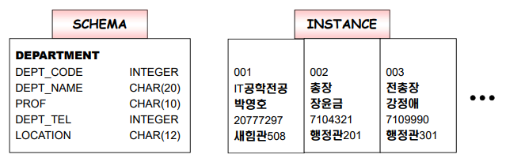
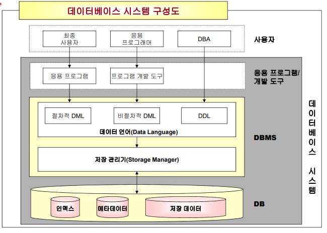
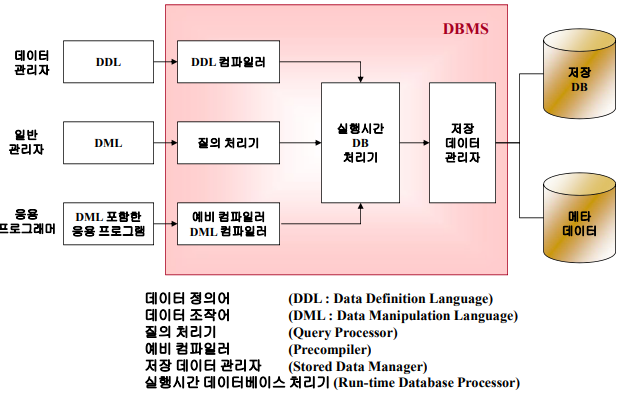
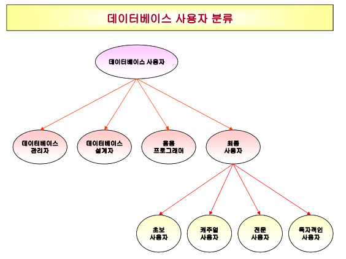

#### 추가 개념

Artificial Intelligence

- 인간의 지능을 갖고 있는 기능을 갖춘 컴퓨터 시스템
- 인간의 지능을 기계 등에 인공적으로 시연(구현)한 것
- 일반적으로 범용 컴퓨터에 적용한다고 가정함
- 또한 그와 같은 지능을 만들 수 있는 방법론이나 실현 가능성 등을 연구하는 과학 분야를 지칭하기도 함

#### 스카마와 인스턴스 개념

- 스키마 : 데이터베이스에 저장되는 데이터의 구조 및 유형을 정의한 것으로 데이터베이스의 전체적인 정의를 말한다.

  - DBMS 관리하의 **디스크 카탈로그**에 존재

- 인스턴스 : 데이터베이스에 저장되는 실제값을 가리킴

  - **하드디스크의 Database**내에 존재

  

#### 데이터베이스 시스템 구성도

- 메타데이터에 스키마가 저장, 저장데이터에 인스턴스가 저장

- 사용자 종류와 질의 처리 관점에서 본 데이터베이스 관리 시스템 구성도

  

  - 데이터 정의어 : 데이터 베이스 관리자가 스키마를 작성하는 언어

    ex. create, alter, drope

  - 데이터 조작어 : 기본적인 데이터 처리(검색, 삽입, 삭제, 변경 등)를 하는 언어

    ex. select, insert, update, delete

    - 절차적 데이터 조작어 : 무슨 데이터를 원하며 어떻게 그것을 접근하여 처리해야 되는지 명세해야하는 초급 데이터 언어
    - 비절차적 데이터 조작어 : 사용자가 무슨 데이터를 원하는지만 명세하고 (어떻게는 명세할 필요x) 데이터 베이스 관리 시스템에 위임하는 고급 언어

## 1. 기본 정의

- Database : 연관된 데이터들의 모음 (a collection(=set) of related data)
- Data : 기록될 수 있는, 어떤 묵시적인 뜻(의미)을 가지고 있는 알려진 사실들
- Mini-word : Real-world의 부분 : 방대한 실제 세상 데이터 중에 특정(=관심있는) 일부분을 데이터베이스에 저장하고 이를 "Mini-world"라고 한다.
- Database Management System (DBMS) : 컴퓨터화된 데이터베이스의 생성(ex. create) 및 유지관리 (ex. insert, delete, update)를 용이하게 하는 **소프트웨어 패키지**

## 2. 데이터베이스의 예

- 어떤 mini world의 객체들 (entities) : SECTION, STUDENT, COURSE
- 어떤 mini world 관계성(relationships)을 가지는지
- tuple(논리적) = record(물리적)
- 데이터를 저장하는 두가지 방법
  - **파일 시스템**에 저장
    - 파일에 데이터를 저장함
    - 순차적, 비순차적 파일 구조를 가짐
    - 데이터에 대한 정보는 파일 자체에 내장되어 있음, 일단 파일을 읽음
  - **데이터베이스 시스템**에 저장
    - 파일에 데이터를 저장함
    - 파일에 대한 설명서인 스키마를 가짐(**스키마는 카탈로그**에 있음)
    - 스키마를 통해서 데이터의 구조를 먼저 파악하고 데이터에 접근
  - 가장 큰 차이점 : 카탈로그의 존재 유무

## 3. 데이터베이스 기술의 주요 특징

가장 쉽게 저장하는 방법 : 파일 시스템에 저장 -> 그러나 불충분

1. ##### database system의 Self-contained nature (자기 기술성)

   - 메타 데이터는 데이터를 "설명"하는 데이터이다. DBMS에는 카탈로그라는 메타 데이터가 있어 데이터베이스를 "설명" 해 준다.
   - 메타 데이터는 하나의 DBMS 소프트웨어를 다른 데이터 환경인 다른 데이터베이스들에서도 동작하게 해주는 다리 역할을 한다.
     - database가 변경되는 경우, DBMS는 메타 데이터만 바꾸어 주면 되지만, 파일 시스템은 환경에 맞게 재 작성해 주어야 한다.

2. #####  programs과 data 간의 Insulation (격리, 결과적으로 데이터 추상화)

   - 이것을 program-data independence라 하고, 서로가 관계 없이 해 준다. 
   - data의 format이 바뀌면 program 다시 해야 하는 불편이 있으니, data의 format을 바꾸었을 때도 program은 안 바뀌도록 해 주는 기능을 제공한다.

3. ##### Data Abstraction (데이터 추상화)

   - 보통 user는 저장된 data의 location까지 정확히 알 필요가 없다.
   - Data Model은 그 detail을 감추고자 할 때 사용되고, 데이타베이tm의 “conceptual view" 만 user들에게 보여주는 DBMS의 기능. 

4. ##### 같은 데이터에 대한 다중 관점(Multiple View)들을 지원

   - 같은 data에 대해서 얻고자 하는 “관점(view)”가 모두 다르다. 

   - 각 user는 그 database의 각기 다른 view만을 보고자 한다. 

     -> 각 user가 “원하는 data만”을 기술해 줄 수 있어야 한다. 

## 4. 데이터베이스 사용자들의 클래스

1. ##### 현장에서 일하는 사람들

   방대한 데이터 베이스를 매일 사용하는 사람들

   - Database administrators(DBAs) : 설계된 데이터베이스를 관리하는 책임을 맡은 사람 (데이터베이스 관리자)
   - Database designers : 데이터베이스를 설계하는 사람 (데이터베이스 설계자)
   - End users (최종 사용자)
     - querying, updating, report 생성을 위해서 데이타베이스를 사용하는 사람
     - 일반 사용자 : 임시 사용자
     - 파라미터의 최종 사용자
       - 사전에 프로그래밍된 "통조림 처럼 만들어 놓은 것"을 사용하여 데이터베이스와 지속적으로 상호작용
       - 예를 들어 은행텔러나 예약 사무원
   - 시스템 분석가/애플리케이션 프로그래머 (응용프로그래머)
     - 파라미터의 사용자들을 위해서 "캔된 트랙잭션"을 구현해주는 사람

2. ##### 배후에서 일하는 사람들

   DBMS S/W 패키지를 만들거나 design, development, operation, maintenance하는 직업을 가진 프로그램 전문가들

   - DBMS 설계자 및 구현자
     - DBMS 소프트웨어 패키지 자체 설계 및 구현
   - 도구 개발자
     - DBMS 소프트웨어 사용을 촉진하는 도구 설계 및 구현
     - 도구에는 설계 도구, 성능 도구, 특수 인터페이스 등이 포함
   - 운영자 및 유지보수 인력
     - 데이터베이스 시스템의 하드웨어 및 소프트웨어 환경 실행 및 유지 관리 작업

## 5. 데이터베이스 기술의 추가 특징

1. data storage 내의 중복을 최대한 없애고, 개발과 유지 보수 노력을 많이 줄여준다. 
2. multiple users 간에 데이터를 공유할 수 있도록 해준다. 다중 동시 access에 대한 동시성 제어(concurrency control = 교통 정리)를 해 준다. 
3. 데이터의 허용되지 않은 access를 막는다(ex, 학점 보기). 

4. 다양한 class의 사용자들을 위한 다중 interface들을 지원
5. 데이터 간의 복잡한 관계성을 표현할 수 있도록 한다. (entity relationship을 표현)
6. 제약 사항을 넣어 두면, 데이타베이스는 항상 integrity constraint를 check해 준다. 
7. backup과 recovery services를 제공한다. 
8. standards를 유지한다. 
9. 프로그램에 영향 없이 자료 구조를 바꿀 수 있게 해 준다. 
10. 응용 개발 시간을 줄여 준다. 
11. 항상 최신 정보를 동시에 얻을 수 있다. (Availability of up-to-date information)
12. 대형 시스템을 만들 때에도 DBMS로 handle할 수 있다. (Economies of scale)

## 6. DBMS를 사용하지 않는 경우

- ##### Main costs of using a DBMS

  - 높은 초기 투자액 : 초기 구입 비용이 크고, 추가적인 하드웨어를 위한 비용이 청구될 수 있음
  - 일반, 보안, 복구, 무결성, 동시성 제어를 지원하기 위해 연산 오버헤드 비용이 클 수 있다.
    - 오버헤드 : 특정 작업을 수행할 때 메인 작업에 비해 부수적인 작업의 양이 지나치게 많을 때 데이터 베이스 시스템 측면에서 부담이 된다는 의미

- ##### When a DBMS may be unnecessary

  - 데이터베이스와 애플리케이션이 너무 간단하고 잘 정의되고 너무 자주 구조가 변하는 것 (ex. 주소록)
  - DBMS 오버헤드 때문에 충족되지 않을 수 있는 엄격한 실시간 요구사항이 있는 경우 -> 요즘은 해결 가능
  - 홀로 사용하는 경우는 DBMS 사용x