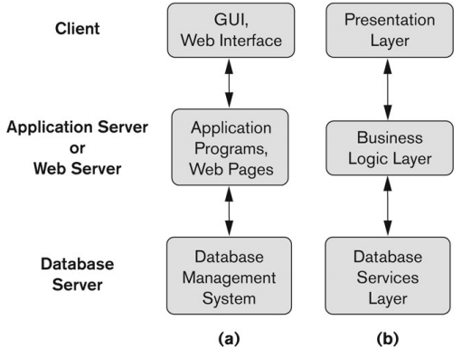

#### 하나의 DB를 Access

#### DBMS

#### 모델 - model

- <명사> 본보기 또는 모형
- 실체를 가져올 수 없으므로 (핵심 특성을 담은) 모형을 등장시켜 실체를 설명하기 위한 것, 즉 **실체를 이해시키는 것**이 **"모델의 목적"**임

## 1. 데이터 모델

데이터 모델이란 어떤 데이터에 대한 개념적 형식적 표현

어떤 "데이터"를 "모델" 하기 위해서는 다음 3가지가 설명되어야 함

- #### What is Data Model?

  1. 데이터(데이터베이스)의 **구조(structure)**가 설명되어야 함

     ex. DML을 정의한다 : CREATE SCHEMA...

  2. 1번을 운용하기 위한 **연산(operation)**들 즉, 데이터베이스로부터 데이터를 추출, 삽입, 갱신하기 위한 연산들이 설명되어야 함

     ex. DML을 정의한다 : SELECT FROM...

  3. 데이터베이스가 지켜야 하는 **제약 조건(constraint)**들을 표현하기 위한 "개념들의 집합"이 설명되어야 한다.

     (부여하고자 하는 제약조건 ex. 20년 이내에 졸업해야 한다.)

- #### Categories of Data Models

  - **Conceptual** (high-level, semantic-level) Data Models (개념적 데이터 모델)
    - 데이터를 높은 수준이나 의미적 수준으로 표현하는 데이터 모델이라고 하며, “대상 데이터(학생)를 표현할 때, 사용자에게 구체적으로 필요한 데이터 레벨(나이, 주소, 학과 등)로 표현하는 **생각의 수준**”의 데이터 모델이다. 
    - ex. “학생” 테이블의 구성 요소인 “나이”, “주소” 등을 정함) 
      - 즉 데이터베이스 스키마
  - **Physical** (low-level, internal-level) Data Models (물리적 데이터모델)
    - 데이터를 낮은 수준이나 물리적 수준으로 표현하는 데이터 모델이라고 하며, “학생 데이터가 **디스크에 어떻게 저장**되는 것이 효과적인가?” 라는 관점을 설명하기 위한 구현 수준의 실질적 데이터 모델이다. 
    - ex. “나이”는 4 byte 정수로 하자! 여기에 B-tree index를 구축하여 빨리 찾자! 등을 정하는 일) 
  - **Implementation** (record-oriented, representational) Data Models (구현(기록 중심, 표현형) 데이터 모델)
    - 앞에서 설명된 상위 2 모델의 **중간 레벨**로 상용 제품의 구현 시 적용되는 데이터 모델임 
    - 위 두가지 사이에 해당하는 개념을 제공하여 사용자 뷰와 일부 컴퓨터 스토로지 세부 정보 간에 균형을 조정한다.
  - **Self-Describing Data Models** (자가설명형 데이터 모델)
    - data value들을 가진 data의 설명을 결합한 데이터 모델
    - ex. XML, key-value stores, some NOSQL systems.
    - structure도 아니고 unstructure도 아니지만 unstructure들의 데이터를 잘 담아서 그들의 구조를 형성해 줌으로써 1:1 구조는 아닌 계층적인 구조

## 2. 스키마와 인스턴스

- #### Database Schema (구조, 뼈대)

  - 데이터베이스에 대한 설명서
  - 데이터베이스 모델을 설명한 결과물
    - 데이터베이스 구조와 데이터베이스가 지켜야 하는 제약조건들에 대한 설명들을 포함한다. (연산은 제외, 연산은 스키마가 아닌 인스턴스에 부여된다.)
  - 데이터베이스 카탈로그에 존재함

- #### Schema Diagram (스키마 도면)

  - 데이터베이스 스키마를 diagram형식으로 표현한 것
    - ex. E-R diagram
  - 테이블을 구성하고 있는 속성들을 그림으로 표현한 데이터 설계 도면

- 스키마 구조

  - 스키마의 구성 요소 또는 스키마 내의 객체
    - ex. STUDENT, COURSE

- #### Database State

  - 특정 시점에 데이터 베이스에 저장된 **실제 데이터**이다. 여기에는 데이터베이스의 모든 데이터 콜렉션이 포함된다.
  - 데이터 베이스 인스턴스(또는 occurrence, snapshot)
    - 인스턴스라는 용어는 **개별 데이터베이스 구성 요소**에도 적용된다.
    - ex. record instance, table instance, entity instance
  - 한 번에 데이터 베이스 **내용**을 참조한다.
  - 초기 데이터 베이스 상태 : **처음 시스템에 로드**될 때의 데이터베이스 상태를 나타낸다.
  - Valid State : 데이터베이스의 구조 및 제약 조건을 충족하는 상태

- #### schema와 instance 비교

  - 데이타베이스 스키마(schema)는 자주 변하지 않는다. 
  - 그러나, 인스턴스(instance), 다른 말로 데이타베이스 상태(state)는 데이타베이스가 갱신될 때마다 변한다. 
  - (주로 “deductive database”에서) 스키마는 “intention”이라도 부르는 반면, 상태 or 인스턴스는 “extension”이라고도 부른다. 
  - instance는 어떤 특정 시간에 데이타베이스에 실제로 저장되어 있는 실체
  - ex. 학생 릴레이션의 나이는 “22”, 주소는 “강남구 논현동”, 학년은 “3” 있을 때 나이, 주소, 학년은 schema 정보 (=type information) 이고, “22”, “강남구 논현동”, “3” 은 instance 정보 (=value information) 이다.
  - 데이터베이스 스키마는 매우 **자주 변경되지 않음**
  - 데이터베이스가 **업데이트** 될 때마다 **데이터베이스 상태가 변경**된다.

## 3. 3단계 스키마 구조

- ##### DBMS가 다음의 특성들을 지원하기 위한 구조임

  - Program data independence (상호간의 독립성)를 제공하기 위함
  - 데이터의 복수개의 뷰를 제공하기 위하여 만들어짐

- #### DBMS schema를 3 level로 구분하여 정의함

  - **External schemas** : 다양한 사용자 뷰(view)들을 기술하는 레벨이다.

    - ex. SQL 언어로 각 사용자가 필요로 하는 정보인 view를 기술

  - **Conceptual schema** : 전체 데이터베이스에 대한 데이터의 구조와 그 데이터에 부여되는 **제약조건**들을 기술하는 레벨

  - **Internal schema** : Physical data model을 표현해 주는 것

    - Data storage구조와 access path들과 같은 디스크에 어떻게 저장할 것인가 등 구체적 방법을 기술하는 low-level schema임
    - 데이터 베이스의 물리적 저장구조를 기술
    - 사용자는 물리적 구성을 몰라도 질의할 수 있음

    

  - external/conceptual mapping 

    - ex. STUDENT, COURSE, PROFESSOR 등의 table에서 view1이 학생인 경우 모든 table에 접근하지 못하게 막음

  - conceptual/internal mapping 

    - ex. STUDENT 테이블과 2번 디스크 N번째 폴더와 연결 됨

- #### Schema level들 간의 "mapping"의 용도

  - user가 보는 view를 기반으로 질의가 주어졌을 때 computer가 보는 view의 관점으로 변환시켜 주기 위해서 각 level간에 "mapping = query 변환"이 필요함
    - 프로그램들이 external schema를 참조할 때 필요하게 된다
    - DBMS가 그 프로그램의 수행을 위해 internal schema에 map하기 위해 필요하다.

- 레벨 간 mapping을 설명하기 위한 질의 처리(query processing 수행 예제)

  - “DB” 코스를 수강하는 “학생” 중 “나이”가 30세 이상인 학생? (고수준질문)
    - “DB” 릴레이션과, “학생” 릴레이션이 있는 disk page를 찾는다. (저수준 처리)
    - “나이”는 tuple의 시작으로 부터, offset 39 bytes 부터 시작한다. 
    - (나이 순으로 tuple 이 정렬되어 있다면,) “나이”의 “value”가 30보다 작으면 왼쪽으로, 크면 오른쪽으로 간다. 
    - 그 결과를 projection한다. 그리고, Next record는 byte offset이 400 bytes이므로 이를 더해가며, 결과를 릴레이션의 끝까지 찾는다.

- #### mapping의 개념

  - External Schema(고수준)를 참조하는 프로그램들은 Internal schema(저수준)를 참조하는 프로그램으로 변경되어야 한다. 

## 4. 데이터 독립성

- #### 왜 mapping을 하는가?

  - (하위 레벨로부터 독립하자! 즉 상위레벨은 안바꾸고 mapping만 바꾸자!)
  - 다음의 중요한 2가지 특성을 부여하기 위함
  - **논리적 데이터**(로 부터) **독립성**(Logical Data Independence) (독립하자)
    - external schema나 그들을 이용하는 **응용 프로그램들을 전혀 바꾸지 않고**도 conceptual schema가 변경될 수 있도록 DBMS가 지원하는 특성
    - ex. 스키마에서 “이름”과 “주소”의 위치를 변경해도, 상위 프로그램은 불변
    - 예) 즉, GRADE_REPORT를 바꿔도, **프로그램의 변경이 없어**, TRANSCRIPT(학생 성적표)결과에 영향이 없어야 함
    - ex. 데이터베이스 확장, 제약조건 갱신, 데이터 베이스 축소
  - **물리적 데이터** (로 부터) **독립성**(Physical Data Independence) (독립하자)
    - conceptual schema (우리가 DDL로 작성한 **schema)를 전혀 바꾸지 않고**도 internal schema (disk내 record 위치 정보 등) 만 변경해도 되도록 지원하는 특성
    - 자료에 대한 접근 기능을 강화하여, 검색이나, 갱신 성능을 높이고자 할때, 물리적부분(디스크) 접근 구조를 변경함 -> 상위에 영향 안 주어야 함
    - 예) disk 내의 레코드 위치를 track 15에서 track 24로 이동해도 schema는 그대로 놔두면 됨

- 하위 레벨에 있는 어떤 schema에 변경이 생겼을 때, 변경된 schema와 그것의 상위 레벨 schema 사이에 차이가 생긴다. 이때, 단순히 “**mapping**”만을 변경해서, **“데이터의 독립성**”을 완전히 지원할 수 있도록 할 필요성이있다. 

- **그 상위 레벨 schema들은 안 바뀐다**. 그러므로, 응용 프로그램들은 external schema들을 참조(refer)하기 때문에 변경하지 않아도 되는 것이다. 

## 5. DBMS 언어

- #### Data Definition Language (DDL)

  - schema 정의 언어, DBMS와 대화하기 위한 준비 언어
  - DBA와 database desinger들이 데이터베이스의 conceptual schema를 표현하기 위해서 이 언어를 사용한다.
  - 대부분의 DBMS들에서 DDL은 **internal schemas(tables, index** 등 conceptual schema), **external schemas(사용자 views**)를 모두 정의하기 위해 사용된다.
  - 일부 어떤 dbms에서는
    - internal schemas 표현을 위해 SDL언어 사용
    - external schemas 표현을 위해 VDL언어 사용

- #### Data Manipulation Language (DML)

  데이터베이스의 내용을 추출하고 갱신하기 위한 언어, 데이터를 조작(데이터에 대한 검색, 삽입, 삭제, 수정)할 수 있는 수단

  1. **고급 언어 내재 방식**
     - DML 커맨드는 C, C++, C#, Java, Python or PASCAL와 같은
       General-purpose Programming Language (범용 프로그래밍 언어)에 내재되는 언어(embedded language)를 말한다. (ODBC나 JDBC 드라이버 필요)
     - 또한, DML은 JSP, ASP, PHP, HTML5과 같은 Web Script Language (웹 언어)에 내재되는 언어(embedded language)를 말한다. (웹 서버 설치 필요)
  2. **문답식 방식**
     - 선택적으로, stand-alone DML 명령어들은 (예를 들어, SELECT, INSERT, UPDATE, DELETE 와 같은 DML은) DBMS가 제공하는 **질의 창 (Query Interface)**를 통해 **query를 직접 작성**하여 질의 할 수 있다. 

- #### DML의 타입

  - 고수준 또는 비절차적 언어 (=목적만 명시)
    - 예) SQL 관계 언어
    -  “SET-at-a-time” 형태로 데이터 검색
    - 선언적 언어
    - "집합"을 지향하며 데이터를 검색하는 방법 대신 검색할 데이터를 지정한다.
  - 저수준 또는 절차적 언어 (=job의 모든 과정을 구체적으로 명시함)
    - "RECORD-at-a-time" 형태로 데이터 검색 (즉 반복문 사용)
    - 호스트 프로그램 언어(C, C++, Java, python 등) 안에 DML 문장들(SQL)이 embedded된 후, 컴파일 되어, 하나의 실행파일이 된다. 
    - 개별 database RECORD들에 대해서 찾고, 추출한다. 그리고, 
      Multi-Record들을 각기 찾고, 추출하기 위해서는 Host Programming Language의 looping과 construct들을 사용한다. (한번에 레코드 하나, 그리고 next, next, … 해서 찾음, 수동화)

## 6. DBMS 인터페이스

1. #### 프로그래밍 언어에 DML을 내장하기 위한 프로그래머 인터페이스

   - 임베디드 접근방식
     - ex. embedded SQL (for C, C++, etc.), SQLJ (for Java)
   - 프로시저 호출 접근방식
     - ex. JDBC for Java, ODBC (Open Database Connectivity)
     - API(애플리케이션 프로그래밍 인터페이스)로서 다른 프로그래밍 언어의 경우
   - 전용 database 프로그래밍 언어 접근방식
     - ex. ORACLE에는 SQL 기반의 프로그래밍 언어인 PL/SQL이 있다.
     - 언어는 SQL과 그 데이터 유형을 필수 구성 요소로 통합한다.
   - 스크립트 언어 : PHP(클라이언트 측 스크립팅) 및 Python(서버측 스크립팅)은 데이터베이스 프로그램을 쓰는 데 사용된다.

2. #### 사용자 친화적인 인터페이스

   - 메뉴 기반(웹 기반) : 웹 탐색에 널리 사용됨
   - 폼 기반 : 폼에서 항목을 채우는 데 순수 사용자를 위해 설계되었다. 
   - 그래픽 기반
     - 가리키고 클릭, 끌어서 놓기 등
     - 스키마 다이어그램에 쿼리 지정
   - 자연어: 영어로 된 요청
   - 위의 조합:
     - 예를 들어, 메뉴와 폼 둘 다 웹 데이터베이스 인터페이스에서 광범위하게 사용된다.

3. #### 기타 DBMS 인터페이스

   - 자연어: 질의로써 자유롭게 텍스트로 가능
   - speech : 입력 쿼리 및 출력 응답
   - 키워드 검색이 있는 웹 브라우저
   - 파라메트릭 인터페이스(예: 기능 키를 사용하는 은행 텔러)
   - DBA용 인터페이스:
     • 사용자 계정 만들기, 권한 부여
     • 시스템 매개 변수 설정
     • 스키마 또는 액세스 경로 변경

#### Database System Utilities

- 파일에 저장된 데이터를 데이터베이스에 로드, 데이터 변환 도구를 포함
- 데이터베이스를 주기적으로 테이프에 백업
- 데이터베이스 파일 구조를 재구성
- 성능 모니터링 유틸리티.
- 보고서 생성 유틸리티.
- 기타기능 : 정렬, 사용자 모니터링, 데이터 압축 등

#### Other Tools

- 데이터 사전/저장소:
  - (1) 스키마 설명 (2) 설계 결정, (3) 응용 프로그램 설명, (4) 사용자 정보, (5) 사용 표준 등과 같은 기타 정보를 저장하는 데 사용된다.
  - **액티브 데이터 사전**은 DBMS 소프트웨어와 사용자/DBA가 모두 함께 액세스한다. (ex. 카탈로그의 스키마 등)
  - **패시브 데이터 사전**은 사용자/DBA만 액세스할 수 있습니다.
- 개발 환경 애플리케이션
  - CASE 도구(computer-aided software engineering)
- 예시 : PowerBuilder (Sybase)  JBuilder (Borland)  JDeveloper 10G (Oracle)

## 7. DBMS 콤포넌트 모듈

## 8. DBMS 아키텍쳐

아키텍쳐(Architecture) : 컴퓨터 시스템의 하드웨어 구조

#### 중앙 집중식 및 클라이언트-서버 DBMS 아키텍처

- 중앙 집중식 DBMS:

  - 다음을 포함한 모든 것을 **단일 시스템**으로 결합합니다.
    - DBMS 소프트웨어, 하드웨어, 응용 프로그램 및 사용자 인터페이스 처리 소프트웨어.
  - 사용자가 여전히 원격 터미널을 통해 연결할 수 있음
    - 그러나 **모든** 처리가 중**앙 집중식 사이트**에서 수행된다.

  

#### 기본 2계층 클라이언트-서버 아키텍처

- 특수 기능이 있는 **특수 서버**

  - 인쇄 서버, 파일 서버, DBMS 서버, 웹 서버, 전자 메일 서버

- 클라이언트가 액세스할 수 있음

  - 위의 것들처럼 필요에 따라 전문화된 서버

  

#### 클라이언트 파트

- **적절한 인터페이스** 제공
  - 클라이언트 **소프트웨어** 모듈을 통해
  - 다양한 **서버 리소스**에 **액세스**하고 활용한다.
- 클라이언트는 **디스크가 없는**(디스크 거의 사용x) 시스템, PC 또는 워크스테이션일 수 있습니다.
  - **설치된 클라이언트 소프트웨어만** 디스크를 사용
- 서버에 연결됨
  - 어떤 형태의 **네트워크**를 통해.
  - LAN(소켓기반), 근거리 통신망, 무선 통신망 등

#### DBMS 서버 파트

- 클라이언트에 데이터베이스 **쿼리 및 트랜잭션** 서비스 제공
- 관계형 DBMS 서버는 종종 다음과 같이 불린다:
  - SQL 서버, 쿼리 서버 또는 트랜잭션 서버
- 클라이언트에서 실행되는 **응용 프로그램**은 **API**(응용 프로그램 인터페이스)를 사용하여 다음과 같은 **표준 인터페이스**를 통해 **서버 데이터베이스에 액세스**한다.
  - ODBC: 개방형 데이터베이스 연결 표준
  - JDBC: Java 프로그래밍 액세스를 위한 데이터베이스 연결

#### 2계층 클라이언트-서버 아키텍처

- 클라이언트 및 서버가 ODBC 또는 JDBC에 적합한 클라이언트 모듈 및 서버 모듈 소프트웨어를 설치해야 합니다.
- 클라이언트 프로그램은 **데이터 소스**라 불리는 여러 DBMS에 연결할 수 **있다**.
- 일반적으로 데이터 소스는 파일 또는 데이터를 관리하는 다른 DBMS가 아닌 소프트웨어일 수 있다.
- 데이터베이스에 대한 자세한 내용은 10장을 참조하십시오.

#### 3계층 클라이언트-서버 아키텍처

- 웹 응용 프로그램 공통
- **응용 프로그램 서버** 또는 **웹 서버**라고 하는 중간 계층:
  - 데이터베이스 서버에서 해당 데이터에 액세스하는 데 사용되는 응용프로그램의 "**웹 연결 SW**" 및 "**비즈니스 논리 부분**"을 저장합니다.
  - 데이터베이스 서버와 클라이언트 간에 부분적으로 처리된 데이터를 전송하기 위한 **배선(전달자, 중재자)**처럼 작동합니다.
- **보안을 강화**할 수 있는 3계층 아키텍처:
  - **중간 계층을 통해서만** 데이터베이스 서버 액세스 가능
  - 클라이언트가 데이터베이스 서버에 **직접 액세스할 수 없음**
  - 클라이언트는 사용자 **인터페이스 및 웹 브라우저를 포함**합니다.
  - 클라이언트는 일반적으로 웹(인터넷)에 연결된 PC 또는 모바일 장치입니다.

​	

## 9. DBMS의 분류

#### DBMS 분류

- 사용되는 데이터 모델을 기반으로 한 분류
  - 과거: 네트워크, 계층적.
  - 현재 사용: 관계형(ex. SQL), 객체 지향, 객체 관계형
  - 최신 기술:
    - key-value 스토리지 시스템
    - NOSQL 시스템: (1) 문서 기반, (2) 열 기반, (3) 그래프 기반 (4) 키 값 기반.
    - 기본 XML DBMS
- 기타 분류
  - **단일** 사용자(일반적으로 개인용 컴퓨터와 함께 사용) vs **다중** 사용자(대부분의 DBMS)
  - **중앙 집중**식(데이터베이스가 한 개인 컴퓨터 사용) vs **분산형**(여러 컴퓨터, 여러 DB)

#### 분산 DBMS(DDBMS)의 변형

- 동일한 DDBMS : 모든 사이트에서 같은 DBMS 소프트웨어 사용
- 이질적인 DDBMS : 각 사이트에서 상이한 DBMS 소프트웨어 사용 가능
- 연합 또는 다중 데이터베이스 시스템
  - 참여하는 데이터베이스는 높은 수준의 자율성과 느슨하게 결합된다.
- (결과적으로) DDBMS는 다음과 같은 이유로 클라이언트-서버 기반 데이터베이스 시스템으로 알려지게 되었다.
  - 완전히 분산된 환경을 지원하지 않는다.
  - 그러나 클라이언트 집합을 지원하는 데이터베이스 서버 집합입니다.

#### DBMS에 대한 비용 고려 사항

- **다양한 비용 범위**: 무료 오픈 소스 시스템에서 수백만 달러의 비용이 드는 구성에 이른다.
  - 무료 관계형 DBMS의 예: MySQL, PostgreSQL, 기타
- 상업용 DBMS는 **시계열** 모듈, **공간** 데이터 모듈, **문서** 모듈, **XML** 모듈과 같은 특수 모듈을 추가로 제공합니다.
  - 이 제품은 별도로 구입할 때 추가적인 특수 기능을 제공합니다.
  - 카트리지(예: 오라클에서) 또는 블레이드라고도 함
- 사이트 라이센스, 최대 동시 사용자 수(시트 라이센스), 단일 사용자 등 다양한 라이센스 옵션

#### 기타 고려 사항

- 데이터베이스 시스템 내 액세스 경로 유형
  - 예: 반대의 인덱싱 기반(ADABAS는 그러한 시스템 중 하나이다)
  - 전체 인덱스된 데이터베이스는 검색 엔진에서 사용되는 **모든 키워드**로 액세스 가능
- 일반 목적 vs. 특수 용도
  - 예: 항공사 예약 시스템
  - 기타: 호텔/자동차 예약 시스템 등
  - 특수 목적 **OLTP**(온라인 트랜잭션 처리 시스템)

## 10. History of Data Models

#### Relational Data Models (관계형 데이터 모델)

- 1970년 E.F.에 의해 제안되었다. 1981-82년 최초의 상용 시스템인 Codd(IBM).
- 현재 몇 가지 상용 제품(예: DB2, Oracle, MS SQL Server, SYBASE, INFORMIX)에서 사용할 수 있습니다.
- MySQL, PostgreSQL, 큐브리드(NHN)와 같은 여러 자유 오픈 소스 구현
- 현재 데이터베이스 응용프로그램 개발에 가장 우세합니다.
- SQL 관계 표준: SQL-89(SQL1), SQL-92(SQL2), SQL99, SQL3, …
- 5장부터 11장까지, 이 모델에 대해 자세히 설명합니다.

#### Object-oriented Data Models (객체 지향 데이터 모델)

- 데이터베이스 시스템에 구현하기 위해 몇 가지 모델이 제안되었다.
- 한 세트는 C++(예: OBJECT STORE 또는 VERSANT), Smalltalk(예: GEMSTONE)와 같은 영구 O-O 프로그래밍 언어 모델로 구성된다.
- 또한 O2, ORION(MCC - 그 후 ITASCA), IRIS(H.P. - OpenOODB)와 같은 시스템이 사용됩니다.
- 객체 데이터베이스 표준: ODMG-93, ODMG 버전 2.0, ODMG 버전 3.0.
- 12장에서는 이 모델에 대해 설명합니다.

#### Object-relational Data Models (객체 관계 데이터 모델)

- **객체 모델과 관계형 모델을 혼합**하는 추세는 **Informix** Universal Server에서 시작되었다.
- 관계형 시스템은 객체 데이터베이스의 개념을 **통합**하여 객체-관계형으로 유도하였다.
- Oracle, DB2 및 SQL Server 버전 및 기타 DBMS에 예시되어 있습니다.
- 관계형 DBMS 공급업체의 현재 경향은 XML, 텍스트 및 기타 데이터 유형을 처리할 수 있는 기능을 갖춘 관계형 DBMS를 확장하는 것입니다.
- "객체 관계형"이라는 용어는 시장에서 **퇴보**하고 있습니다.
