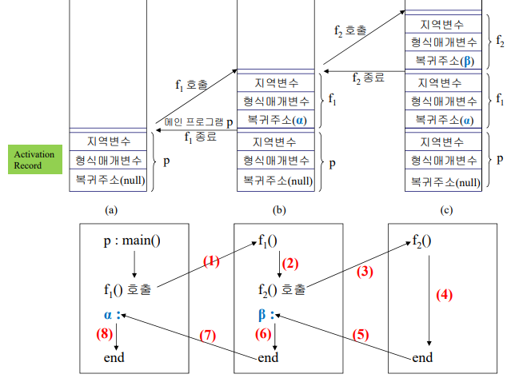
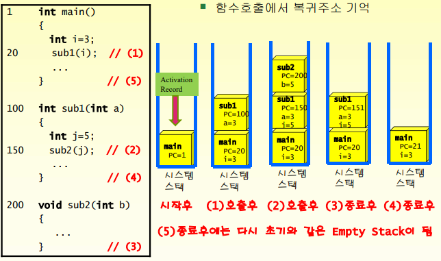
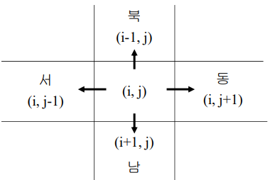
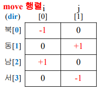

## 1. 스택 추상 데이타 타입

- 후입선출 리스트 (LIFO)
  - 가장 최근에 들어온 데이터가 가장 먼저 나감
  - 기능은 2가지 : 삽입(push), 삭제 (pop)
  - 스택을 pushdown리스트라고도 함
  
- 스택의 구조

  - 스택 하단(bottom), 스택 상단(top), 요소(element)

- 스택의 기능

  - 삽입 (push), 삭제(pop)

- 스택의 정의

  - 삽입과 삭제가 한쪽 끝, 톱(top) 에서만 이루어지는 유한 순서 리스트

- 스택의 연산

  - push() : 스택에 데이터를 추가 (top을 올린 후 삽입)
  - pop() : 스택에서 데이터를 삭제 (아이템을 가져온 후 top을 내림)
  - create() : 스택을 생성
  - is_empty(s) : 스택이 공백상태인지 검사
  - is_full(s) : 스택이 포화상태인지 검사
  - peek(s) : 스택 top을 보기(read)만 하는 연산

- 스택의 응용

  - 리스트의 순서를 역순으로 만드는 데 유용
  - 입력과 역순의 출력이 필요한 경우
    - 에디터에서 되돌리기 기능
    - 함수호출에서 복귀주소 기억

  - 컴퓨터 시스템이 이 성질을 사용하여 시스템을 운영함
    - 시스템 스택 (system stack)
    - 실행시간 스택 (runtime stack)

- 시스템 스택 (system stack)

  - 프로그램 간의 호출과 복귀에 따른 실행 순서 관리 도구
  - 활성화 레코드를 만들어 스택에 삽입
    - 복귀주소, 형식 매개변수, 지역 변수들을 포함
    - 스택의 톱에는 항상 현재 실행되는 함수의 활성화 레코드가 존재

  

- 실행시간 스택 (run time stack)

  

- 순환 호출 (Recursive Call)

  - 순환 호출이 일어날 때마다 활성화 레코드가 만들어져 시스템 스택에 삽입됨
  - 가능한 순환 호출의 횟수는 활성화 레코드의 최대 개수를 얼마로 정하느냐에 따라 결정
  - 순환 프로그램의 실행이 느린 이유
    - 활성화 레코드들의 생성과 필요한 정보 설정 등의 실행 환경 구성에 많은 시간이 소요

- 배열을 이용한 스택의 구현

  - 1차원 배열 stack[]
  - 스택에서 가장 최근에 입력되었던 자료를 가리키는 top변수
  - 가장 먼저 들어온 요소는 stack[0]에 가장 최근에 들어온 요소는 stack[top]에 저장
  - 스택이 공백상태이면 top은 -1

## 2. 스택의 순차 표현

- 1차원 배열을 이용한 stack[n] 순차 표현
  - 스택을 표현하는 가장 간단한 방법
  -  n은 스택에 저장할 수 있는 최대 원소 수
  - 스택의 i번째 원소는 stack[i-1]에 저장
  - 변수 top은 스택의 톱 원소를 가리킴
    - 초기에는 top = -1로 설정하여 공백스택을 표시
    - 스택이 full인 경우 top >= n-1 인지 체크

## 3. C 배열을 이용한 스택의 구현

## 4. 복수 스택의 순차 표현

- 복수 스택의 순차 표현 (배열)
  - 하나의 배열(순차 사상)을 이용하여 여러 개의 스택을 동시에 표현하는 방법
  - 두 개의 스택인 경우
    - 스택0은 mStack[m-1] 쪽으로 스택1은 mStack[0] 쪽으로 확장시키면 됨

- n개의 스택인 경우
  - 메모리가 m개 있는 경우
  - 각 스택에 n개로 분할된 메모리 세그먼트를 하나씩 할당
  - n개의 스택에 균등 할당한 뒤의 초기 배열 mStack[m]
    - b[i] = t[i] = i (m/n) -1

## 5. 스택의 연결 표현

- Linked Stack은 Linked List를 이용하여 구현한 Stack
  - 장점 : 크기가 제한되지 않음
  - 단점 : 구현이 복잡하고 삽입이나 삭제 기간이 오래 걸림
- 연결 리스트로 표현된 연결 스택 (linked stack)
  - top이 지시하는 연결 리스트로 표현
    - 스택의 변수 top은 톱 원소, 즉 첫 번째 원소를 가리킴
  - 원소의 삽입
    - 생성된 노드를 연결 리스트의 첫 번재 노드로 삽입
  - 원소의 삭제
    - 항상 연결 리스트의 첫 번재 노드를 삭제하고 원소 값을 반환

## 6. C 리스트를 이용한 스택 구현

## 7. 수식의 괄호쌍 검사

## 8. 스택을 이용한 수식의 계산

#### 스택을 이용한 수식의 연산

- 수식
  - 피 연산자와 연산자로 구성
- 수식의 표기법
  - 전위 표기법, 중위 표기법, 후위 표기법
  - 후위 표기법 장점 : 연산 순서가 간단, 괄호가 불필요
  - 후위표기법 참고 : 폴리쉬 표기법 : 모든 연산 기호를 모든 변수보다 뒤에 위치하도록 기술하는 불 대수(Boolean algebar)의 기법

- 중위 -> 후위로의 변환
  - 손으로 변환해 보는 방법
    1. 중위 표기식을 완전하게 괄호로 묶는다.
    2. 각 연산자를 묶고 있는 괄호의 오른쪽 괄호로 연산자를 이동시킨다.
    3. 괄호를 모두 제거한다.
  - 피연산자의 순서는 불변
  - 연산자의 순서는 우선순위를 반영

#### 수식의 계산

- 컴퓨터에서의 수식 계산 순서 : 중위표기법 -> 후위표기법 -> 답 도출
  - step(1) : 중위 표기식 -> 스택을 써서 후위 표기식으로 변환
  - step(2) : 위의 후위표기식 -> 스택을 써서 계산 결과를 얻음
  - 두가지 스텝이 순서대로 실행, 두 스텝 모두 스택을 사용

#### 후위 표기식으로 변환을 위한 우선순위

| 연산자 | PIS (스택 내 우선순위) | PIE (수식 내 우선순위) |
| ------ | ---------------------- | ---------------------- |
| )      | -                      | -                      |
| ^      | 3                      | 3                      |
| * /    | 2                      | 2                      |
| + -    | 1                      | 1                      |
| (      | 0                      | 4                      |

- '(' 는 수식에 있을 때는 우선 순위가 가장 높아서 stack으로 push된다.
- Stack에 들어가자 마자 우선순위가 가장 낮아진다. 이는 이후 모든 연산자를 stack에 받아들이게 하기 위함이다.
- ')'을 만나면 현재 stack에 있는 모든 연산자를 '(' 까지 pop한다.

#### (1) 중위 표기식 -> 후위 표기식

- 중위표기와 후위표기
  - 중위 표기법과 후위 표기법의 공통점은 피연산자의 순서는 동일
  - 연산자들의 순서만 다름 (연산자만 스택에 저장했다가 출력하면 된다.)
- 알고리즘
  - 수식에서 피연산자를 만나면, 그대로 결과로 출력
  - 현재 판단하고자 하는 연산자(X라 한다)를 만나면, 스택 top의 연산자와 다음과 같이 연산자 우선순위 비교/판단:
    - 스택에 아무것도 없거나, X가 현 스택 top 연산자 보다 우선순위가 높으면, 스택에 push함
    - 스택 top 연산자와 X의 우선순위가 같으면, top을 pop한 다음, X를 push함
    - 스택 top 연산자 보다, X의 우선 순위가 낮으면, 그때 top을 pop하여 출력함
  - 왼쪽 괄호 ‘(’ 는 스택에 들어가는 순간, 우선순위가 가장 낮은 연산자로 변모
  - 오른쪽 괄호‘)’가 나오면 스택 내 왼쪽 괄호 ‘(’ 위에 쌓여 있는 모든 연산자를 pop하여 출력

#### (2) 후위 표기식 -> 계산 결과 산출

후위 수식의 예) 82/3-32*+

1. 수식을 왼쪽에서 오른쪽으로 Scan하면서 다음을 진행한다. 
2. 이번엔, 피연산자(Operand)이면 Stack 에 저장한다. 
3. 연산자(Operator)이면 필요한 수만큼의 피연산자를 Stack 에서 꺼내 연산을 실행한다. 
4. 3번의 연산의 결과를 다시 Stack에 저장한다.

## 9. 미로 문제

- m*n 미로를 maze(m+2, n+2) 배열로 표현

  - 원소의 값은 0과 1 : 0은 이동 가능 1은 막혀있는 벽
  - 사방을 1로 둘러싸서 경계 위치에 있을 때의 예외성을 제거

- 현재 위치 : maze[i, j]

- 이동 방향

  - 북 동 남 서 (시계 방향)

    

  - 이동 방향 배열 : move[4, 2]

    

  - 다음 위치 계산 : maze[next_i, next_j]

    - next_i <- i + move [dir, 0];
      - 예를 들어, 남쪽(2)으로 갈 때는, move [2, 0] 이므로, 값은 “+1”이 된다. 행이 +1 증가됨. 
    - next_j <- j + move [dir, 1];
      - 예를 들어, 서쪽(3)으로 갈 때는, move [3, 1] 이므로, 값은 “-1”이 된다. 열이 -1로 감소됨. 
    - 방문한 경로를 mark[m+2, n+2]에 표시
      - 한 번 시도했던 위치로는 다시 이동하지 않음
      - 초기에는 0, 방문한 위치는 1
    - 지나온 경로 <i, j, dir>을 스택에 저장
      - 스택의 최대 크기 : m*n

