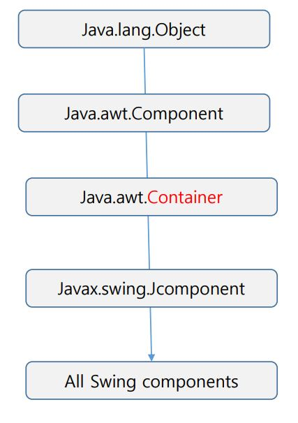
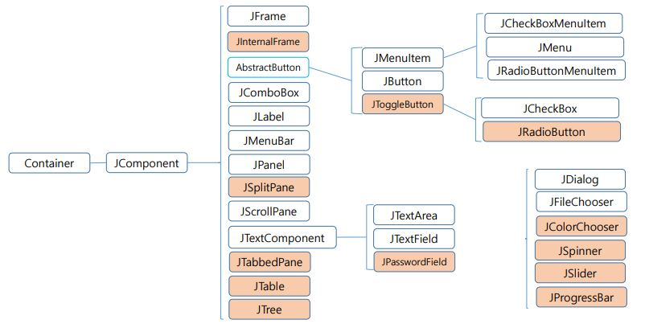
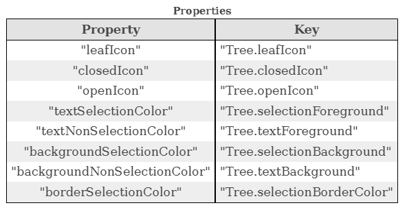

#### 1. Java Swing

- java에서 사용되는 보다 세련된 그래픽 사용자 인터페이스(GUI) 구성 요소 제공
  - Java AWT GUI 요소들의 확장이다.
- 패키지는 javax.swing 으로 제공한다.
  - GUI 구성 요소에 대한 클래스를 포함한다.
- 스윙은 AWT와 달리 그래픽을 자바 가상기계가 자체적으로 처리함, AWT는 모든 컴포넌트를 나타내기 위해 실행 중인 시스템에 대응되는 그래픽 컴포넌트를 사용하지만 스윙은 대부분의 컴포넌트들을 자바 시스템이 처리한다.

#### 2. Swing Components Hierarchy

- javax.swing.* 요소들
  - 

- Swing의 요소들
  - 각 요소들로부터 계층적인 관계를 나타내는 자료
  - 

#### 3. Swing Components

- JComponent클래스를 상속한다
- JComponent 클래스
  - Swing GUI 구성 요소의 최상위 클래스
  - 모든 Swing 구성 요소에 공통적인 방법 및 기능 제공

1. ##### JFrame

   - Container의 개념을 가진다.
     - 다른 컴포넌트를 컴포넌트 내부에 중첩할 수 있다.
     - getContentPane() 메서드를 사용해 다른 컴포넌트를 연결한다.
     - jf.setDefaultCloseOperation(JFrame.EXIT_ON_CLOSE);
       - AWT에서는 닫힘 버튼을 구현하지 않아 동작하지 않았는데 Swing부터는 디폴트로 들어가게 되어 닫힘버튼이 동작한다.
   - 생성자
     - JFrame() : 처음에 보이지 않는 새 프레임을 만든다.
     - JFrame(GraphicsConfiguration gc) : 화면 장치의 지정된 그래픽 구성(gc)에서 프레임과 빈 제목을 만든다.
     - JFrame(String title) : 지정한 제목으로 처음에 보이지 않는 새 프레임을 만든다.
     - JFrame(String title, GraphicsConfiguration gc)
   - 주요 메소드
     - getContentPane() : awt의 add() 와 동일
     - setContentPane() : contentPane 속성을 설정
     - setJMenuBar(JMenuBar menubar) : 이 프레임에 대한 메뉴바를 설정
     - setLayout(LayoutManager manager) : LayoutManager설정

2. ##### JLabel

   - 정적 텍스트를 이미지(아이콘)와 함께 표시한다.
   - 생성자
     - JLabel(String text, Icon icon, int alignment) : 지정된 텍스트, 이미지 및 수평 정렬을 사용하여 JLabel 인스턴스를 만든다.

3. ##### JPanel

   - 컨테이너이다.
   - AWT 패널과 유사함
   - 다른 GUI 컴포넌트를 연결할 수 있는 공간 제공
   - 다른 패널을 부착할 수 있다.
   - 작성된 패널을 프레임 또는 창에 추가해야 볼 수 있다.
   - 생성자
     - JPanel(LayoutManger layout) : 레이아웃을 설정하면서 패널을 만든다.

4. ##### AbastractButton

   - 클릭 및 선택 기능에 대한 일반적인 방법을 정의한다.
   - JButton, JCheckBox, JRadioButton, JToglleButton, JMenu, JMenuItem으로 상속
   - Button 및 menu items 에 대한 일반적인 동작을 정의한다.
   - Button은 Actions에 의해 구성되고 어느정도 제어될 수 있으며 Button과 함께 Action을 사용하면 button을 직접 구성하는 것 이상의 많은 이점이 있다.

   1. JButton
      - AWT의 button과 유사하며 '마우스 클릭'을 사용하여 동작을 제공한다.
      - 그러나 JButton은 컴포넌트에 이미지 아이콘을 포함할 수 있다.
      - 생성자
        - JButton(String name, Icon icon) : 아이콘을 주면서 버튼에 문자열을 설정하면서 생성
      - 주요 메소드
        - addActionListener()
   2. JCheckBox, JRadioButton, JToggleButton
      - AWT의 Checkbox와 CheckboxGroup, RadionButton과 유사하다.
      - 생성자
        - JCheckBox(String, Boolean)
        - JRadioButton(Icon, String, CheckboxGroup, Boolean)
      - 주요 메소드
        - addItemLisener()

5. ##### JList

   - AWT의 List와 유사하다.
   - JList는 한 번에 여러 항목을 볼 수 있는 선택 옵션을 제공한다.
   - JList는 스크롤 기능을 지원하지 않는다. 따라서 스크롤을 사용하기 위해 ScrollPane을 사용하여 JList 개체를 추가할 수 있다.
     - sp.add(list); //스크롤팬 컴포넌트에 list를 추가

6. ##### JComboBox

   - 스크롤이 있는 하나의 항목을 보여주는 AWT의 Choice와 유사하다.
   - 한 번에 하나의 항목을 볼 수 있는 선택옵션을 제공한다.
   - 스크롤 기능 지원

7. ##### JTextComponent

   -  JTextField, JTextArea, JEditorPane, JPassword, JTextPane 상속
   - 한줄 텍스트 : JTextField, JPassword
   - 일반 텍스트 영역 : JTextArea
   - 스타일 텍스트 영역 : JEditorPane, JTextPane
   - 생성자
     - JTextField(String text, int columns)
     - JPassword(String text, int columns)
       - 주요 메소드 : setEchoChar(char)
     - JTextArea(String text, int rows, int columns)

8. ##### JTabbedPane

   - 한 헤더 라인에 여러 패널 객체를 표시하기 위한 레이아웃을 제공한다.
   - 사용자가 주어진 제목 및 아이콘이 있는 탭을 클릭하여 컴포넌트 그룹 간에 전환할 수 있는 컴포넌트이다.
   - 탭 / 컴포넌트는 addTab 및 inserTab 메소드를 사용하여 TabbedPane개체에 추가된다.
   - 첫번째 탭의 인덱스는 0이고 마지막 탭이 인덱스는 탭의 수에서 -1한 것과 같다.
   - 생성자
     - JTabbedPane(int tabPlacement, int tabLayoutPolicy) 
       - tabPlacement :  `JTabbedPane.TOP` , `JTabbedPane.BOTTOM` , `JTabbedPane.LEFT` `JTabbedPane.RIGHT` 
       - tabLayoutPolicy : 탭에 레이아웃을 설정한다.
   - 주요 메소드
     - addTab(String title, Icon icon, Component comp)
     - insertTab(String title, Component comp) : 탭 삽입
     - remove(Component comp) : 탭에서 지정된 컴포넌트 제거

9. ##### JTable

   - 튜플의 집합처럼 테이블 스타일을 보여주기 위한 레이아웃을 제공한다.

   - JTable은 셀의 통상의 2차원 테이블을 표시하고 편집하는데 사용된다.

   - JTable을 일반적으로 JScrollPane 내부에 배치된다. 기본적으로 JTable은 가로 스크롤바가 필요하지 않도록 너비를 조정한다. 수평 스크롤바를 허용하려면 AUTO_RESIZE_OFF와 함께 setAutoResizeMode(int)를 호출한다.

   - 생성자
     - JTable(Object[ ] [ ] rowData, Object[] columnNames) : 2차원 배열 rowData의 값을 열 이름 columnNames로 표시하는 JTable을 구성한다.

     - JTable(TableModel tm) : tm 데이터 모델, 기본 열 모델 및 기본 선택 모델로 초기화된 JTable을 구성한다.

   - 메소드들
     - getColumnModel() : 이 테이블의 모든 열 정보를 포함하는 테이블 열 모델을 반환합니다.

   - DefaultCellEditor : 테이블 및 트리 셀의 기본 편집기입니다.

   - 간단한 테이블 만들기

   - 배열을 이용하여 테이블 만들기

   - Table Model을 이용하여 테이블 만들기
     - TableModel을 만들어야하며 이는 AbstractTableModel 상속
       - 구현해야하는 메소드들

       - getColumnCount() :모형에 있는 열 수를 반환합니다. JT 테이블은 이 방법을 사용하여 기본적으로 몇 개의 열을 만들고 표시할지 결정합니다.

       - getRowCount() : 모형에 있는 행 수를 반환합니다. JT 테이블은 이 방법을 사용하여 표시할 행 수를 결정합니다. 이 방법은 렌더링 중에 자주 호출되므로 신속해야 합니다.

       - getColumnName(int col) : 스프레드시트 규칙을 사용하여 열의 기본 이름(A, B, C, ... Z, AA, AB 등)을 반환합니다. 열을 찾을 수 없는 경우 빈 문자열을 반환합니다.

       - getValueAt(int row, int col) : 행과 열의 셀 값을 반환합니다.

       - 추가적인 메소드

       - getColumnClass(int c) : Index 열에 관계없이 Object.class를 반환합니다.

       - isCellEditable(int row, int col) : false를 반환합니다. 이것은 모든 셀에 대한 기본 구현입니다.

10. ##### JTree

    - 계층적 데이터 집합을 개요로 표시하는 컨트롤이다. 트리의 특정 노드는 TreePath(노드와 모든 조상을 캡슐화 하는 개체) 또는 표시 영역의 각 행이 하나의 노드를 표시하는 표시행으로 식별할 수 있다. 확장된 노드는 모든 상위 노드를 확장할 때 그것들의 자식들을 표시하는 비리프노드이다. 
    - 접힌 노드는 노드를 숨기는 노드이며 숨겨진 노드는 접힌 조상 아래에 있는 노드이다. 표시되는 모든 노드의 상위 항목이 확장되지만 표시될 수도 있고 표시되지 않을 수도 있다. 표시된 노드는 볼 수 있고 표시 영역에서도 볼 수 있다.
    - DefaultMutableTreeNode 
      - 트리노드는 최대 하나의 부모와 0개 이상의 자식을 가질 수 있다. DefaultMutableTreeNode는 노드의 부모와 자식을 검사하고 수정하는 작업과 노드가 속한 트리를 검사하는 작업을 제공한다. 노드의 트리는 노드에서 시작하여 부모와 자식에 대한 모든 가능한 링크를 다라 도달할 수 있는 모든 노드의 집합이며 부모가 없는 노드는 트리의 루트이다. 자식이 없는 노드는 리프이다. 트리는 여러 하위 트리로 구성될 수 있으며 각 노드는 자체 하위 트리의 루트 역할을 한다.

      - 생성자
        - JTree(TreeModel root) : JTree 루트 노드를 표시하는 지정된 TreeNode 루트를 반환한다. 
        - DefaultMutableTreeNode (Object userObject) : 부모가 없고 자식이 없지만 자식을 허용하는 트리 노드를 만들고 지정된 사용자 개체로 초기화한다.
    - DefaultTreeCellRenderer
      - JTree를 사용하여 복합노드 (ex. 그래픽 아이콘과 텍스트가 모두 포함된 노드)를 표시하고 TreeCellRenderer를 하위 클래스로 분류하고 setCellRenderer(javax.swing.tree.TreeCellRenderer)를 사용하여 트리에 사용할 것을 지시한다. 이러한 노드를 편집하려면 서브클래스 TreeCellEditor와 setCellEditor를 사용한다.
      - DefaultTreeCellRenderer에서 사용하는 아이콘 및 색상 세트는 다양한 설정기 방법을 사용하여 구성할 수 있습니다. 각 속성의 값은 기본 테이블에서 초기화된다. 모양과 느낌이 바뀌면 (업데이트UI가 호출됨) UIResource 유형의 값을 가진 모든 속성이 기본 테이블에서 새로 고쳐진다. 다음 표에는 DefaultTreeCellRenderer 속성과 기본 테이블 키 간의 매핑이 나와 있다.
        - 

      - 이 클래스는 성능 향상을 위해 무효화, 유효성 검사, 재검증, 재도장 및 firePropertyChange를 재정의한다. 재정의되지 않은 경우, 자주 호출되는 이러한 메서드는 기본 트리 셀 렌더러에 불필요한 코드 경로를 실행할 수 있습니다. 직접 렌더러를 작성하는 경우 이러한 방법을 재정의할 경우의 장점과 단점을 따져봐야한다.
      - DefaultTreeCellRenderer() : 기본 트리 셀 렌더러를 만든다. 아이콘 및 텍스트 색상은 UIManager에서 결정한다.
      - public void setCellRenderer(TreeCellRenderer x) : 각 셀을 그리는 데 사용할 트리 셀 렌더러를 설정한다.
      - setEditable(boolean flag) : 트리가 편집 가능한지 여부를 결정합한다. 새 설정이 기존 설정과 다른 경우 속성 변경 이벤트를 발생시킨다.

    - TreeSelectionListener
      - 선택사항이 언제 변경되는지 알고 싶다면 TreeSelectionListener 인터페이스를 구현하고 addTreeSelectionListener메소드를 사용하여 인스턴스를 추가한다. valueChanged는 선택이 별경될 때마다 호출된다. 즉 사용자가 동일한 노드를 두번 클릭하면 valueChanged는 한번만 호출된다.
      - public void addTreeSelectionListener(TreeSelectionListener tsl)
        - TreeSelection에 수신기를 추가한다.
        - tsl : 노드가 선택 또는 선택취소될 때 통지되는 트리 선택 수신기

      - valueChanged(TreeSelectionListener e) : 선택 영역의 값이 변경될 때마다 호출된다.

    - TreeSelectionEvent
      - 현재 선택 영역의 변경 특성을 나타내는 이벤트이다. 변경사항은 경로의 수에 따라 달라진다. 일반적으로 TreeSelectionListener는 변경 가능성이 있는 각 행의 새로운 선택된 상태에 대해 이벤트의 소스를 쿼리한다.

11. ##### JInternalFrame

    - 다른 창 내에 JFrame과 유사한 창을 표시할 수 있는 Frame을 제공한다.
    - JDesktopPane
      - 다중 문서 인터페이스 또는 가상 데스크톱을 만드는 데 사용되는 컨테이너이다. JInternalFrame 개체를 생성하여 JDesktopPane에 추가한다. JDesktopPane은 JLayeredPane을 확장하여 잠재적으로 중복되는 내부 프레임을 관리한다. 또한 UI 클래스에서 현재 L&F(Look and Feel)에 대해 설정한 데스크톱 관리자 인스턴스에 대한 참조를 유지한다.  JDesktopPane은 경계를 지원하지 않는다.
      - 이 클래스는 일반적으로 Jinternal Frames에 플러그 가능한 Desktop Manager 개체를 제공하기 위해 Jinternal Frames의 부모로 사용된다. L&F 특정 구현의 installUI는 desktopManager 변수를 적절하게 설정하는 역할을 한다. JinternalFrame의 부모가 JDesktopPane인 경우 동작의 대부분을 DesktopManager에 위임해야 한다.

    - 생성자 : JInternalFrame(String, boolean, boolean, boolean, boolean)
      - JinternalFrame 인스턴스를 만든다. 첫 번째 인수는 내부 프레임에서 표시할 제목(있는 경우)을 지정, 나머지 인수는 사용자가 내부 프레임을 크기 조정, 닫기, 최대화 및 아이콘화할 수 있도록 내부 프레임에 장식을 포함할지 여부를 지정한다(순서대로 지정). 각 부울 인수의 기본값은 false이며, 이는 작업이 허용되지 않음을 의미한다.


#### 4. JMenu

- AWT의 메뉴와 유사하다
- 사용하는 방법
  - JMenuBar 객체를 만들고 Frame 객체와 같은 메뉴 컨테이너에 메뉴바를 설정합니다.
  - 하나 이상의 JMenu 개체를 만들고 이러한 메뉴 개체를 메뉴 모음 개체에 추가합니다.
  - 하나 이상의 JMenuItem 개체를 생성하고 이러한 메뉴 항목을 메뉴 개체에 추가합니다.
- JMenu
  - 메뉴 구현 - 사용자가 JMenuBar에서 항목을 선택할 때 표시되는 JMenuItems를 포함하는 팝업 창이다. JMenuItems 외에도 JMenu에는 JSeparators도 포함될 수 있다.
  - 본질적으로, 메뉴는 연관된 JPopupMenu가 있는 버튼이다. "버튼"을 누르면JPopupMenu가 나타난다. "버튼"이 JMenuBar에 있는 경우 메뉴는 최상위 창이다. "버튼"이 다른 메뉴 항목인 경우, JPopupMenu는 "pull-right" 메뉴이다.
  - 메뉴는 액션에 의해 구성될 수 있으며 어느 정도 제어할 수 있다. 메뉴와 함께 액션을 사용하면 메뉴를 직접 구성하는 것 외에도 많은 이점이 있다.
  - 생성자 : JMenu()
- JMenuBar
  - 메뉴바의 구현이다. 메뉴바에 JMenu개체를 추가하여 메뉴를 구성할 수 있다. 사용자가 JMenu 객체를 선택하면 연관된 JPopupMenu가 표시되므로 사용자는 JMenu 객체에서 JMenu 항목 중 하나를 선택할 수 있다.
  - void javax.swing.JFrame.setJMenuBar(JMenuBar menubar) : 해당 프레임에 메뉴바를 설정한다. 
  - 생성자 : JMenuBar()
- JMenuItem
  - 메뉴에 있는 항목의 구현이다. 메뉴 항목은 기본적으로 목록에 있는 단추이다. 사용자가 "버튼"을 선택하면 메뉴 항목과 관련된 작업이 수행된다. JPopupMenu에 포함된 JMenuItem은 정확히 그 기능을 수행한다.
  - 메뉴 항목은 액션에 의해 구성될 수 있으며 어느 정도 제어할 수 있다. 메뉴 항목과 함께 작업을 사용하면 메뉴 항목을 직접 구성하는 것 외에도 많은 이점이 있다.
  - 생성자 : JMenuItem(String text, Icon icon) 
    - JMenuItem을 텍스트와 아이콘과 함께 생성한다.
- JCheckBoxMenuItem
  - 선택 또는 선택 취소할 수 있는 메뉴 항목이다. 이 옵션을 선택하면 일반적으로 메뉴 항목 옆에 확인 표시가 있는 상태로 표시된다. 선택하지 않거나 선택하지 않으면 메뉴 항목이 확인 표시 없이 나타난다. 
  - 일반 메뉴 항목과 마찬가지로 확인란 메뉴 항목에는 텍스트 또는 그래픽 아이콘이 연결되거나 둘 다 포함될 수 있다.
  - isSelected/set Selected 또는 getState/setState를 사용하여 메뉴 항목의 선택 상태를 결정/지정할 수 있다. 기본 설정 방법은 isSelected및 setSelected이며, 모든 메뉴 및 버튼에 대해 작동한다. getState 및 setState 메서드는 다른 구성 요소 세트와의 호환성을 위해 존재한다.
  - 생성자 : JCheckBoxMenuItem()
    - 처음에 선택하지 않은 확인란 메뉴 항목을 텍스트나 아이콘이 설정되지 않은 상태로 만든다.
- JRadioButtonMenuItem
  - 라디오 단추 메뉴 항목의 구현입니다. JRadioButtonMenuItem은 그룹의 한 항목만 선택할 수 있는 메뉴 항목 그룹의 일부인 메뉴 항목이다. 선택한 항목이 선택한 상태를 표시한다. 이 옵션을 선택하면 선택한 다른 항목이 선택 취소 상태로 전환된다. 라디오 버튼 메뉴 항목 그룹의 선택된 상태를 제어하려면 ButtonGroup 개체를 사용한다.
  - 생성자 : JRadioButtonMenuItem()
    - 텍스트와 아이콘 없이 생성한다.


#### 5.JDialog

- 약간의 데코가 있는 독립형 창이라는 점에서 프레임과 유사하다.

- 일반적으로 JButton click과 같은 다른 사용자 인터페이스 작업에 대해 팝업이 표시된다.

- 대화 상자 창을 만드는 기본 클래스이다. 이 클래스를 사용하여 사용자 정의 대화 상자를 만들거나 JOptionPane에서 여러 클래스 메서드를 호출하여 다양한 표준 대화 상자를 만들 수 있다. 

- JDialog 구성 요소에는 JRootPane이 유일한 하위 항목으로 포함되어 있다. contentPane은 JDialog의 모든 child 중 parent이어야 한다. 편의상 이 클래스의 추가, 제거 및 설정 레이아웃 메서드는 재정의되므로 이 메서드는 ContentPane의 해당 메서드에 호출을 위임한다. 예를 들어 다음과 같이 하위 구성 요소를 대화 상자에 추가할 수 있다.

  dialog.add(child);

  그러면 child가 contentPane 에 추가된다. 

- 창 내용은 항상 null이 아니다. 이 값을 null로 설정하려고 하면 예외가 생성된다. 기본 내용 영역에는 경계선 레이아웃 관리자가 설정되어 있다.


#### 6. JFileChooser

- 파일을 읽고 쓸 수 있는 파일 선택 대화 상자 인터페이스를 제공한다.
- JFileChooser는 사용자가 파일을 선택할 수 있는 간단한 메커니즘을 제공한다.
- 생성자 : JFileChooser()
  - 사용자의 기본 디렉토리를 가리키는 JFileChooser를 구성한다.
- 메소드
  - public int showOpenDialog(Component parent) 
    - 파일 열기 선택 대화상자가 나타난다. 승인 버튼에 나타나는 텍스트는 L&F에 의해 결정된다.
    - 리턴값 : 팝업 시 파일 선택자의 반환 상태
      - JFileChooser.CANCEL_OPTION
      - JFileChooser.APPROVE_OPTION
      - JFileChooser.ERROR_OPTION
  - public File getSelectedFile()
    - 선택한 파일을 반환한다. 프로그래머가 setSelectedFile을 통해 설정하거나 UI에 파일 이름을 입력하거나 UI의 목록에서 파일을 선택하는 등의 사용자 작업을 통해 설정할 수 있다.
  - public int showSaveDialog(Component parent)
    - 파일 저장 선택 대화 상자가 나타납니다. 승인 버튼에 나타나는 텍스트는 L&F에 의해 결정된다.
    - 리턴값 : 팝업 시 파일 선택자의 반환 상태
      - JFileChooser.CANCEL_OPTION
      - JFileChooser.APPROVE_OPTION
      - JFileChooser.ERROR_OPTION


#### 추가조사

**ActionListener**

- action이벤트를 받기 위한 리스너 인터페이스이다. action이벤트 처리에 관심있는 클래스가 이 인터페이스를 구현하고 해당 클래스로 생성된 객체는 컴포넌트의 addActionListener 메소드를 사용하여 컴포넌트에 등록된다. action이벤트가 발생하면 해당 개체의 actionPerformed 메소드가 호출된다.
- ActionEvent
  - 정의된 컴포넌트에 action이 발생했음을 나타내는 의미있는 이벤트이다. 이러한 고급 이벤트는 컴포넌트에서 action(ex. 버튼 누르기)이 발생할 때 컴포넌트 (ex. Button)에 의해 생성된다. 이벤트는 컴포넌트의 addActionListener 메소드를 사용해 이러한 이벤트를 수신하도록 등록된 모든 ActionListener 개체에 전달된다.
- void actionPerformed(ActionEvent e)
  - action이 발생할 때 호출된다. (e : 처리할 이벤트)
- getSource() : 이벤트가 발생한 객체를 리턴해준다.


**ItemListener**

- 아이템 event를 수신하기 위한 리스너 인터페이스이다. 아이템 이벤트 처리에 관심 있는 클래스가 이 인터페이스를 구현한다. 그런 다음 해당 클래스로 생성된 객체는 컴포넌트의 addItemListener 메소드를 사용하여 컴포넌트에 등록된다. 아이템 선택 이벤트가 발생하면 리스너 객체의 itemStateChanged 메소드가 호출된다.
- ItemEvent
  - 항목이 선택되거나 선택이 취소되었음을 나타내는 의미의 이벤트이다. 이러한 고급 이벤트는 사용자가 항목을 선택하거나 선택을 취소할 때 ItemSelectable 개체에 의해 생성된다. 이벤트는 컴포넌트의 addItemListener 메소드를 사용하여 이러한 이벤트를 수신하도록 등록 된 모든 ItemListener 객체로 전달된다.
  - ItemListener 인터페이스를 구현하는 객체는 이벤트가 발생할 때 이 ItemEvent를 가져온다. 리스너는 개별 마우스 이동 및 마우스 클릭 처리에 대한 내용을 이벤트 처리할 수 있다.
  - 주요메소드
    - getItem() : 이벤트의 영향을 받는 item을 반환
    - getItemSelectable() : 이벤트 발생자를 반환
    - getStateChange : 상태 변경 유형(선택 또는 선택 취소)을 반환
      - SELECTED, DESELECTED
- itemStateChanged(ItemEvent e)
  - 사용자가 항목을 선택하거나 선택을 취소할 때 호출된다. 이 메소드에 대해 작성된 코드는 항목이 선택(또는 선택 취소)될 때 발생해야 하는 작업을 수행해야 한다.


### Wrapper classes

- 래퍼(wrapper)의 wrap은 '감싸다, 포장하다'라는 의미로, 자바에서 래퍼 클래스(wrapper class)는 기본 타입을 감싼 것을 말한다.
- 생성한 래퍼 객체에는 기본 타입의 값을 저장할 수 있으므로 래퍼 객체를 통해서 기본 타입을 객체로 다룰 수 있다. 
- 각각의 기본 타입에 대해서 아래와 같은 래퍼 클래스를 가지고 있다.
  - 

- 래퍼 객체는 다음과 같이 생성할 수 있다.

- ```c
  // 자바 9 이후에는 'new Integer()'가 사용되지 않으며 대신에 Integer.valueOf() 메서드를 사용
  Integer a = new Integer(10);
  Integer b = Integer.valueOf(10);
  Integer c = 10;
  ```

- valueOf()

  - 메서드 내부의 코드 

  - ```c
    public static Integer valueOf(int i) {
    	// -127 <= i <= 127의 경우에는 이미 만들어진 래퍼 객체를 활용
    	if (i >= IntegerCache.low && i <= IntegerCache.high)
    		return IntegerCache.cache[i + (-IntegerCache.low)];
    	// 그렇지 않은 경우에는 래퍼 객체를 새롭게 생성
    	return new Integer(i);
    }
    ```

  - 자주 사용되는 수들을 래퍼 객체로 미리 만들어두고 이를 활용하므로 메모리 공간을 절약할 수 있고 이미 만들어진 객체를 이용하므로 다시 만들지 않아도 된다는 장점이 있다. 하지만 위에서 지정한 범위를 벗어나면 새로운 객체를 생성한다.

  - Byte, Short, Integer, Long은 -127부터 127까지, Character는 0에서 127까지를 미리 만들어두고 있지만 사용하고 있는 JVM이나 버전에 따라서 달라질 수 있으므로 이 범위를 너무 신뢰하면 안된다.

- 오토박싱(Auto-boxing)

  - 우리가 생성자를 이용해서 래퍼 객체를 만들거나 valueOf() 메서드를 통해서 따로 변환하지 않아도, 자바 컴파일러는 자동으로 기본 타입에 해당하는 래퍼 객체로 변환해준다. (예를 들어서 int는 Integer로 변환하고, double은 Double로 변환)

- 언박싱(Unboxing)

  - 오토박싱과 비슷하게, 우리가 따로 변환시키지 않아도 자바 컴파일러는 자동으로 래퍼 객체에 해당하는 기본 타입으로 변환

- typeValue()

  - 어떤 래퍼 객체를 원하는 기본 타입으로 변환하고 싶은 경우에는 typeValue() 메서드를 사용한다. (예를 들어서 Integer 객체를 double 타입으로 변환하고 싶다면 doubleValue() 메서드를 호출)


### AbstractTableModel

- 이 추상 클래스는 TableModel 인터페이스에 있는 대부분의 메소드에 대한 디폴트 구현을 제공한다. 리스너 관리를 처리하고 TableModelEvents를 생성하고 리스너에 디스패치하기 위한 몇가지 편의를 제공한다.

- AbstractTableModel의 하위클래스로 구체적인 TableModel을 만들려면 다음 세가지 메서드에 대한 구현을 제공하면 된다.

  - ```java
    public int getRowCount();
    public int getColumnCount();
    public Object getValueAt(int row, int column);
    ```

- 서브 클래스 : DefaultTableModel
  - 이 클래스는 셀 값 객체를 저장하기 위해 Vector의 Vectors 를 사용하는 TableModel의 구현이다.