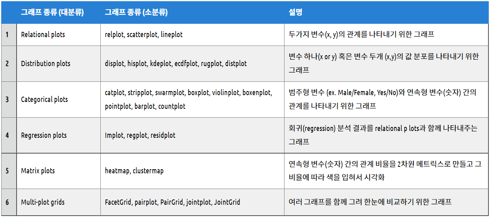

# 개념정리


## 시리즈 데이터를 데이터프레임 형태로 바꾸기

### as_index 파라미터 사용

- ```python
  #시리즈 데이터로 나옴
  wine_df.groupby('color')['quality'].mean()
  ## 위와 같이 groupby 안에 지정하는 컬럼들은 데이터프레임의 인덱스로 지정됨.
  # 이를 원하지 않으면 'as_index=False' 파라미터를 지정 -> 데이터 프레임으로 변환됨
  wine_df.groupby('color', as_index=False)['quality'].mean()
  ```

  

### reset_index()

데이터 프레임의 인덱스를 재설정하고 기본 인덱스를 사용한다.

데이터프레임에 복수인덱스가 있는 경우 이 메소드는 하나 이상의 레벨을 제거할 수 있다.

```python
DataFrame.reset_index(level=None, drop=False, inplace=False, col_level=0, col_fill='')
```

- **level** : int, str, tuple, or list, default None
  - 인덱스에서 지정된 수준만 제거합니다. 기본적으로 모든 레벨을 제거합니다.
- **drop** : bool, default False
  - True : drop 매개변수를 사용하여 이전 인덱스가 열로 추가되는 것을 방지할 수 있습니다.
- **inplace** : bool, default False
  - DataFrame을 제자리에서 수정합니다(새 개체를 만들지 않음)
- **col_level** : int or str, default 0
  - 열의 수준이 여러 개인 경우 레이블을 삽입할 수준을 결정합니다. 기본적으로 첫 번째 레벨에 삽입됩니다.
- **col_fill** : object, default 
  - 열의 수준이 여러 개인 경우 다른 수준의 이름을 지정하는 방법을 결정합니다. 없을 경우 인덱스 이름이 반복됩니다.


## 코랩에 데이터 불러오기

1. 구글 드라이브 연동

2. 로컬 드라이브에서 업로드

   - 왼쪽 메뉴바 활용

     

   - 드래그앤 드롭 가능

   - 코드 직접 입력

     - ```python
       from google.colab import files
       
       uploaded = files.upload()
       ```


## 데이터 유형에 따른 EDA 방법

### 데이터 유형

- Numerical Data
  - Continuous : 연속적인 값 (ex. 키, 몸무게)
  - Discrete : 이산적인 값 (ex. 방문객 수, 자동차 사고 건수)
  - 평균, 표준편차, 최댓값, 최솟값 등의 통계치를 통해 분석
- Categorical Data
  - Ordinal : 범주 간 순서에 의미가 있는 자료(ex. 선호도, 등급)
  - Nominal : 범주 간 순서에 의미가 없는 자료(ex. mbti, 성별)
  - 데이터의 빈도, 비율 등의 통계치를 통해 분석


### EDA

- Exploratory Data Analysis 탐색적 데이터 분석 : 수집한 데이터를 분석하기 전 데이터의 특성을 관찰하고 이해하는 단계

#### EDA 목적

- 여러 시각화 도구 및 통계 기법을 사용해 데이터를 한눈에 파악하고 이해
- 어떤 변수가 예측력 높고 낮은지 확인 가능
- 예측 모델을 구축하기 전 적합한 통계 도구 선택 가능
- 도출하고자 하는 결과의 기본이 되는 가설의 검증 과정이 될 수 있음
- 데이터를 다양한 각도에서 살펴보며 다양한 패턴들을 발견하고 새로운 더 좋은 가설 세울 수 있음


#### EDA 과정

1. 해결하고자 하는 문제 파악 후 분석할 데이터 확인
2. 데이터를 전체적으로 살펴보며 이상치, 결측치가 없는지 확인
3. 시각화 통해 데이터의 대략적인 분포를 파악하고 적절한 통계지표를 결정
4. 데이터의 변수들 간에 어떤 유의미한 상관관계를 가지는지 파악


#### EDA의 종류

|                       | 일변량(Uni-variate)                               | 다변량(Multi-variate)                           |
| --------------------- | ------------------------------------------------- | ----------------------------------------------- |
| 시각화(Graphic)       | 히스토그램, 막대그래프, box plot, QQ-plot         | 산점도(Scatter Plot), 범주별 시각화             |
| 비시각화(Non Graphic) | 통계요약(Summary Statistics), 빈도표 (Tabulation) | 교차표(Cross-tabulation), 상관분석(Correlation) |

- 일변량 시각화(Uni-variate Graphic)
  - 히스토그램, 막대그래프 : 데이터 분포를 확인하거나 이상치를 파악할 때 주로 사용하며 연속적인 데이터에 사용하면 효과적
  - Box plot : 이상치 파악, 데이터의 치우침 정도를 파악할 때 효과적
  - QQ-plot : 왜도와 첨도를 파악할 때 주로 사용
- 일변량 비시각화(Uni-variate Graphic) 
  - 통계요약 : 주로 Numeric 데이터를 분석할 때 사용하며 Mean, Media, Mod, Variance, IQR, Tail, Skewness, Outliers 등으로 파악
  - 빈도표 : 특정 범위에 포함되는 빈도, 결측치를 파악하고자 할 때 사용

- 다변량 시각화
  - 산점도 : 두 변수가 양적 변수일 때 종속 변수를 y축에 두고 빈도를 확인
  - 범주별 시각화 : 범주에 따라 일변량 시각화를 적용

- 다변량 비시각화
  - 교차표 : 범주형 데이터에 주로 사용
  - 상관분석


## groupby() , query()

### groupby()

- 데이터를 그룹으로 묶어 그룹별 통계연산과 집계, 요약을 빠르게 가능하게 함

- NA값 자동으로 제외됨, 전달 원할 시 `dropna=False`써주기

- `groupby()` 사용할 때 반드시 aggregate하는 통계함수와 일반적으로 같이 적용

- ```python
  # 두개 이상의 칼럼으로 그룹 -> list로 묶어서 지정
  df.groupby(['sex', 'pclass']).mean()
  # 1개의 특정 컬럼에 대한 결과 도출
  df.groupby(['sex', 'pclass'])['survived'].mean()
  # 다중 칼럼에 대한 결과 도출
  df.groupby(['sex', 'pclass'])[['survived', 'age']].mean()
  
  # 데이터 프레임으로 출력하는 방법
  # 1. pd.DataFrame()으로 감싸주기
  pd.DataFrame(df.groupby(['sex', 'pclass'])['survived'].mean())
  # 2. survived 컬럼을 []로 한 번 더 감싸주기
  df.groupby(['sex', 'pclass'])[['survived']].mean()
  
  #인덱스 초기화 하여 새로운 데이터 프레임 생성하기 -> reset_index() 활용
  df.groupby(['sex', 'pclass'])['survived'].mean().reset_index()
  
  # 다중 통계함수 적용 -> agg() 함수 사용
  df.groupby(['sex', 'pclass'])[['survived', 'age']].agg(['mean', 'sum'])
  
  # 열 선택 후 그룹화
  group_density = wine_df['density'].groupby(wine_df['quality'])
  
  ```


### query()

- 조건식을 문자열로 입력받아 해당 조건에 만족하는 행을 추출해 출력해주는 함수

- `DataFrame.query(expr, inplace=False)`

- expr은 입력되는 조건식을 입력받고 inplace가 True일 경우 query에 의해 출력된 데이터로 원본데이터를 대체한다.

- query 메서드를 사용하는 이유 : 대괄호[]를 사용해 조건식을 입력해도 되지만 방대한 양의 데이터를 처리할 경우 성능면에서 우위를 보인다.

  - ```python
    #대괄호 사용 조건식
    df[(df.a<df.b) & (df.b<df.c)]
    #쿼리 사용 조건식
    df.query('(a<b) & (b<c)')
    df.query('a<b and b<c') #비교연산자가 논리연산자보다 우위에 있으므로 위의 코드와 동일한 결과
    ```

- ```python
  #비교 연산자 사용 (==) (!=) (<, >)
  str_expr = "height != 150"
  df = df.query(str_expr)
  
  #in, not in 연산자 (in 과 == , not in 과 != 의 결과는 같음)
  str_expr = "weight in [60, 30]"
  df = df.query(str_expr)
  
  #논리 연산자(and or not)
  str_expr = "(weight == 50) and (weight <80)"
  str_exprr = "not (weight == 50)"
  df = df.query(str_expr)
  
  #외부 변수 참조 연산 (데이터 프레임에 존재하지 않은 변수를 참조할 때는 변수 앞에 @)
  str_expr = "(weight > @num_weight)"
  
  ```


## value_counts()

- 지정된 열의 각 값에 대한 모든 발생 횟수를 반환

- 기본 파라미터 : 열에 있는 모든 고유값(unique value) 의 개수를 반환, NaN 값 모두 무시 (dropna 인수의 기본값이 True이기에)

- NaN 값 표시 : dropna 매개변수 False 설정하기

- 오름차순 정렬 : 기본 값 False로 설정되어 내림차순 정렬이 디폴트

- 정렬하지 않기 : 기본 값 True이므로 sort = False

- 값의 상대빈도 구하기 : 전체 관찰 수 내에서 값이 발생하는 횟수의 비율을 반환하려면 normalize 매개변수를 True

- 연속형 자료를 이산형 자료로 : bin인수를 사용해 연속 데이터를 이산 간격으로 binning할 수 있음, 숫자 값이 포함된 열에만 사용 가능

  - ```python
    # na값 표시, 오름차순 정렬, 정규화
    patients['나이'].value_counts(dropna = False, ascending = True, normalize = True)
    # 연속형 자료를 3개 구간으로 범주화
    patients['몸무게'].value_counts(bins = 3)
    # 연속형 자료를 사용자 지정 구간으로 범주화
    patients['몸무게'].value_counts(bins = [60,80,100,120]) # 세개 구간으로 나옴
    
    # 다른 함수와 결합해서 사용
    # 결과를 알파벳 순서로 정렬
    patients['나이'].value_counts().sort_index()
    # 성별에 따른 성적 값 확인
    exData.groupby('sex')['Grade'].value.counts()
    ```


## 데이터 시각화

### Matplotlib

- pandas의 데이터프레임을 바로 시각화할 때도 내부적으로 matplotlib을 사용
- 
  - Figure : 그림이 그려지는 도화지
  - Axes : plot이 그려지는 공간
  - Axis : plot의 축
- pandas의 시리즈나 데이터프레임을 시각화 메서드를 사용(plot)
  - plot 메서드의 kind라는 인수를 바꾸면 여러가지 플롯을 그릴 수 있다. 
    - `iris.sepal_length[:20].plot(kind='bar', rot=0)`
  - `kind` 인수에 문자열을 쓰는 대신 `plot.bar`처럼 직접 메서드로 사용할 수도 있다.
    - `iris[:5].plot.bar(rot=0)`
  - bar : 범주형 자료를 나타내는 그래프로서,  일반적으로 수평축에 데이터로부터 구한 각 범주를 표시하고 수직축에는 각 범주에 해당하는 도수 또는 상대도수를 표시한 그래프를 말합니다. 
  - pie: 카테고리 별 값의 상대적인 비교
  - hist : 히스토그램
    - 막대그래프와 히스토그램의 차이 : 모양은 같지만 그 사용용도와 의미는 다릅니다. 히스토그램은 양적 자료를 나타내는 그래프이며 수평축은 계급의 폭을 나타내지만 막대그래프의 수평축은 단순히 각 범주를 나타내기 때문에 각 범주의 폭의 크기는 의미를 갖지 않습니다.
    - 확률분포와 관계가 있어 통계적 요소를 나타내기 위해 많이 사용
  - kde
  - box
  - scatter : 2차원 데이터 즉, 두 개의 실수 데이터 집합의 상관관계를 알 수 있다.
  - area


### Seaborn

- matplotlib을 기반으로 다양한 색 테마, 차트 기능을 추가한 라이브러리
- matplotlib에 없는 그래프를 가지고 있음
- 


# 일일회고


## Keep (유지할 것)

- 지난 밤 예습을 살짝 하고 잤는데 오늘 과제하는 데 많은 도움이 되었다. 첫날처럼 어떤 코드를 짜야하지.. 이렇게 우왕좌왕거리지 않아서 좋았다. **예습을 되도록이면 지향**하자!!
- 오늘은 일찍 일어나졌다! 7시에 일어났는데 한시간이라도 더 자고 싶어서(최상의 수면시간은 7시간이라고 생각하기에) 눈을 감았는데 잠이 안왔음 왜냐면 배고파서...ㅋ... 그러니까 전날에 좀 **배고픈 채로 자자**~ 담날 일찍 기상 가능


## Problem (문제점, 방해 요소)

- 어쩔 수 없이 카톡을 켜놓아야 하는데 (핸드폰을 안보니 급한 연락이 있을 수 있으니) 이로인해 친구들과의 재밌는 이야기가 자꾸 올라와서 보게 된다.. 
- 왕 큰 창문이 바로 놋북 앞에 있어서 얼굴이 뜨겁다..
- 자료와 코드문을 번갈아 가면서 확인해야되는데 너무 불편하다.
- 내생일이라서.. 평일날 약속이 잡혔는데 하루죙일 그생각때문에 집중이 잘 안됐다.. 평일에 약속잡기는 절대 금물.. 잡는다면 토요일!!!!! 나에게 주어진 건 토요일 뿐이야.. ~~(술먹고 싶다)~~


## Try (시도할 것)

- 재밌는 단톡방은 **알람을 꺼놓기**
- 싼 커튼 구매 완료->설치하자
- 모니터 구매 완료(어머니 사랑합니다)->설치하자
- 10시간 이상을 책상에 앉아있다보니 엉덩이가 납작해지고 다리 근육이 퇴화되는 느낌.. 예전에 헬스인 이였으니까 일찍 일어나서 헬스장가자~ **운동 꼭 하기!!**


