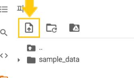

# 개념정리


## 시리즈 데이터를 데이터프레임 형태로 바꾸기


## 코랩에 데이터 불러오기

1. 구글 드라이브 연동

2. 로컬 드라이브에서 업로드

   - 왼쪽 메뉴바 활용

     

   - 드래그앤 드롭 가능

   - 코드 직접 입력

     - ```python
       from google.colab import files
       
       uploaded = files.upload()
       ```


## 데이터 유형에 따른 EDA 방법

### 데이터 유형


### EDA 방법


# 일일회고


## 느낀점

- 지난 밤 예습을 살짝 하고 잤는데 오늘 과제하는 데 많은 도움이 되었다. 첫날처럼 어떤 코드를 짜야하지.. 이렇게 우왕좌왕거리지 않아서 좋았다. **예습을 되도록이면 지향**하자!!


## 보완점


