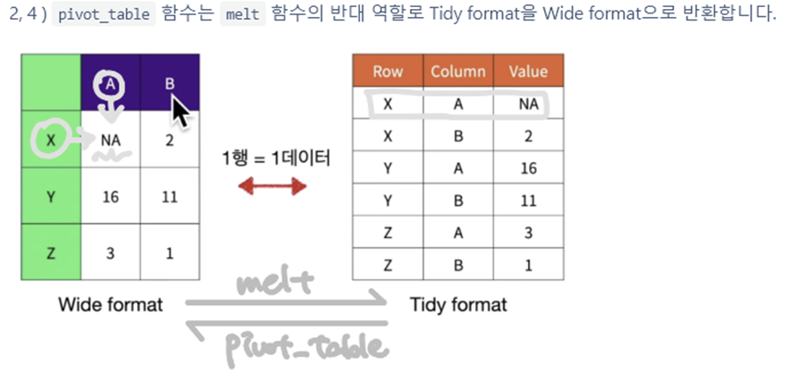
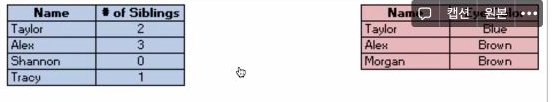
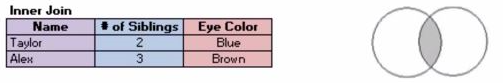
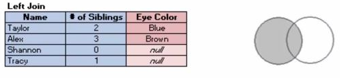
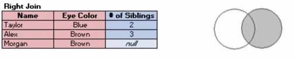
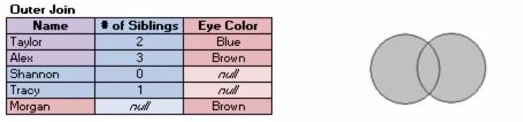
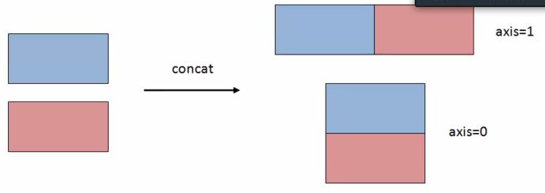

# 개념정리


## Tidy Data

- 지저분한 데이터의 일반적인 모습
  1. 열 이름(Column header)이 변수 이름이 아니고 값인 경우
  2. 같은 표에 다양한 관측 단위(observational units)가 있는 경우
  3. 하나의 열(column)에 여러 값이 들어 있는 경우
  4. 변수가 행과 열에 모두 포함되어 있는 경우
  5. 하나의 관측 단위(observational units)가 여러 파일로 나누어져 있는 경우
- 

### pivot_table


### melt


## 데이터 프레임 합치기(concat, merge, join)

- 열기준 컬럼명으로 합치기 : merge
- 열기준 Index명으로 합치기 : merge, concat
- 행기준으로 합치기 : concat, append


### 합치는 방법



- **Inner** : 두 DataFrame의 기준 컬럼에서 둘 다 존재하는 데이터만 Join
  - 
- **Left Outer join** : 왼쪽 DataFrame으로 합치기
  - 
- **Right Outer Join** : 오른쪽 DataFrame으로 합치기
  - 
- **Outer Join** : 두 DataFrame의 모든 Data를 합치기
  - 


### concat

- 데이터 프레임을 물리적으로 이어 붙여주는 함수

- `pd.concat([left,right], axis, join,...)`

  - **[left,right]** : left DataFrame과 right DataFrame으로 이루어진 List
  - **axis = 0** : 행기준으로 합치기, 1: 열기준으로 Index명으로 합치기
  - 

- ```python
  pd.concat([df1, df2]) #defalut 값으로 axis = 0이 적용되어 행방향으로 데이터프레임을 이어붙임
  pd.concat([df1,df2], ignore_index=True) # 인덱스를 재배열
  pd.concat([df1,df2],axis=1, join='inner') # default는 outer, 열방향으로 합치기
  ```

  

### merge

- 두 데이터 프레임을 각 데이터에 존재하는 고유값(key) 기준으로 병합할 때 사용

- `pd.merge(df_left, df_right, how='inner', on=None)` 디폴트

- `pd.merge(left, right, how, on, left_on, right_on, left_index, right_index)`

  - **left** : Merge 할 왼쪽 DataFrame
  - **right** : Merge 할 오른쪽 DataFrame
  - **how** : inner, left, right, outer
  - **on** : 두 DataFrame을 Join할 기준 컬럼명(컬럼명이 동일할 경우)
  - **left_on** : Join할 기준 컬럼의 왼쪽 DataFrame의 컬럼명
  - **right_on** : Join할 기준 컬럼의 오른쪽 DataFrame의 컬럼명
  - **left_index** : 왼쪽 DataFrame index로 Join할 경우 True
  - **right_index** : 오른쪽 DataFrame index로 Join할 경우 True

- ```python
  #공통 열이름 기준으로 교집합
  pd.merge(df1,df2)
  
  # id 기준으로 합치되 어느 한쪽에라도 없는 데이터가 있는 경우 NaN
  pd.merge(df1,df2, how='outer',on='id')
  
  # 왼쪽 데이터인 df1의 고유값을 기준으로 하며 왼쪽의 키는 stock_name 오른쪽의 키는 name
  pd.merge(df1,df2, how='left', left_on='stock_name', right_on='name')
  ```


### join

- merge() 함수 기반으로 만들어져 기본 작동방식은 비슷하지만 join은 행 인덱스를 기준으로 결합한다는 점에서 차이가 존재함


## replace()


## pandas 문자열 관련 함수


# 일일회고


## Keep (유지할 것)

- 


## Problem (문제점, 방해 요소)

-  


## Try (시도할 것)

- 

